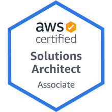
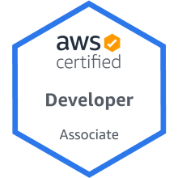
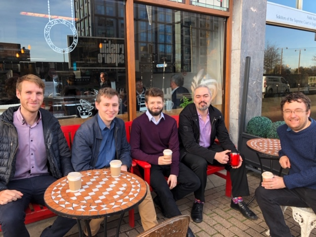

# My Experience from AWS Certifications  

So I have now completed both the [Solution Architect Associate](https://aws.amazon.com/certification/certified-solutions-architect-associate/) and [Developer Associate](https://aws.amazon.com/certification/certified-developer-associate/) certifications and thought I would share my thoughts from the process.

## Why Bother?

For a long time, I haven't been particularly bothered by doing any certifications. I have always believed in proving myself in the work I do, and this was particularly true when I worked as an in-house developer. As a consultant for [Scott Logic](https://www.scottlogic.com/), I naturally have to have a more public profile - certification is one way of saying I know a technology area.

Alteryx introduced certification a couple of years ago and that was my first exposure to actually doing one. It was a requirement of being an [ACE](https://community.alteryx.com/t5/ACE-Program/bd-p/ace-program) that you at least the [Core certification](https://community.alteryx.com/t5/Certification/bd-p/product-certification). In this case, I have spent far too much time digging deep into Alteryx so didn't do much study for them. The Expert certification really made me value the process. It is a very hard test and really demonstates a great breadth of detailed knowledge in the platform.

In AWS case, the SA associate gives a fantastic introduction to their services. AWS is a huge platform and grows at an astronomical rate - take a look at the [2018 What's New](https://aws.amazon.com/about-aws/whats-new/2018/) to give you an idea. The SA associate exposes you to a wide range of services giving you a brief introduction to many of them. In addition, it goes much deeper into some import topic areas such as EC2 and IAM. This helps hugely when working on the platform as you have a good idea where to start looking.

Finally, the cloud is a new world and we should think in a new way. If all we do is lift and shift from data center to the cloud then the benefits are a lot smaller. The SA gives a lot of advice and examples of how to build things in a cloud way. Changing the way you think about using the platform is another huge value from passing the certifications.

## So How Did I Approach It

There are hundreds of blogs or YouTube videos about how I study and passed AWS certification in 2 weeks. I don't agree with this approach. My principal goal was to turn my experience of working in AWS (which was quite limited) into a skill that would allow me to work quickly and effectively in the platform. Because of this, I wanted to take my time going over the topics and experimenting and building with each area that I looked at.

A group of us working on the same project decided we all wanted to work together to learn about AWS. 

At first, we just wanted to learn about AWS in general but when we looked into it felt like the SA associate was a good way 

## Alteryx Certification
