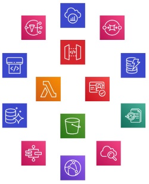
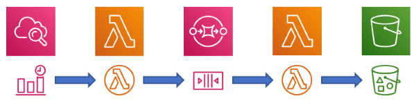
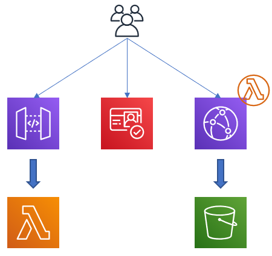
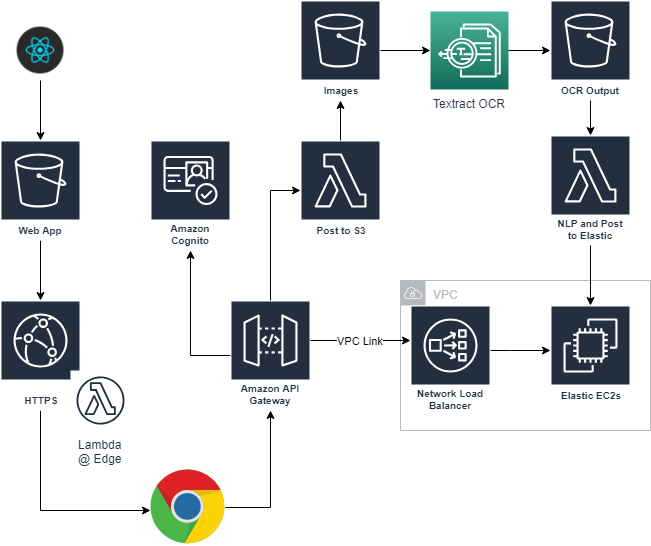

# RecipeFinder: A Serverless Data Flows, NLP, Elasticsearch in the Cloud Project

So, I have far too many recipe cards...

Over the years, I have collected (read hoarded) hundreds of recipe cards from trips to the supermarket. I've generally kept them in folders so I can find them when I want but I want to do better. I'd love to be able search for them, find out commonly paired ingredients, work out cooking times.

Over the last few months, I have been working with serverless technologies in AWS both for hosting a secure HTML5 front end application and for ingesting and performing natural language processing on documents with the output being stored on [Elasticsearch](https://www.elastic.co/products/elasticsearch). We have had a lot of success with these technologies. I thought I could probably use some of these ideas and make a way to hold all my recipe cards and have some fun along the way pushing different AWS technologies.

Additionally, I'll want to use AWS technologies to secure the platform, take images in and OCR the content and allow me to find out more about all the recipes I have gathered!

## So Why Use Serverless Technologies

I've talked about some of the benefits of Serverless Compute (Function as a Service) before when looking at [Azure Functions](https://jdunkerley.co.uk/2018/02/06/creating-a-simple-azure-function-in-javascript-with-vs-code/), but there are more services than just compute. The list below shows some serverless technologies on AWS (there are equivalents on Azure) just to give an idea of what is available:

- Storage: *S3*
- Content Delivery Network: *CloudFront*
- API Management: *API Gateway*
- IDAM: *Cognito*
- Databases: NoSQL - *DynamoDB*, SQL - *Aurora Serverless*
- Message: *SQS* and *SNS*
- Logging and Tracing: *X-Ray* and *CloudWatch*

The first one that normally comes up is cost. Serverless technologies are charged on a consumption model - i.e. you pay for what you use. If you think about a web server under light load it spends most of its time idle. If you are using an EC2 instance for this, you pay for all the time it is running. If you replace it with a serverless equivalent, then you will only pay when it is serving content. Additionally, for Lambda (and other Functions as a Service (FaaS) offerings), you get a chunky free allowance each month - used wisely it can be a long time before you pay for it.

Scalability is huge benefit to using serverless technologies. Prior to the public cloud, you would have needed to either buy physical servers and set up in a data centre or rent them. One of the first services that was offered by AWS was EC2 (it launched in around March 2006). This meant you could get hardware in the cloud quickly and easily. However, you still must size and scale for anticipated demand (you can use autoscaling technologies to automate this). Serverless technologies are generally all designed to scale instantly. To take a couple of examples, Lambda is designed to just add instances until it has enough to cope with incoming events and S3 will happily store huge files (up to 5TB) and cope with thousands of requests per second.

With modern distributed architectures, you need to design for failures and think about high availability. If you imagine running a machine in a data centre, you need to think about everything from the machine rebooting through to complete destruction of the data centre and everything in between. AWS has regions and availability zones (AZ) allowing you to set up machine clusters such that a failure is isolated. For their serverless services, they are all designed to run across multiple AZs (and can as required span across regions). This means you get high availability effectively for no effort.

Another huge advantage is around security. Firstly, like all AWS services you can use IAM to provide role-based access control to the services. For example, you can control exactly which users can run lambda functions and which other services can trigger them. Additional various services have additional policies that can be applied which will allow or deny access based on different conditions (for example client IP restrictions on API Gateway). These tools allow you to make all of the services very securely.

One final security aspect of note, Lambda has a known state for each execution. While it is not quite true that every execution is a completely clean environment (it is possible to use `/tmp` to share things between invocations for example), the runtimes are much shorter lived than is the case with servers or containers. Additionally, as there is no guarantee of sharing a runtime, it encourages everything to be written in a self-contained manner.

We have handed over the management of the hardware but if we are running virtual machines, we still to think about keeping the environment patched and up to date. If you consider running in containers, then you can hand over the management of the host OS and docker environment. All three main cloud providers offer a container service ([ECS](https://aws.amazon.com/ecs/), [ACS](https://docs.microsoft.com/en-us/azure/container-service/), and [Google Containers](https://cloud.google.com/compute/docs/containers/)). When combined with [AWS Fargate](https://aws.amazon.com/fargate/) or [Azure Container Instances](https://azure.microsoft.com/en-gb/services/container-instances/), you no longer need to guess scale up front or manage hosts. 

Unfortunately, even at the container level, there is still a lot of stuff to care about. The container will have a container OS and these base images will need managing and updating. If you are using a runtime (Python, Node, .Net or Java), it will need patching and updating. Serverless technologies take away these two layers. The provider will manage patching everything except your code. You just manage your application and its dependencies.

As architectures grow and become more distributed, it becomes critical to have good logging and tracing capabilities. AWS uses CloudWatch for both logging and metrics. This is built into many of the serverless services giving you the option to log and measure many different aspects of your architecture. Additionally, you can use X-Ray to trace an execution through the application showing where bottlenecks or failures occur.

All of this adds up to a speed of delivery is amazing with these technologies. You only need to deal with what matters to you. You can start small and deliver something that will scale as you need straight away.

There are catches of course. You are giving up lots of control by handing it over to AWS to manage for you but often this is an advantage. A couple of examples of issues you might face are execution time limitations (e.g. a Lambda has maximum run time of 15 minutes)

### Why Does It Suit A Data Flow?

Consider a simple data process.

Starting with a time-based trigger in we run a process to generate a list of work to do. Each item of work can then be gathered, processed and stored. In the picture above, CloudWatch is used to provide a cron style trigger which runs a first Lambda function. This function works out what work is needed to be done and stores the item in a Simple Queue Service (SQS) queue. A second lambda watches this queue and is then triggered in parallel to pick up the items and begin processing. The results of this lambda can then be stored in an S3 bucket for later use.

The serverless services allow us to implement this simple event driven data pipeline in an incredibly short period of time. The event messaging is all built into the AWS architecture and makes it straight forward to plug together components to build complex pipelines.

Each event becomes its own execution. This isolates issues down to that specific record. If the lambda crashes, then it only affects the single record passing through and allows the others to proceed. This single record as a single invocation also allows us to leverage the scalability of lambda and run hundreds (or even thousands) in parallel.

Additionally, all asynchronous invocations of Lambda automatically have retry logic built in, attempting 3 times to complete the execution. It is also trivial to attach a 'dead letter queue' to these lambdas allowing you to receive notifications in the event of a failure.

### Serverless Web App

Using a collection of serverless services it is very straight forward to host a modern web app. Place the built HTML/JS into an S3 bucket. I don't recommend directly exposing this using it's web hosting except for early development as it only supports HTTP not HTTPS. From past experience, do not leave security features (like HTTPS) to the end as they are a lot easier to build as you go along. Fortunately, there is an easy solution for this. If you use CloudFront to serve the content from S3 then you can easily add HTTPS.

For REST APIs needed to power the site, you can easily do this using API Gateway backing onto Lambda (or other services as needed). This is HTTPS by default (I don't believe it support HTTP). You can then additionally secure the APIs using Cognito such that only authorised users can use parts of the site.

The big advantage of this is cost. All services will hardly cost anything for this set up. Obviously, if your site takes off costs will start to appear but the free tier for these services is huge.

## Why Use Elasticsearch?

So far, I have argued for serverless everywhere. I could look to use a serverless NoSQL solution such as DynamoDB as my final datastore. Depending on the nature of the data this could be good solution. 

Elasticsearch has some amazing capabilities. The underlying Apache Lucene technologies creates highly performant indexes allowing search and retrieval of records easily. Additionally, while not simple, the query syntax allows you to build arbitrarily complicated searches with a good fuzzy matching capability.

The downside is you need a machine or cluster. To enable this, you need to build a VPC and set up the EC2 within one or more private subnets. Elasticsearch is straight forward to get set up first as a single machine and then as cluster. Additionally, as its cluster is very resilient you can easily take nodes out and upgrade. 

Having a non-serverless component comes with some limitations (you can't expect it to scale as well as the serverless components), but this it is power is huge.

## 10,000 Foot Plan

So, this is my first thoughts on the architecture I want to build:

The front end will be build using [ReactJS](https://reactjs.org/) and hosted in an S3 bucket behind a Cloud Front distribution to ensure only HTTPS access. The front end will be authenticated using Cognito (probably backed off to a Facebook or other Web Identity Federation options). It will provide a way to upload an image to an S3 bucket.

The front end will also allow for searching the backend. My current view is to use Elasticsearch as a backend. This allows for a rich query syntax which we can use to search and find data. I plan to look at building a custom cluster from first basis just to go through the process. I will probably contrast it with using the Elasticsearch service from AWS and also potentially look into DynamoDB as an alternative.

The last area and one of the most fun is to create a pipeline in Lambda trigger by S3 causing an OCR of the image followed by running through some NLP technologies. I haven't chosen which tools to use here yet and again will be interesting to try a few different ways and see which ones are better or worse.

So that's the initial ideas for the architecture, but there is also the whole world of build and deployment technologies to play with. All the code will be hosted in [GitHub](https://github.com/serverlessrecipefinder) and team managed in Trello. I plan to look at different options for building the code (such as Code Build or maybe even using Azure DevOps) and the various options for deploying each piece (from using the CLI directly through to the Serverless Framework via CloudFront and Terraform (to name but a few)). 

## What's Next

So, there's a lot of fun steps ahead, lots of fun technologies to play with and dive deep into from Lambdas, APIs, AI, NLP, Elastic to pick just a few. A couple of my colleagues, [Jan Akerman](https://janakerman.co.uk/), [Bartosz Jedrzejewski](https://www.e4developer.com/), [Jamie Morris](https://github.com/jamiemorris1991) and Colin Lambden, have agreed to join me on this journey and will be helping with the different tools and technologies as we build out the application.

We'll try and do all this securely and with as much tips and tricks to help others as we go. My plan is that we do this in a series of small focused posts on each part. So first up will be to build an Elastic EC2 instance from the ground up.