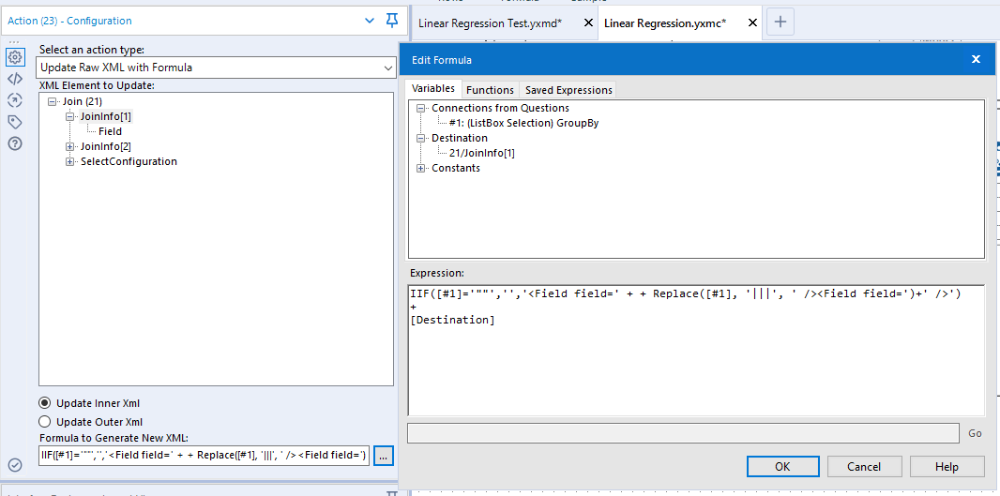
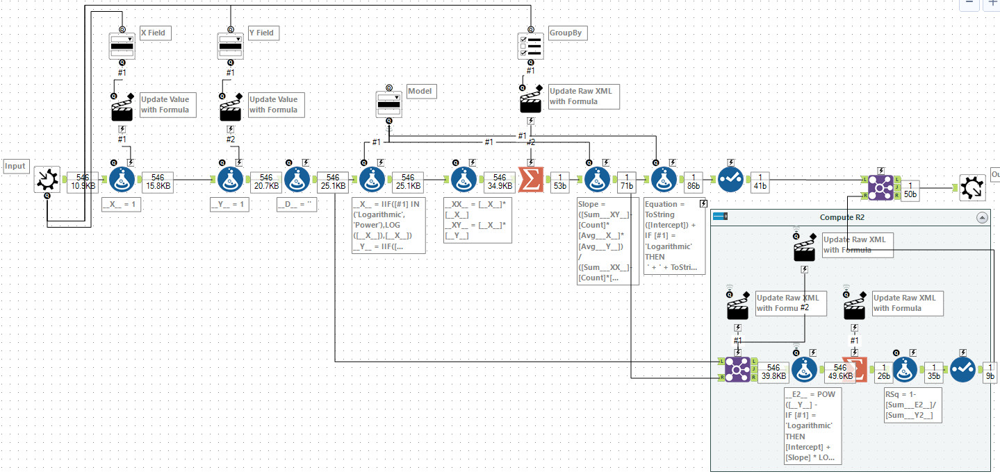
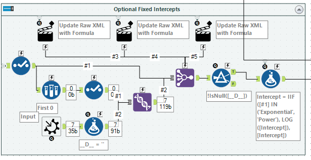
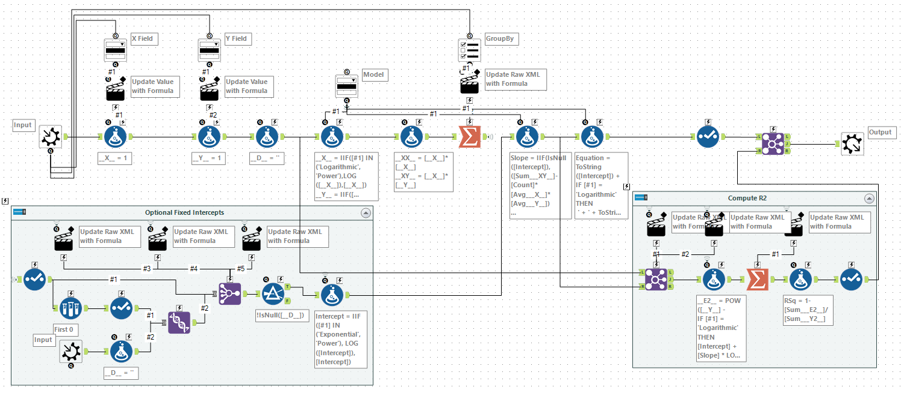

# Least Squares in an Alteryx Macro

A friend on the Alteryx community recently asked me about recreating the Excel trendline capabilities within Alteryx. 


If you have the predictive tools installed then Alteryx has a [Linear Regression tool](https://help.alteryx.com/2018.2/lm.htm) which will fit a linear model to the set. This uses R and produces a model for the entire dataset. For my implementation, I wanted to allow for groups of data and go back to first principles and use the core Alteryx tools (i.e. no SDKs, R, or Python) to build it.

Excel has 6 options for fitting a trendline to a dataset. Apart from *Moving Average* these are all fitted using the least squares method. The five models are:

- *Exponential*: 
- *Linear*: 
- *Logarithmic*: 
- *Power*: 
- *Polynomial*:  *depends on Order*

For my Alteryx macro, I plan to support Exponential, Linear, Logarithmic, and Power (Moving Average isn't really the same and Polynomial will need more work). 

The Excel tool also allows you to specify an intercept (the value when ) for Linear, Exponential, and Polynomial. In other words, fixing the value of *A* in each case. In the *Power* case, the intercept is always *0* and for the *Logarithmic* case it will be an error as the logarithm is not defined at 0. I want my macro to also support this.

Finally, you can get the trendline in Excel to output both the equation and the value of , so the last requirement is to do this as well.

A quick shout out to the [LaTeX Previewer](http://www.tlhiv.org/ltxpreview/) by [Troy Henderson](http://www.tlhiv.org/) - I used it to create the SVG of all the LaTeX in this post. Onto the maths...

## Least Squares Method for Regression

Let's imagine we have a dataset of points . 

The goal of the least squares method is to fit a function , which minimises the square of the errors, , where  is defined as . In other words:


So, let's work this out for the *Linear* case. Let's expand out the summation and then see if we can simplify it:

First, substitute for :


Next, replace :


Now, expand out the square:


The goal is to find *A* and *B* to minimise the above expression: 


Going back to calculus basics, a maximum or minimum will be when the first derivative is 0. So let's differentiate with respect to *A*:


We want to find when this is 0. Rearranging (and dividing by 2):


We can then expand the sums for this:


Dividing by *n*, this gives us:


Where  and  are the average of *x* and *y* respectively.

Now back to the original expression, this time let's differentiate with respect to *B*:


Following a similar approach, we can get that:


If we have a known intercept, then we can substitute this for *A* above. Otherwise, we can substitute our expression we had above for *A*:


This means to find *A* and *B*, all we need to compute is:

- *n* - the number of records
-  - the average of *x*
-  - the average of *y*
-  - the sum of *x* squared
-  - the sum of *x* times *y*

All of this is straight forward using the Summarize tool.

## Building the First Macro

Let's start building the macro. This first version will handle computing *A* and *B* for the linear model.


We start by taking a standard macro input. I have chosen not to expose a FieldMap but instead created new variables called `__X__` and `__Y__`. I used a dropdown box to allow you to map the field to each, using an action tool to update the raw XML of a pair of formula tools. 

Next, I computed values for `__XX__` and `__XY__` which I needed to compute the totals. Then it was on to the Summarize tool to compute the five values I needed. Additionally, I used a List Box to allow selection of the Group By within this macro. This was a little fiddly inside the formula for action tool, but basically, it worked by adding the group by entries to the raw XML of the summarise:

```
IIF([#1]='""',
    '',
    '<SummarizeField field=' + 
      Replace([#1], '|||', ' action="GroupBy" /><SummarizeField field=') +
    ' action="GroupBy" />')
+
[Destination]
```

Finally, the last step was to compute the `Slope` and `Intercept` and to use a select tool to drop all the intermediary fields. One last little catch is to remember to select the *Output fields change based on macro's configuration or data input* option within the Interface Designer.


## Expanding to Other Models

Currently, it can only solve *Linear*. However, we've basically finished the hard work and all we need to do is see how we can transform the inputs to get each of the other models. 

### *Logarithmic*: 

This is straight forward. If we take the log of x as `__x__` then we have the linear model.

### *Exponential*: 

Let's take the log of both sides:


Again, we have gotten to a linear model. If we take the log of y as `__y__` and then take the exponential of the intercept we can compute this model.

### *Power*: 

Let's take the log of both sides:


As before, this is a linear model. In this case, we have to take both the log of x as `__x__` and the log of y as `__y__` and then finally take the exponential of the intercept to compute this model.

### Expanded Macro

First, let's add a model drop down with a manual set of values:

```
Linear (y=A+Bx):Linear
Logarithmic (y=A+B ln(x)):Logarithmic
Exponential (y=Ae^(Bx)):Exponential
Power (Y=Ax^B):Power
```

We can feed this into a new formula tool after creating `__X__` and `__Y__` to create the adjust(?) series we need.

```
__X__ = IIF([#1] IN ('Logarithmic', 'Power'),LOG([__X__]),[__X__])
__Y__ = IIF([#1] IN ('Exponential', 'Power'),LOG([__Y__]),[__Y__])
```

And then add an additional step to formula tool, adjusting the intercept for *Exponential* and *Power*:

```
Intercept = IIF([#1] IN ('Exponential', 'Power'), EXP([Intercept]),[Intercept])
```

## Equation

Now, that we have different models it seems a good time to add a new column containing the expression. A simple formula tool will handle this:

```
ToString([Intercept]) + 
IF [#1] = 'Logarithmic' THEN
 ' + ' + ToString([Slope]) + ' LOG(X)'
ELSEIF [#1] = 'Exponential' THEN
' EXP(' + ToString([Slope]) + ' X)'
ELSEIF [#1] = 'Power' THEN
' X ^ ' + ToString([Slope])
ELSE
	' + ' + ToString([Slope]) + ' X'
ENDIF
```

## R Squared

R Squared is a measure which measures how much of the dependent variable is predicted by the model. It is expressed as:


In order to compute this, I needed to join the model values back to the original series. As we might not always have a grouping field, I needed to add a dummy variable, `__D__`, which can be included in all joins to make them(?) value. Dynamically creating joins is a little harder than adding group by clauses (as we must do it twice!). In this case, we need to take something that looks like `"A"|||"B"|||"C"` to something like:

```XML
<Field field="A" />
<Field field="B" />
<Field field="C" />
```

This is like the last case but needs to be applied to two nodes in the Join configuration. The expression below changes the list to the raw XML needed:

```
IIF([#1]='""','','<Field field=' + + Replace([#1], '|||', ' /><Field field=')+' />')
+
[Destination]
```



Now to compute the values we need for R squared, I first used a formula tool to evaluate the top and bottom of the fraction and then used a summarise to make totals. Again, this summarise tool needs to be grouped in the correct manner. Finally, I computed the R squared value for each set. After this, I knew that the output of this calculation would be in the same order as the output of the Slope/Intercept calculation so I joined by record position to add the value to the output. At this point the macro looked like:



## Fixed Intercepts

The last step was to take in an optional set of intercepts. Alteryx supports optional Macro Inputs, they will come through as an empty (0 row) copy of the template if no input is supplied. Unfortunately, as we were building the grouping fields dynamically, we couldn't have a template that would work for all cases. 

The workaround I chose, was to take the output of the Summarise tool, sample 0 rows from it, and use it to create a complete set of all the columns we need. This can then be unioned to the Macro Input tool to create a superset of columns. Using similar expressions to the above, we can reconfigure a Join Multiple tool. I chose to use this over a Join tool as it meant that the order of the records from the Summarise tool was preserved.



The formula tool at the end copes with the *Exponential* and *Power* models, where the *Intercept* needs to be adjusted. Finally, the *Slope* calculation needs to be updated to use the *Intercept* if provided:

```
IIF(IsNull([Intercept]),
([Sum___XY__]-[Count]*[Avg___X__]*[Avg___Y__]) / ([Sum___XX__]-[Count]*[Avg___X__]*[Avg___X__]),
([Sum___XY__]-[Count]*[Intercept]*[Avg___X__]) / [Sum___XX__]
)
```

## Wrapping Up



You can download the final macro [here](https://www.dropbox.com/s/u9pouzkupusg08v/Linear%20Regression.yxmc?dl=0).

This macro should re-create most of the capabilities of Excel trendlines. The direct manipulation of raw XML does mean that some field names (e.g. containing a `"`, `|||` or `>`) may cause it some issues.

If you want to fit another expression you can hopefully use the techniques above to get you started. Some of the techniques in building the macro are quite advanced but provide a powerful way to add new functionality.
