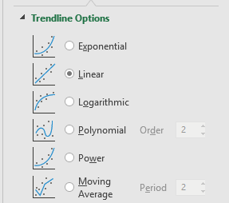
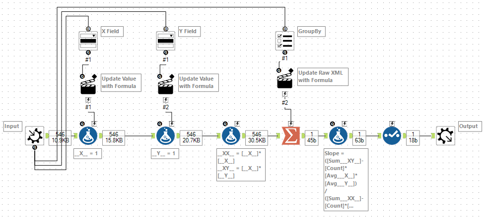
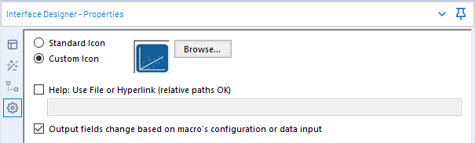

# Least Squares in Alteryx

A friend on the Alteryx community recently asked me about recreating the Excel trendline capabilities within Alteryx. 



If you have the predictive tools installed then Alteryx has a [Linear Regression tool](https://help.alteryx.com/2018.2/lm.htm) which will fit a linear model to the set. This uses R and produces a model for the entire dataset. For my implementation, I wanted to allow for groups of data and go back to first principles and use the core Alteryx tools (i.e. no SDKs, R or Python) to build it.

Excel has 6 options for fitting a trendline to a dataset. With the exception of *Moving Average* these are all fitted using the least squares method. The five models are:

- *Exponential*: 
- *Linear*: 
- *Logarithmic*: 
- *Power*: 
- *Polynomial*:  *depends on Order*

For my Alteryx macro, I plan to support Exponential, Linear, Logarithmic and Power (Moving Average isn't really the same and Polynomial will need more work). 

The Excel tool also allows you specify an intercept (the value when ) for Linear, Exponential and Polynomial. In other words fixing the value of *A* in each case. In the *Power* case, the intercept is always *0* and for the *Logarithmic* case it will be an error as the logarithm is not defined at 0. I want my macro to also support this.

Finally, you can get the trendline in Excel to output both the equation and the value of . So finaly requirement is to do this as well

A quick shout out to the [LaTeX Previewer](http://www.tlhiv.org/ltxpreview/) by [Troy Henderson](http://www.tlhiv.org/) - I used it to create the SVG of all the LaTeX in this post. Onto the Maths...

## Least Squares Method for Regression

Lets imagine we have a dataset of points . 

The goal of the least squares method is to fit a function , which minimises the square of the errors, , where  is defined as . In other words:


So let's work this out for the *Linear* case. Let's expand out the summation and then see if we can simplify it:

First, substitute for :


Next, replace :


Now, expand out the square:


So the goal is to find *A* and *B* to minimise the above expression: 


Going back to calculus basics, a maximum or minimum will be when the first derivative is 0. So let's differentiate with respect to *A* :


So we want to find when this is 0. Rearranging (and dividing by 2):


We can then expand the sums for this:


Dividing by *n*, this gives us:


Where  and  are the average of *x* and *y* respectively.

Now back to the original expression, this time let's differentiate with resepect to *B*:


Following a similar approach, we can get that:


If we have a known intercept, then we can substitute this for *A* above. Otherwise, we can substitute our expression we had above for *A*:


So to find *A* and *B* all we need to compute is:

- *n* - the number of records
-  - the average of *x*
-  - the average of *y*
-  - the sum of *x* squared
-  - the sum of *x* times *y*

All of this is straight forward using a Summarize tool.

## Building the First Macro

So let's start building the macro. This first version will handle computing *A* and *B* for the linear model.



We start by taking a standard macro input. I have chosen not to expose a FieldMap but instead create new variables called `__X__` and `__Y__`. I use a drop down box to allow you to map the field to each, using an action tool to update the raw XML of a pair of formula tools. 

Next, I compute values for `__XX__` and `__XY__` which I will need to compute the totals. Then it is on to the Summarize tool to compute the five values I need. Additionally, I use a List Box to allow selection of the Group By within this tool. This is a little fiddly inside the formula for action tool, but basically it works by adding the group by entries to the raw XML of the summarise:

```
IIF([#1]='""',
    '',
    '<SummarizeField field=' + 
      Replace([#1], '|||', ' action="GroupBy" /><SummarizeField field=') +
    ' action="GroupBy" />')
+
[Destination]
```

Finally, last step is to compute the `Slope` and `Intercept` and to use a select tool to drop all the intermediary fields. One last little catch is to remember to select the *Output fields change based on macro's configuration or data input* option within the Interface Designer.



## Expanding to Other Models

Currently, it can only . We've basically finished the hard work. 