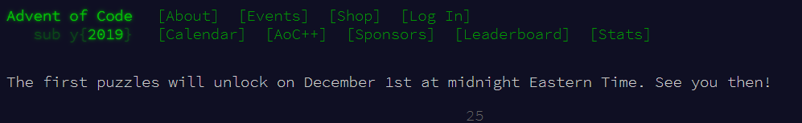
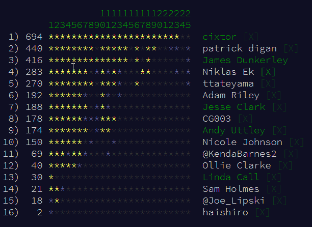
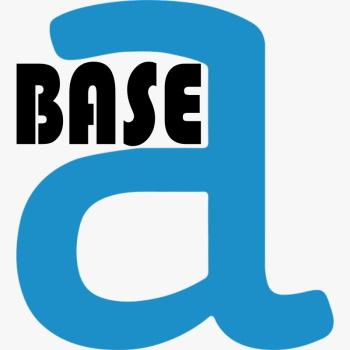

# Alteryxing the Advent of Code 2019

So the lights are up across London, the weather is atrocious and the trains are going nowhere fast; so it must be time to think about the [Advent of Code](https://adventofcode.com/). For those of you who haven't heard of it, this is a fantastic set of 25 puzzles released one by one every day in December until Christmas Day.

[Jesse Clark](https://community.alteryx.com/t5/user/viewprofilepage/user-id/4671) and I spoke about gamification within Alteryx at Inspire London this year. One of the ways I like to have fun with it is finding challenges which are fun to attempt to solve within the platform. The weekly challenges are a great set, but these are curated specifically for Alteryx. In the Advent of Code, the challenges are general programming problems that start off easy and get progressively harder and harder.

<iframe width="560" height="315" src="https://www.youtube.com/embed/PjihHsxxysI" frameborder="0" allow="accelerometer; autoplay; encrypted-media; gyroscope; picture-in-picture" allowfullscreen></iframe>

Alteryx is in many ways like a programming language, this naturally led Adam Riley to suggest last year that we try doing the Advent of Code in it. It was a lot of fun if very challenging. Following some very late additional solves [Patrick Digan](https://community.alteryx.com/t5/user/viewprofilepage/user-id/2387) is leading the real Alteryx entries:

## BaseA

The rules for playing are straight forward - solve the puzzle each day as quickly as you can using Alteryx. Nowadays Alteryx lets you lots of extra things so we need a few constraints - at London the ACE's nicked-named this rules BaseA:

- No RunCommand tool
- No Python tool
- No R tool
- No SDK based Custom Tools (macros are fine)
- No Formula SDK extensions
- Download tool allowed for downloading (no posting to APIs to get answers from!)

Thanks to [Sam](https://community.alteryx.com/t5/user/viewprofilepage/user-id/1179) for our logo.

Last year, some of the puzzles were beyond our capabilities with these constraints but many were perfectly solvable. If you want to read a retrospective of solving them, I wrote a post [here](https://jdunkerley.co.uk/2019/01/01/alteryx-ing-the-advent-of-code/).

## Come Join Us

So as we start another year's challenges, I invite you to come join us and see who can be the Alteryx user to achieve a perfect 25 Gold Stars. 

You can join the Alteryx leaderboard by going to https://adventofcode.com/2019/leaderboard/private and using the code `453066-ca912f80`. Last year we chatted on twitter (with the hashtag #AlteryxOfCode) but felt might be easier to chat on the Alteryx Community where we can share problems and solutions.
