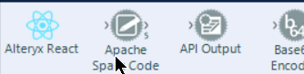

# React Alteryx Tools

A question recently came up on the community about an Alteryx custom tool using React. So I thought might be fun to come up with a guide of how to do this. The goals:

- Based off Create React App
- Typescript based
- Simple Python engine

# Set Up - Getting React Hello World Tool

So for my case, I am going to call it `alteryx-react` so a straight forward:

```bash
yarn create react-app alteryx-react --template typescript
```

After this we have a configured React project. My next step is to remove the service worker. So inside `src/index.tsx` remove the following lines:

```typescript
import * as serviceWorker from './serviceWorker';
...
// If you want your app to work offline and load faster, you can change
// unregister() to register() below. Note this comes with some pitfalls.
// Learn more about service workers: https://bit.ly/CRA-PWA
serviceWorker.unregister();
```

You can then also delete the `src/serviceWorker.ts` file.

Next up we need to wire it into Alteryx. Add a file called `alteryx-reactConfig.xml` with the following code:

```xml
<?xml version="1.0"?>
<AlteryxJavaScriptPlugin>
  <EngineSettings EngineDll="Python" EngineDllEntryPoint="alteryx-react.py" SDKVersion="10.1" />
  <GuiSettings Html="build/index.html" Icon="build/logo192.png" SDKVersion="10.1">
    <InputConnections>
    </InputConnections>
    <OutputConnections>
    </OutputConnections>
  </GuiSettings>
   <Properties>
    <MetaInfo>
      <Name>Alteryx React</Name>
      <Description>Hello World Tool in React</Description>
      <CategoryName>Developer</CategoryName>
      <SearchTags></SearchTags>
    </MetaInfo>
  </Properties>
</AlteryxJavaScriptPlugin>
```

We're getting close to something we can run in Alteryx. Let's download a few scripts which will install the new tool into Alteryx. The following are links to four scripts which create symbolic links adding the tool to Alteryx:

- [Install.ps1](https://github.com/jdunkerley/alteryx-react/blob/master/Install.ps1)
- [InstallerHTML.ps1](https://github.com/jdunkerley/alteryx-react/blob/master/InstallerHTML.ps1)
- [Uninstall.ps1](https://github.com/jdunkerley/alteryx-react/blob/master/Uninstall.ps1)
- [UninstallerHTML.ps1](https://github.com/jdunkerley/alteryx-react/blob/master/UninstallerHTML.ps1)

Download these four scripts into the `alteryx-react` project. Run `Install.ps1` and it will install into Alteryx.

Finally, we need to build the project so run `yarn build` and then we can open Alteryx. If all goes well a new tool will be present in the Developer tab:

