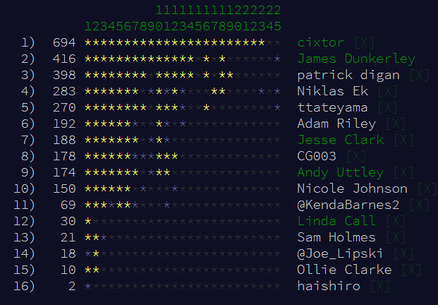

# Alteryx-ing the Advent of Code

For the last four year [Eric Wastl](http://was.tl/) has produced ['the Advent of Code'](https://adventofcode.com/). This year [Adam Riley](https://community.alteryx.com/t5/user/viewprofilepage/user-id/120) challenged us to try and [do it in Alteryx](https://community.alteryx.com/t5/Alteryx-Designer-Discussions/Advent-Of-Code/m-p/337533):

<blockquote class="twitter-tweet" data-partner="tweetdeck"><p lang="en" dir="ltr"><a href="https://twitter.com/hashtag/AdventOfCode?src=hash&amp;ref_src=twsrc%5Etfw">#AdventOfCode</a> Days 1-3 look very solvable with <a href="https://twitter.com/alteryx?ref_src=twsrc%5Etfw">@alteryx</a>! Who is in to see how far we can get? <a href="https://t.co/Ogq1O6Ps6o">https://t.co/Ogq1O6Ps6o</a></p>&mdash; Adam Riley (@AlteryxAd) <a href="https://twitter.com/AlteryxAd/status/1069619208865107969?ref_src=twsrc%5Etfw">December 3, 2018</a></blockquote>
<script async src="https://platform.twitter.com/widgets.js" charset="utf-8"></script>

As December (and Advent a week ago) has just finished, and as it is the start of 2019, I thought I would look back on how I got on. Alteryx is not the natural choice for some of these problems. Because of this, some of the techniques I used in the process were convoluted but could be adapted for other data processing use.

The rules of the challenge were simple:

- Must use Alteryx
- No use of the Python tool (this would count as another programming language)
- No use of the R tool (as above)
- No use of the SDK based tools or custom functions (this was waved as I got stuck!)

A fair few of us took part this year. The image below shows our leader board as of January 1, 2019:



## Score Sheet: 

First how I stand at present (on the 1st January): *(if I solve more will update)*

|Day   |1|2|3|4|5|6|7|8|9|10|11|12|13|14|15|16|17|18|19|20|21|22|23|24|25|
|------|-|-|-|-|-|-|-|-|-|--|--|--|--|--|--|--|--|--|--|--|--|--|--|--|--|
|Part 1|*|*|*|*|*|*|*|*|*|* |* |* |* |* |  |* |  |* |  |  |  |  |  |  |* |
|Part 2|*|*|*|*|*|*|*|*|X|* |* |* |* |X |  |* |  |* |  |  |  |  |  |  |  |

Those marked with:
- '*': Solved using just the standard Alteryx tools and functions.
- 'X': Required the [Abacus](https://github.com/jdunkerley/AlteryxFormulaAddOns) libraries, specifically the new variable system.

All the workflows can be downloaded from [GitHub](https://github.com/jdunkerley/adventofcode). They generally have my input stored inside them as a Text Input.

## Day By Day

This is my review of the various solutions I built, along with some of the tricks I used along the way. I'd love to hear other peoples suggestions for improvements and other solutions!

*Tips and Tricks:*
- Generate Rows and Append Fields to repeat: Day 1
- Regex Tokenise . to split string to rows: Day 2
- Cartesian Joins in the Join tool: Day 2
- Double Generate Tools to make a grid: Day 3
- Generating the alphabet: Day 5
- Replicating recursion: Day 8
- Fixed Length String Array: Day 9 (Part 1)
- Spatial charting: Day 10
- Binary and ASCII: Day 12
- Delimeted Array in String: Day 16 (Part 2)

### Day 1 - [Chronal Calibration](https://adventofcode.com/2018/day/1)
*Run time: 3.8s, 6 tools*

Straight out of the gate a particularly suited puzzle to Alteryx in part 1. Just keep a running total. A couple of tools and the answer came out. 

For part 2, need to repeat the input over and over and look for the first duplicate record. I chose a simple Generate Rows tool followed by an Append Fields to loop the input. To find the first duplicate row, I chose to use a Sample tool to skip the first occurence of each of running total followed by a Sort to put the first output at the top. 

### Day 2 - [Inventory Management System](https://adventofcode.com/2018/day/2)
*Run time: 1.6s, 20 tools*

First use of Regular Expressions. These were my friend during these problems. In this case, a string needed to be broken up into single records which can processed. The easiest way to do this is using the Regex tool in tokenise mode with an expression of `.`. After that part 1 was just a couple of summarise tools.

Part 2 again represented a little more of a challenge. You need to compare each row against each other. Using the Join tool but joining on a character index allowed for a 'cartesian join' after which a bit of summarising to find strings differing by one character.

### Day 3 - [No Matter How You Slice It](https://adventofcode.com/2018/day/3)
*Run time: 1.8s, 12 tools*

As becomes a common theme in the questions a grid is required for this puzzle. The input is a set of rectangles with widths and heights. Using a pair of generate tools you can convert to a set of XY co-ordinates. The first creates a set of X values for each rectangle. This is then fed into the second which generates the set of Y values.

A nice little trick of using the Min and Max in a summary to get if there is more than one value assigned to a square. A quick summarise tool produced the answer for Part 1. Part 2 involved a couple of joins and looking at the unjoined records to find the answer needed.

### Day 4 - [Repose Record](https://adventofcode.com/2018/day/4)
*Run time: 4.2s, 25 tools*

Demonstrating my choice of Regex for parsing input in this one and again using Generate Rows to create all the possible minutes.

### Day 5 - [Alchemical Reduction](https://adventofcode.com/2018/day/5)
*Run time: 56.1s, 19 tools and an iterative macro*

The first dive into iterative macros. Unfortunately iteration in Alteryx is quite slow and so even though this only needs about 3200 iterations it takes about 1 minute. The performance issue means in later puzzles 'inventive' solutions are needed to avoid using these macros.

The trick I liked most in this one was using a Generate rows tool to produce the ASCII codes of the alphabet and then using CharFromInt to create characters. The iterative macro has a nice feature of running until modification stops at which point it writes the result.

### Day 6 - [Chronal Coordinates](https://adventofcode.com/2018/day/6)
*Run time: 15.3s, 21 tools*

Back to building a XY grid again and then a cartesian join, this time using the Append tools. 

### Day 7 - [The Sum of Its Parts](https://adventofcode.com/2018/day/7)
*Run time: 44.3s, lots of tools and 2 iterative macros*

Part 1 follows one of the common community questions of walking a heirarchy picking off leaf nodes one at a time. This is a useful apprach that iterative macros are particularly suited for. Each iteration picks the first leaf letter sorted alphabetically.

My solution to part 2 involves simulating step by step each path until all are complete. In my case this took about 1000 iterations. My only trick here was to use two Record ID to join by row. In retrospect, I should have used the option in the join tool and made my second iterative macro simpler. All in all not the cleanest macro but sufficient to simulate the problem in a reasonable time frame.

### Day 8 - [Memory Maneuver](https://adventofcode.com/2018/day/8)
*Run time: 3m19s, 24 tools*

This one took a lot of thought in Alteryx. My immediate reaction to this was I wish I could recursively call a macro, and while I thought I might be able to generate workflows dynamically this felt insanely complicated. So onto my alternate solutions...

<blockquote class="twitter-tweet" data-conversation="none" data-lang="en"><p lang="en" dir="ltr">Was in a weird mood and refused to use macros for todays... works but my solution is not for the feint hearted!</p>&mdash; James Dunkerley (@jdunkerley) <a href="https://twitter.com/jdunkerley/status/1071317868804009984?ref_src=twsrc%5Etfw">December 8, 2018</a></blockquote>
<script async src="https://platform.twitter.com/widgets.js" charset="utf-8"></script>

Part 1 works using Multi-Row formula. The task is to walk a dictionary structure and hunt down until you find a complete element and add it together. Each element is of variable length with the children contained inline. I chose to do this by encoding the state in a string:

```
_8:X
_8:11
_7:11_6:X
_7:11_6:3
_7:11_5:3_4:X
_7:11_5:3_4:5
_7:11_5:3_3:5_3:X
```

Each set is separated by an `_`. A record constists of 2 numbers. The first number is the number children to match and second is the number of data fields.
The first record of each set is indicated by ending with an X, as we haven't read the number of children yet. The next row will declare the number of child elements. When a child record starts, we need to decrease the parent's child count by 1. Once all children are read then we read the data fields until record is complete. Again on each step I decrease the count in the string.

The expression is pretty hairy:

```
IF Right([Row-1:Totals],1)="X" THEN
	Substring([Row-1:Totals],0,Length([Row-1:Totals])-1) + [Field_1]
ELSEIF REGEX_Replace([Row-1:Totals],"^.*?(\d+):\d+$","$1") = "0" then
	IF Right([Row-1:Totals],4) = "_0:1" then
		Substring([Row-1:Totals], 0, Length([Row-1:Totals])-4)
	ELSE
		REGEX_Replace(
                     [Row-1:Totals],
			"^(.*):(\d+)$",
			"$1:"+ToString(ToNumber(REGEX_Replace([Row-1:Totals],"^.*:(\d+)$","$1"))-1))
	ENDIF
ELSE
	REGEX_Replace(
       	[Row-1:Totals],
		"^(.*)_(\d+):(\d+)$",
		"$1_" + ToString(ToNumber(REGEX_Replace([Row-1:Totals],"^.*?(\d+):\d+$","$1"))-1)+":$3")
	+ "_" + [field_1]+":X"
ENDIF
```

Having produced this sequence, a second Multi-Row formula reads the state of this value and can then produce the required sum. 

Part 2 came from the built structure as well but it involves a little extra work. First, I assigned an ID to each node. This needs to hold the structure of the tree so ends up being a path as well as the node ID. For example:

```
1
11
12
121
13
```

After this a few joins and sums produce the final results.

### Day 9 - [Marble Mania](https://adventofcode.com/2018/day/9)
*Run time: Part 1 - minutes, Part 2 - hours, a lot....*

This one really didn't suit Alteryx at all. It's basically a large scale iteration inserting and removing records from a list. This would be a fairly straight forward problem for a programming language but not easy in Alteryx unfortunately. 

#### Part 1

This required running 70k iterations. My first attempts to do this with an iterative macro took ages. Again, iterative macros were not the way to go.

I then tried using strings with delimeters and regular expressions again. A generate rows tool creates all the iterations I need. This was reasonably successful but in the end I gave up on this approach and went for fixed length strings for each value in the list.

I broke the problem into a couple of steps. Step 1 used a multi-row formula tool to work out where to write or remove the value from in the list. Step 2 then manipulates the string:

```
IIF([Marble]=0,[MarbleStr],
  iif([Action]=1,
    Left([Row-1:Positions],Current * [Length])
    + [MarbleStr] + 
    SubString([Row-1:Positions],Current * [Length]),
    Left([Row-1:Positions],(Current - 1) * [Length])
    + SubString([Row-1:Positions],Current * [Length]))
)
```

In the end this approach was fairly quick and easy to work with.

#### Part 2

This required running 7,000,000 iterations. Gulp.

My first attempt was to just scale up the number of Part 1 and let it keep running. Unfortunately this wasn't practical. The length of the string needed to be increased to hold 7 digits. In addition, the size of the string being manipulated goes up and up and is soon in the order of megabytes. Each step takes longer and longer to iterate.

What I really needed was a List object allowing for manipulation. After banging my head against this for a few days in the end I admitted defeat and implemented a list variable type in the Abacus library and allowed use of that. I will do a post on the new variable system built into the Abacus library as well as an additional post on the list system I added.

### Day 10 - [The Stars Align](https://adventofcode.com/2018/day/10)
*Run time: 15.3s, 21 tools*

This one needed a little thought before build. A brief look at the data suggest the values that might be a good place to start and then I shifted it up and down a single step. One nice trick was to convert the XY points to Spatial point and plot in a browse tool to read the result. 

### Day 11 - [Chronal Charge](https://adventofcode.com/2018/day/11)
*Run time: 1m19, 12 tools*

Lots of generate row tools here (4 of them) in a series. A fairly quick and dirty brute force solution - but an easy approach in Alteryx.

### Day 12 - [Subterranean Sustainability](https://adventofcode.com/2018/day/12)
*Run time: 13.5s, 28 tools and an iterative macro*

This one got to use Alteryx Binary and ASCII functions to encode the strings and match. This allowed for some nice use of the Find and Replace allowing for the process to performed in a couple of tools.

One other nice trick of note, is using a filter to loop round in an iterative macro terminating when a specific number of iterations has been met. When true the records are looped, when false the records are returned:

```
[Engine.IterationNumber]<200
```

For part 2, the Browse tool, it's interactive charting, and some thought made it clear that the solution was not to run for a long time but to look at the results and make a prediction.

### Day 13 - [Mine Cart Madness](https://adventofcode.com/2018/day/13)
*Run time: 4m09, 43 tools and an iterative macro*

When I first read this question I completely misunderstood it and came up with a nice approach for a completely different question! After a bit of re-reading understood my mistake. 

I first took the appraoch of reading the data into a map and into positions of the carts. After this the iterative macro is not too hard to implement. This macro just moves each cart and doesn't worry about impacts. The parent workflow then checks for impact on the movement of each cart. 

For part 2, I ended up running 20,000 iterations. Again this took a lot longer than I would have liked but by far the simplest solution for this puzzle.

### Day 14 - [Chocolate Charts](https://adventofcode.com/2018/day/14)

Again this involves building a list of values and continually adding a value and reading values from the list. I did succeed on implementing Part 1 without using any non-core feature just using an iterative macro. Part 2 needed the Abacus VarList functionality again. It required running 32,000,000 tests in my case to find the final result. This wasn't practical with the iterative macro approach.

### Day 16 - [Chronal Classification](https://adventofcode.com/2018/day/16)
*Run time: 2.3s, 42 tools and iterative macro*

This was a lot of fun to build. For part 1, I kept it simple and built each expression as its own formula tool. It was a fun challenge and produced a nice looking workflow.

For part 2, I again used a hierarchy walker style iterative macro to identify each number with its command. Then a long switch statement to actually perform the calculation. I did think it would be a lot of fun to build a dynamic formula and then run it dynamically but that seemed overkil. In terms of holding state of the registers, this time I chose to use a delimited string list and then used regular expression to read and write the values. Creating the expression was a little fiddly and I ended up using VS Code to help me write the actual formula.

### Day 18 - [Settlers of The North Pole](https://adventofcode.com/2018/day/18)
*Run time: 2.3s, 33 tools and iterative macro*

Again build an XY grid again. The iterative macro performs the state changes as described in the question, with again a termination process based on number of iterations. I chose to run it 600 times printing out the state on each line. Part 1 came out easily enough.

As with day 12 part 2, part 2 needed a look at the results in a Browse window and then to make a prediction. Unlike day 12 I did end up encoding that into the workflow.

## Wrapping Up

Well, I hope this gives some insight into the processes I used to work through Advent of Code. It was a lot of fun trying to see what was or wasnt possible within Alteryx. I'd like to work towards the mythical 50 stars but most of the remaining challenges will take significant investments of time.

Hope to see you Alteryx-ing the 2019 Advent of Code.