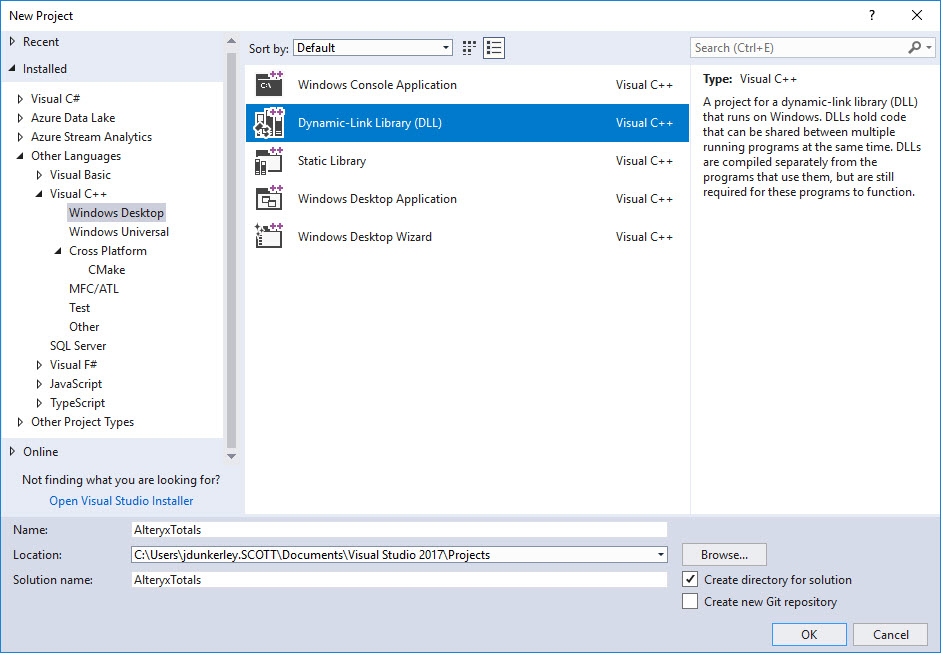
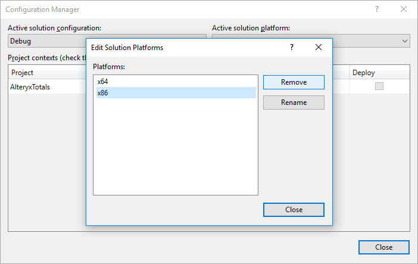
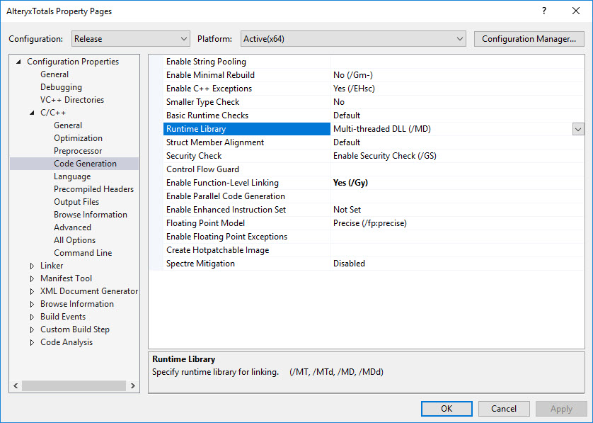
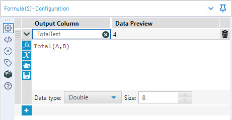

# Creating An Alteryx Custom Function in C++

At [Inspire EU 18](https://www.alteryx.com/inspire-europe-2018/), I presented a talk on [how to create custom functions](https://www.youtube.com/watch?v=vm2H9TXJ0Pc) for Alteryx. As I described, there are two options available - XML Macro functions and C++ Coded functions. In a [previous post](https://jdunkerley.co.uk/2016/08/13/beyond-alteryx-macros-part-2-how-to-create-an-xml-macro-function/), I have gone through creating an XML function. This post will look at creating a very simple function - a simple `TOTAL` function adding all numerical inputs.

## Why Would I Want To?

The main reasons for wanting to create new functions is to extend functionality. Technically, the XML Macro functions are just a shorthand to existing expressions (although this is still a very powerful abilty) - you cannot make Alteryx do anything fundamentally new using this method. The C++ coded functions however allow you to do anything you like within a function (assuming your C++ is up to it!).

They remove a lot of the limitations that the XML functions have. It is straight forward to take a variable amount of inputs and handle appropriately. You can deal with invalid inputs gracefully and return errors (with hopefully helpful messages) back to the end user.

In addition, you can test these with C++ testing frameworks. XML functions need to be tested from within Alteryx and while I am a strong proponent of test workflows, the added benefit of additional unit tests are good.

## Some Initial Warnings

As with all SDK functions or tools, any workflow which uses them can only be run on machines which have them installed. If you export a workflow it will only export macros, it does not package custom tools or functions. I would love to see a [NuGet](https://www.nuget.org/) style packing system built into Alteryx where workflows will install `yxi` files they need. 

Unlike many of the SDKs within Alteryx, the custom function SDK is not used by Alteryx themselves. This is one of the very few places I have encountered bugs in the engine. In all cases, they have been easy to workaround and quickly fixed when reported to Alteryx.

Finally, this SDK is very old - it been there ever since I became a user (but that was only version 9). Unfortunately, there are a few limitations with it. For example, there is no way to detect you are in parse mode as opposed to execution mode.

## Getting Started

For this guide, I will be using the current version of Alteryx Design 2018.4 and [Visual Studio 2017](https://visualstudio.microsoft.com/downloads/). Community edition is perfectly good enough. I think you could also build these in any standard C++ compiler with any editor but I haven't had time to try. 

First, we need to create the new project in Visual Studio and configure as we need. Go to *New Project* and find C++. In my case, it is in *Other Languages* (as my Visual Studio is configured for primarily C#). You may need to adjust your installation to include the C++ project types if it is not there. Once you have found it, you need to create a [*Dynamic-Link Library (DLL)*](https://en.wikipedia.org/wiki/Dynamic-link_library).



This will take a few seconds to create the project. Next, configure the project. Alteryx is 64-bit (since v11 there hasn't been a [32-bit version](https://www.alteryx.com/support-32-bit-windows-systems)) - so first I remove 'x86' from the list. Goto *Build* and then *Configuration Manager*, select the drop down in *Active Solution Platform* and go to *Edit*.



The next step is to adjust the project properties so it compiles with the [C++ Standard Library](https://en.wikipedia.org/wiki/C%2B%2B_Standard_Library) embeded inside the resulting DLL. While not strictly necessary for your own PC, this will make it a lot easier to distribute the resulting code. In the Solution Explorer, choose the project and go to properties window (Right Click or press Alt-Enter).



Inside here, within *C/C++* and then *Code Generation*, there is the innocent sounding *Runtime library*. This is by default on `Multi-threaded DLL (/MD)` for Release mode and `Multi-threaded Debug DLL (/MDd)` for Debug mode. This means it will using the runtime dynamically. If you use this locally or are using the same version as Alteryx uses then it will work fine. However, for general compatibility if you switch to `Multi-threaded (/MT)` for Release mode and `Multi-threaded Debug (/MTd)` for Debug mode, then it will embed the standard library into the compiled DLL. This makes the DLL a little bit bigger but easy to distribute.

I also turn off [Precompiled Headers](https://en.wikipedia.org/wiki/Precompiled_header) for all modes. They seemed to cause me issues and didn't make much difference being there or not. Just set to 'Not Using Precompiled Headers` in the project properties.

I then choose to delete `stdafx.cpp`, `targetver.h` and `dllmain.cpp` files. You also need to remove the line to `#include "targetver.h"` in `stdafx.h`. As `stdafx.h` will make people think you are using precompiled headers, I rename it to `common.h`. This leaves a project structure which looks like:

```none
├── AlteryxTotals
│   ├── AlteryxTotals.cpp
│   ├── AlteryxTotals.vcxproj
│   ├── AlteryxTotals.vcxproj.filters
│   ├── AlteryxTotals.vcxproj.user
│   └── common.h
└── AlteryxTotals.sln
```

## Enough with the setup on with the code...

First, we need to define the Alteryx types needed. Add a new [header file](https://docs.microsoft.com/en-us/cpp/cpp/header-files-cpp?view=vs-2017), say called `AlteryxFunctions.h` and set the content to:

```cpp
#pragma once
#include "common.h"

// Constants For nVarType
const int nVarType_DOUBLE = 1;
const int nVarType_WCHAR = 2;

//  API definition for Formula functions plug ins
struct FormulaAddInData
{
	int nVarType;
	int isNull;

	double dVal; 
	const wchar_t * pVal;

	FormulaAddInData()
	{
		memset(this, 0, sizeof(*this));
	}
};

// Function Defintion
typedef long(_stdcall * FormulaAddInPlugin)(int nNumArgs, FormulaAddInData *pArgs, FormulaAddInData *pReturnValue);
```

### Too much detail on the header file

For those of us not familiar with header files (pretending for a second I know them inside and out), lets talk about what is in here.

```cpp
#pragma once
#include "common.h"
```

The `#` symbol means these are [preprocessor directives](http://www.cplusplus.com/doc/tutorial/preprocessor/). The first line is a ["Header Guard"](https://en.wikipedia.org/wiki/Include_guard) which means the file is only processed once by the compiler no matter how many times it is referenced. The second line includes the `common.h` file, this is needed to define the `memset` function used later. Moving onto the next block:

```cpp
// Constants For nVarType
const int nVarType_DOUBLE = 1;
const int nVarType_WCHAR = 2;
```

This defines constants to identify the variable type Alteryx passes into your function. All custom function variables are passed either as double values (assuming a numberic type in Alteryx) or as unicode character array (assuming a text or date time value in Alteryx). Alteryx tells you what time the variable is by passing one of the two values above. The constants just mean you can use friendly code and not need to remember which one is which!

```cpp
struct FormulaAddInData
{
	int nVarType;
	int isNull;

	double dVal; 
	const wchar_t * pVal;

	FormulaAddInData()
	{
		memset(this, 0, sizeof(*this));
	}
};
```

The above [struct](http://www.cplusplus.com/doc/tutorial/structures/) is how Alteryx will pass values into and how you are expected to return your results. Looking at the members:

- `nVarType`: defines the value type (double or wchar*)
- `isNull`: indicated if the value is `NULL` - 1 for `NULL`, 0 otherwise
- `dVal`: if the value is not `NULL` and is a double (i.e. if `isNull == 0 && nVarType == nVarType_DOUBLE`) then will be the value
- `pVal`: if the value is not `NULL` and is a wchar* (i.e. if `isNull == 0 && nVarType == nVarType_WCHAR`) then will be the value

The last part defines the [default constructor](https://docs.microsoft.com/en-us/cpp/cpp/constructors-cpp?view=vs-2017#default_constructors) for the struct. It is worth noting that the engine of Alteryx is amazingly memory efficient and it will reuse the struct over and over, hence you must check the `isNull` for each execution.

```cpp
typedef long(_stdcall * FormulaAddInPlugin)(int nNumArgs, FormulaAddInData *pArgs, FormulaAddInData *pReturnValue);
```

This is the definition of a custom C++ function in Alteryx. They all look like this. Lets run over the definition:

- `typedef`: This tells the compiler to create an alias for a [function pointer](https://en.wikipedia.org/wiki/Function_pointer)
- `long`: This specifies the return type as a long. If you function succeeds you should return 1 and 0 otherwise
- `_stdcall`: This is a calling convention for Win32 API. More details [here](https://docs.microsoft.com/en-us/cpp/cpp/stdcall?view=vs-2017).
- `* FormulaAddInPlugin`: This specifies that this type definition is a pointer and is called `FormulaAddInPlugin`
- `int nNumArgs`: Alteryx will tell you how many arguments you have been passed. When we get to the XML definition for the function, you can define a variable number of arguments and then this will tell you how many we passed.
- `FormulaAddInData *pArgs`: The input arguments are passed as an array.
- `FormulaAddInData *pReturnValue`: This is struct how you return the value back from your function to Alteryx.

## Onto the C++ Code

Now to write the function. Open the *cpp* file already present. Add an include for the `AlteryxFunction.h` and remove the old reference to `stdafx.h` (as included in the new header file):

```cpp
#include "AlteryxFunction.h"
```

Next, we define the function:

```cpp
extern "C" long _declspec(dllexport) _stdcall Total(int nNumArgs, FormulaAddInData *pArgs, FormulaAddInData *pReturnValue)
{
	pReturnValue->nVarType = nVarType_DOUBLE;

	double total = 0;
	for (auto argNum = 0; argNum < nNumArgs; argNum++)
	{
		if (pArgs[argNum].nVarType != nVarType_DOUBLE)
		{
			return 0;
		}

		if (pArgs[argNum].isNull)
		{
			pReturnValue->isNull = 1;
			return 1;
		}

		total += pArgs[argNum].dVal;
	}

	pReturnValue->isNull = 0;
	pReturnValue->dVal = total;
	return 1;
}
```

Lets go over the function in detail. Starting with declaration:

- `extern "C"`: This makes the C++ function not have it's name mangled by the compiler. This mean Alteryx can find it by name and link to it.
- `long`: This specifies the return type for function.
- `_declspec(dllexport)`: This tells the compiler to export the function in the DLL. Again, allowing Alteryx to call it.
- `_stdcall`: As before, this specified the calling the convention.
- `Total`: This is the name of the function. When we come to the XML definition file we must match this name exactly including case.
- `(int nNumArgs, FormulaAddInData *pArgs, FormulaAddInData *pReturnValue)`: This is the same arguments as described in the `typedef` part above.

Onto the actual function code. Picking out some highlights:

```cpp
pReturnValue->nVarType = nVarType_DOUBLE;
```

This tells Alteryx the return type is a double. It is important you tell Alteryx what type your function returns, regardless of input as parse phase uses the type to work out whether the syntax of an expression is valid.

```cpp
if (pArgs[argNum].nVarType != nVarType_DOUBLE)
{
	return 0;
}
```

This is handling if we are passed an non-numeric argument. In this case, the evaluation should fail and return to Alteryx. Ideally, you would return an error message but I will talk about those in a later post.

```
if (pArgs[argNum].isNull)
{
	pReturnValue->isNull = 1;
	return 1;
}
```

In this section, I am handling a `NULL` value being passed. The function then returns `NULL` but tells Alteryx that evaluation was successful (`return 1`). When thinking about the design of Alteryx funciton, how you handle `NULL` is a very important consideration.

```
pReturnValue->isNull = 0;
pReturnValue->dVal = total;
return 1;
```

This is the happy path exit. The total is returned to Alteryx by setting `dVal` and stating that the result is not `NULL`. Again `return 1`, tells Alteryx that evaluation was success.

At this point, try to compile the project and hopefully it will succeed. You should end up with a file structure like:

```none
├── AlteryxTotals
│   ├── AlteryxFunction.h
│   ├── AlteryxTotals.cpp
│   ├── AlteryxTotals.vcxproj
│   ├── AlteryxTotals.vcxproj.filters
│   ├── AlteryxTotals.vcxproj.user
│   ├── common.h
│   └── x64
│       └── Debug
			...
├── AlteryxTotals.sln
└── x64
    └── Debug
        ├── AlteryxTotals.dll
        ├── AlteryxTotals.exp
        ├── AlteryxTotals.ilk
        ├── AlteryxTotals.lib
        └── AlteryxTotals.pdb
```

The output we care about is the dll file in `x64\Debug`

## XML Definition File

The last file we need is an XML function definition. I suggest you create it in the folder containing the solution file (sln file). It can be named anything but I would match the dll filename (e.g. AlteryxTotals.xml). Add the following:

```xml
<?xml version="1.0" encoding="utf-8"?>
<FormulaAddIn>
  <Function>
    <Name>TOTAL</Name>
    <NumParams variable="true">0</NumParams>
    <Category>Math</Category>
    <InsertText>TOTAL(Value1,Value2,...)</InsertText>
    <Description>Sums the input values</Description>
    <Dll>
      <Name>AlteryxTotals.dll</Name>
      <EntryPoint>Total</EntryPoint>
    </Dll>
  </Function>
</FormulaAddIn>
```

Take a look at my post on [XML functions](https://jdunkerley.co.uk/2016/08/13/beyond-alteryx-macros-part-2-how-to-create-an-xml-macro-function/) for most of the meanings of the XML. The special part for C++ functions is just the Dll part. This specifies the name of the file for Alteryx to read and the name of the function to call. This is *case-sensitive*, and must match the case in the cpp file exactly.

## Installing In Alteryx

Copy the DLL and XML file into the `bin\RuntimeData\FormulaAddIn` folder of your Alteryx install. If you have an admin install, you will need to do this as an administator. Restart Alteryx and hopefully it will show up and work:



## Wrapping It Up

Congratulations - you have created your first custom function in C++. In another post I'll look at handling strings and returning error messages.

The code for this post is available [here](https://www.dropbox.com/s/94o1hx5c5485hkr/AlteryxTotals.zip?dl=0)

A huge thanks to the amazing [Alteryx ACEs](https://community.alteryx.com/t5/ACE-Program/bd-p/ace-program) and [Ned Harding](https://inspiringingenuity.net/) for helping review this post.