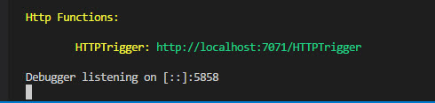
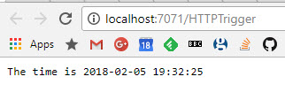
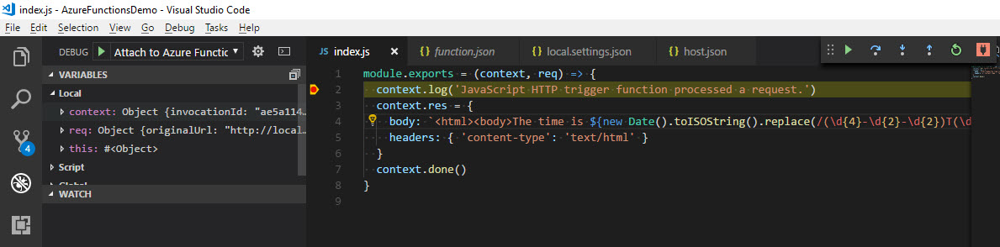

# Creating a Simple Azure Function in JavaScript with VS Code


Azure Functions are a serverless way to create application within the Azure cloud. They can be written in a variety of languages (C#, JavaScript for example) using a variety of tools (or just in the web UI). This post walks through creating a simple HTTP server which will return the current time. The function will be written in JavaScript using VS Code (and all the comamnds I use can be executed within the integrated PowerShell terminal there as well).

## Why Using Functions

Serverless architecture is very popular at the moment. They allow you to easily get an application or service up and running and easily scale from a tiny instance through to managing a huge number of requests. The 'pay and go' nature of serverless instance means you only pay for what you need and don't have redundant processes running unnecessarily. In addition due to the nature of the serverless instance, there are some nice security benefit in that each execution of process is running in a known state.

[Azure Functions](https://azure.microsoft.com/en-us/services/functions/) allow you to provide a simple application with different 'hooks' which trigger it to run. These can be simple web hooks (as will be the case in this walkthrough) or events on other cloud based services (for example a file being written to OneDrive). One nice benefit of Azure Functions is that they can easily be tied into services of other vendors. They are of course not alone, AWS offers [Lambdas](https://aws.amazon.com/lambda/) and GCP has [functions](https://cloud.google.com/functions/) (which is still in beta).

Their pricing model is based on the compute time of the function. As there is no virtual machine or even container running when the function isn't executing this is a great model. Both [Azure](https://azure.microsoft.com/en-us/pricing/details/functions/) and [AWS](https://aws.amazon.com/lambda/pricing/) have the same free tier of 400,000 GB-seconds or 1 million requests. Exactly how quickly you will go through the GB-s will depend on complexity of the function and the size of the host instance you choose.

So which one to use - AWS, Azure of GCP? At the time of writing, GCP is still in beta and not subject to any SLA or guarentees. For that reason, I would probably select one of the other two. The language range of AWS and Azure may be a factor - for example AWS support Java where as Azure does not. Lambdas are more limited to other AWS services but if you are already in AWS that is probably not an issues. The two big things that I think Azure functions have over AWS lambda are great local debugging support and the ability to deploy on premise. I won't cover the on premise side in this post but read the overview of [Azure Function Runtime](https://docs.microsoft.com/en-us/azure/azure-functions/functions-runtime-overview) for more details.

## Getting Started

You will need a new version of [NodeJS](https://nodejs.org/en/) (version 8.5 or later) installed. In addition you will need the [azure-functions-core-tools](https://www.npmjs.com/package/azure-functions-core-tools) npm package installed. Version 1 of library this only works on Windows (as it uses the .Net Framework), however there is a version 2 currently in preview which uses .Net Core and can be run anywhere. This guide uses version 1.0 on Windows. To install the functions run:

```bash
npm i -g azure-functions-core-tools@core
```

which will produce something like:

```none
C:\Repos\AzureFunctionFirst> npm i -g azure-functions-core-tools
C:\Users\jdunk\AppData\Roaming\npm\azurefunctions -> C:\Users\jdunk\AppData\Roaming\npm\node_modules\azure-functions-core-tools\lib\main.js
C:\Users\jdunk\AppData\Roaming\npm\func -> C:\Users\jdunk\AppData\Roaming\npm\node_modules\azure-functions-core-tools\lib\main.js
C:\Users\jdunk\AppData\Roaming\npm\azfun -> C:\Users\jdunk\AppData\Roaming\npm\node_modules\azure-functions-core-tools\lib\main.js

> azure-functions-core-tools@1.0.8 postinstall C:\Users\jdunk\AppData\Roaming\npm\node_modules\azure-functions-core-tools
> node lib/install.js

+ azure-functions-core-tools@1.0.8
added 45 packages in 18.724s
```

### func init

To create the project, run

```bash 
func init AzureFunctionsDemo
```

This will create a new folder called `AzureFunctionsDemo` ready to host functions with:

```none
├── .vscode
|   └── launch.json
├── .gitignore
├── host.json
└── local.settings.json
```

It will also run `git init` on the folder. The `.gitignore` is set to ignore various .Net and JS files by default. 

The `local.settings.json` is a file allowing for local connections and settings needed to run or debug the funcion locally. It is listed in the `.gitignore` so it won't be committed. You can read more on the [online documentation](https://docs.microsoft.com/en-us/azure/azure-functions/functions-run-local#local-settings-file).

The `launch.json` file configures how VS Code will debug the functions. Again this won't be committed to git. The set up is just to attach to a node instance.

The `host.json` file is empty at this point but it will be where all the settings go needed to run the functions either locally or in Azure. The file is currently empty but we will populate later in this post.

### func templates and func new

Next is to create our first function. There are various templates built into the npm library. If you run `func templates list` you will get a list of all the templates for all the langauages (103 templates currently in 9 languages). If you run `func templates list -l JavaScript` then you just get the JavaScript ones

```none
  Blob trigger
  Cosmos DB trigger
  Event Grid trigger
  Event Hub trigger
  External file trigger
  Face locator
  Generic webhook
  GitHub commenter
  GitHub webhook
  HTTP GET
  HTTP POST
  HTTP trigger
  HTTP trigger with parameters
  IoT Hub (Service Bus Queue)
  IoT Hub (Service Bus Topic)
  IoT Hub (Event Hub)
  Manual trigger
  Queue trigger
  SAS token generator
  SendGrid
  Service Bus Queue trigger
  Service Bus Topic trigger
  Timer trigger
```

For this case I am going to use the 'HTTP trigger with parameters'. Within the `AzureFunctionsDemo` folder run:

```bash
func new -l JavaScript -n HTTPTrigger -t 'HTTP trigger with parameters'
```

This will create a new folder caller `HTTPTrigger` so that the whole tree looks like:

```none
├── .vscode
|   └── launch.json
├── HTTPTrigger
|   ├── function.json
|   └── index.js
├── .gitignore
├── host.json
└── local.settings.json
```

### function.json configuration

The `function.json` is the configuration of the Azure Function. It defines the bindings of the function which will trigger execution. The default contents of this looks like:

```json
{
  "disabled": false,
  "bindings": [
    {
      "authLevel": "function",
      "type": "httpTrigger",
      "direction": "in",
      "name": "req",
      "route": "HttpTriggerJS/name/{name}",
      "methods": [
        "get"
      ]
    },
    {
      "type": "http",
      "direction": "out",
      "name": "res"
    }
  ]
}
```

The `disabled` property allows you control whether the function is active (`false`) or inactive (`true`). The `bindings` property contains an array triggers and bindings. All bindings must have a `name`, `type` and `direction` property.

The first binding, called `req`, is an inbound (`"direction": "in",`) HTTP trigger (`"type": "httpTrigger",`). The `name` property should be equal to the variable name used to hold the incoing connection.

The default `authLevel` requires a function-specific API-key to be given to allow execution. There are three valid values for this property: `anonymous`, `function`, `admin`. If not present, then the default is `function`. Admin access requires the functions "master" key, which cannot be revoke and provides access to the runtime APIs. This should not be shared with third parties and used with caution. In this case all I need is anonymous access.

The `methods` property is an array of acceptable HTTP verbs. By default it is set to allow only GET requests. If the property is not present then the function will allow all verbs. For this case, GET is all I need.

The `route` property specifies the routes that the function will be invoked on. If not present it will trigger on `<FunctionName>`. 

The second binding is the outbound http response. This must always be present and the name must be the property name on the `context` used in the code for the response. The adjust file looks like:

```json
{
  "disabled": false,
  "bindings": [
    {
      "direction": "in",
      "name": "req",
      "type": "httpTrigger",
      "authLevel": "anonymous",
      "methods": ["get"]
    },
    {
      "direction": "out",
      "name": "res",
      "type": "http"
    }
  ]
}
```

### index.js script

This is the actual executable of the function. You need to export a function using the standard `module.exports` syntax, which will be executed when the function is triggered. The `func new` method will create a starting point. Following a little tidying, the code for my function looks like:

```javascript
module.exports = (context, req) => {
  context.log('JavaScript HTTP trigger function processed a request.')
  context.bindings.res = {
    body: `<html><body>The time is ${new Date().toISOString().replace(/(\d{4}-\d{2}-\d{2})T(\d{2}:\d{2}:\d{2}).*/,'$1 $2')}</body></html>`,
    headers: { 'content-type': 'text/html' }
  }
  context.done()
}
```

This is a simple function which will return a basic HTML page displaying the current time. 

The arguments of the function always start with a `context` object. The other arguments passed represent each of the bindings defined in the `function.json`. As always with JavaScript, you can just ignore these if you don't need them.

The context object provides a set of useful properties for interacting with the runtime environment. The first property `context.log` allows you to log messages from the function. The standard `console.log` method is not available. In addition the log function has `error`, `warn`, `info` and `verbose` methods you can use for different severity. The severity of the default method can be controlled in the `host.json` file.

The bindings are also exposed via the `context` object as a `bindings` property. Here all the bindings are stored by their name allowing for easy access. For example, the incoming request can be accessed as `context.bindings.req` for this example. The outgoing bindings can also be set using this context (as in the code above).

Finally, the `context.done` method tells the runtime that execution has completed. This method allows for the development of asyncronous functions, calling back once everything is done. The method takes two optional arguments. The first allows you to pass back an error to the runtime. THe second allows you to pass an object whose properties will be used to populate the outgoing bindings.

## Configuring host.json

Now we need to set up the `host.json`. There is a massive amount of [options](https://docs.microsoft.com/en-gb/azure/azure-functions/functions-host-json) on this file. For this case we need to configure only a few:

```json
{ 
    "functions": [ "HTTPTrigger" ],
    "id": "3adb8c2ca78f4171bab74dfc9c600a2f",
    "functionTimeout": "00:00:30",
    "http": {
        "routePrefix": ""
    },
    "tracing": {
        "consoleLevel": "verbose"
    }
}
```

The first two properties are only needed for local execution. When running within Azure they are not needed. The `functions` is just an array list of all the functions to run. The `id` property is a random unique id. I generated this one using a simple PowerShell command - `(New-Guid).ToString().Replace("-","").ToLower()`.

The `functionTimeout` specifies how long execution is allowed to take. Any value from 1 second to 10 minutes is allowed. 

The `http` settings control the HTTP binding. In this case I am removing the `/api` default prefix so the function root url is used.

Finally, the `tracing` settings specify that `context.log` is as the `trace` level.

## Running locally and attaching VS Code

We now have a function ready to test. All we need to do is run `func host start` and the process will run. 



You can access the output of the function via the first displayed Uri in a browser, if all is working it will display the current time:



Note in the console output above, there is a debugger sat listening. The `func init` command set up for VS Code to be able to connect to this. If you go to the Debug tab (Crtl-Shift-D) within VS Code there should be an entry `Attach to Azure Functions`. Click play and you will be able to set a break point inside `index.js` and debug:



## Publishing to Azure

While the Functions Core Tools allow for the updating of a function they don't support the initial publishing of a function. To do that from the command line you will need to install the [Azure CLI](https://docs.microsoft.com/en-us/cli/azure/overview?view=azure-cli-latest).

First you will log into the CLI. Run `az login` and follow the instructions to log in within a browser. It will return a JSON structure of all your subscriptions if it logs in successfully. If you run the command `az accout list -o tsv`, you will get a table view of all you subscriptions. The third column will show the active subscription as `True`.  You can change the subscription by using the command `az account set --subscription <Subscription>` passing either the subscription id (column 6 from the list) or if unique the subscription name (column 4).

