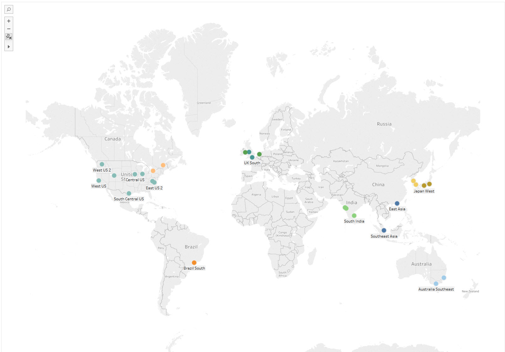
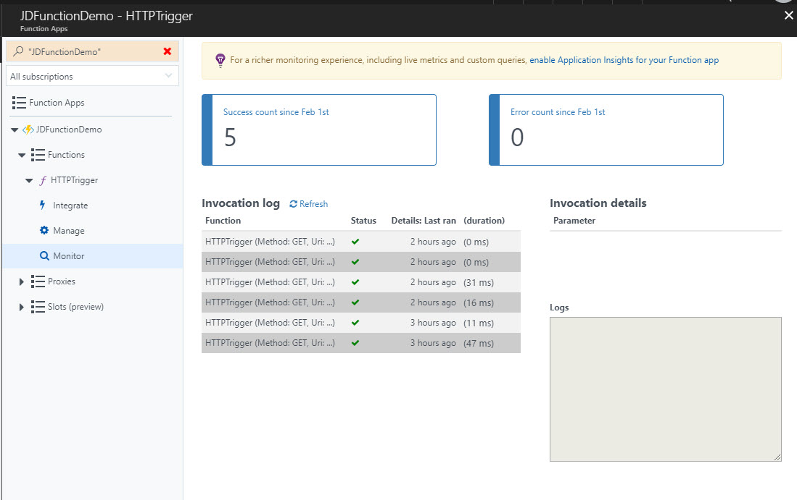

# Creating a Simple Azure Function in JavaScript with VS Code


Azure Functions are a serverless way to create applications within the Azure cloud. They can be written in a variety of languages (C#, JavaScript for example) using a variety of tools (or just inside the web UI). This post walks through creating a simple HTTP server which will return the current time. The function will be written in JavaScript using VS Code (and all the commands I use can be executed within the integrated PowerShell terminal there as well) using the Azure CLI.

## Why Use Functions

Serverless architectures are very popular at the moment. They allow you to easily get an application or service up and running and quickly scale from a tiny instance through to managing massive simultaneous requests. The 'pay and go' nature of serverless instances mean you only pay for what you need and don't have redundant processes or machines running unnecessarily. In addition, due to the nature of the serverless instance, there are some nice security benefits in that each execution runs in a known state in its own space.

[Azure Functions](https://azure.microsoft.com/en-us/services/functions/) allow you to provide a simple application with different 'hooks' which trigger it to run. These can be simple web hooks (as will be the case in this walkthrough) or events on other cloud-based services (for example a file being written to OneDrive). One nice benefit of Azure Functions is that they can easily be tied into services of other vendors for example Twilio or GitHub. They are of course not alone, AWS offers [Lambdas](https://aws.amazon.com/lambda/) and GCP has its own [functions](https://cloud.google.com/functions/).

Their pricing model is based on the compute time of the function. As there is no virtual machine or even container running when the function isn't executing this is a great model. Both [Azure](https://azure.microsoft.com/en-us/pricing/details/functions/) and [AWS](https://aws.amazon.com/lambda/pricing/) have the same free tier of 400,000 GB-seconds or 1 million requests. Exactly how quickly you will go through the GB-s will depend on the complexity of the function and the size of the underlying host instance you choose.

So which one to use - AWS, Azure of GCP? At the time of writing, GCP is still in beta and not subject to any SLA or guarantees. For that reason, I would probably select one of the other two. The language range of AWS and Azure may be a factor - for example AWS supports Java whereas Azure support is still in preview. Lambda is more limited to other AWS services, Functions more aimed at Azure - so you are already in AWS or Azure that will be a big factor. The two big things that I think Azure Functions have over AWS Lambda are great local debugging support and the ability to deploy on-premise. I won't cover the on-premise side in this post but read the overview of [Azure Function Runtime](https://docs.microsoft.com/en-us/azure/azure-functions/functions-runtime-overview) for more details.

## Getting Started

You will need a new version of [NodeJS](https://nodejs.org/en/) (version 8.5 or later) installed. In addition you will need the [azure-functions-core-tools](https://www.npmjs.com/package/azure-functions-core-tools) npm package installed. Version 1 of the library this only works on Windows (as it uses the .Net Framework), however, there is a version 2 currently in the preview which uses .Net Core and can be run anywhere. This guide uses version 1.0 on Windows. To install the functions run:

```bash
npm i -g azure-functions-core-tools
```

which will produce something like:

```none
C:\Repos\AzureFunctionFirst> npm i -g azure-functions-core-tools
C:\Users\jdunk\AppData\Roaming\npm\azurefunctions -> C:\Users\jdunk\AppData\Roaming\npm\node_modules\azure-functions-core-tools\lib\main.js
C:\Users\jdunk\AppData\Roaming\npm\func -> C:\Users\jdunk\AppData\Roaming\npm\node_modules\azure-functions-core-tools\lib\main.js
C:\Users\jdunk\AppData\Roaming\npm\azfun -> C:\Users\jdunk\AppData\Roaming\npm\node_modules\azure-functions-core-tools\lib\main.js

> azure-functions-core-tools@1.0.8 postinstall C:\Users\jdunk\AppData\Roaming\npm\node_modules\azure-functions-core-tools
> node lib/install.js

+ azure-functions-core-tools@1.0.8
added 45 packages in 18.724s
```

### func init

To create the project, run:

```bash 
func init AzureFunctionsDemo
```

This will create a new folder called `AzureFunctionsDemo` ready to host functions with:

```none
├── .vscode
|   └── launch.json
├── .gitignore
├── host.json
└── local.settings.json
```

It will also run `git init` on the folder. The `.gitignore` is set to ignore various .Net and JS files by default. 

The `local.settings.json` is a file allowing for local connections and settings needed to run or debug the function locally. It is listed in the `.gitignore` so it won't be committed. You can read more on the [online documentation](https://docs.microsoft.com/en-us/azure/azure-functions/functions-run-local#local-settings-file).

The `launch.json` file configures how VS Code will debug the functions. Again this won't be committed to git. The set up is just to attach to a node instance.

The `host.json` file is empty at this point, but it will be where all the settings go needed to run the functions either locally or in Azure. This is currently empty, but we will populate later in this post.

### func templates and func new

Next is to create our first function. There are various templates built into the npm library. If you run `func templates list` you will get a list of all the templates for all the languages (103 templates currently in 9 languages). If you run `func templates list -l JavaScript` then you just get the JavaScript ones:

```none
  Blob trigger
  Cosmos DB trigger
  Event Grid trigger
  Event Hub trigger
  External file trigger
  Face locator
  Generic webhook
  GitHub commenter
  GitHub webhook
  HTTP GET
  HTTP POST
  HTTP trigger
  HTTP trigger with parameters
  IoT Hub (Service Bus Queue)
  IoT Hub (Service Bus Topic)
  IoT Hub (Event Hub)
  Manual trigger
  Queue trigger
  SAS token generator
  SendGrid
  Service Bus Queue trigger
  Service Bus Topic trigger
  Timer trigger
```

For this case, I am going to use the 'HTTP trigger with parameters'. Within the `AzureFunctionsDemo` folder run:

```bash
func new -l JavaScript -n HTTPTrigger -t 'HTTP trigger with parameters'
```

This will create a new folder caller `HTTPTrigger` so that the whole tree looks like:

```none
├── .vscode
|   └── launch.json
├── HTTPTrigger
|   ├── function.json
|   └── index.js
├── .gitignore
├── host.json
└── local.settings.json
```

### function.json configuration

The `function.json` is the configuration of the Azure Function. It defines the bindings of the function which will trigger execution. The default contents of this look like:

```json
{
  "disabled": false,
  "bindings": [
    {
      "authLevel": "function",
      "type": "httpTrigger",
      "direction": "in",
      "name": "req",
      "route": "HttpTriggerJS/name/{name}",
      "methods": [
        "get"
      ]
    },
    {
      "type": "http",
      "direction": "out",
      "name": "res"
    }
  ]
}
```

The `disabled` property allows you control whether the function is active (`false`) or inactive (`true`). The `bindings` property contains an array triggers and bindings. All bindings must have a `name`, `type` and `direction` property.

The first binding, called `req`, is an inbound (`"direction": "in"`) HTTP trigger (`"type": "httpTrigger"`). The `name` property should be equal to the variable name used to hold the incoming connection.

The default `authLevel` requires a function-specific API-key to be given to allow execution. There are three valid values for this property: `anonymous`, `function`, `admin`. If not present, then the default is `function`. Admin access requires the functions "master" key, which cannot be revoke and provides access to the runtime APIs. This should not be shared with third parties and used with caution. In this case all I need is anonymous access.

The `methods` property is an array of acceptable HTTP verbs. By default, it is set to allow only GET requests. If the property is not present then the function will allow all verbs. For this case, GET is all I need.

The `route` property specifies the routes that the function will be invoked on. If not present it will trigger on FunctionName by default. 

The second binding is the outbound http response. This must always be present, and the name must be the property name on the `context` used in the code for the response. The adjust file looks like:

```json
{
  "disabled": false,
  "bindings": [
    {
      "direction": "in",
      "name": "req",
      "type": "httpTrigger",
      "authLevel": "anonymous",
      "methods": ["get"]
    },
    {
      "direction": "out",
      "name": "res",
      "type": "http"
    }
  ]
}
```

### index.js script

This is the actual executable of the function. You need to export a function using the standard `module.exports` syntax, which will be executed when the function is triggered. The `func new` method will create a starting point. Following a little tidying, the code for my function looks like:

```javascript
module.exports = (context, req) => {
  context.log('JavaScript HTTP trigger function processed a request.')
  context.bindings.res = {
    body: `<html><body><p>The date is ${new Date().toDateString()}<br />The time is ${new Date().toLocaleTimeString()}</p><p>Query Parameters:</p><pre>${JSON.stringify((req || {}).query, null, ' ')}</pre></body></html>`,
    headers: { 'content-type': 'text/html' }
  }
  context.done()
}
```

This is a simple function which will return a basic HTML page displaying the current date and time on the server. It will also display any query string parameters passed in the URL.

The arguments of the function always start with a `context` object. The other arguments passed represent each of the bindings defined in the `function.json` (in this case the next argument is the HTTP binding). As always with JavaScript, you can just ignore these if you don't need them.

The context object provides a set of useful properties for interacting with the runtime environment. The first property `context.log` allows you to log messages from the function. The standard `console.log` method is not available. Also the log function has `error`, `warn`, `info` and `verbose` methods you can use for different severity. The severity of the default method can be controlled in the `host.json` file. I will talk about viewing the logs later in ths post.

The bindings are also exposed via the `context` object as a `bindings` property. Here all the bindings are stored by their name allowing for easy access. For example, the incoming request can be accessed as `context.bindings.req` for this example. The outgoing bindings can also be set using this context (as in the code above).

Finally, the `context.done()` method tells the runtime that execution has completed. This method allows for the development of asynchronous functions, calling back once everything is done. The method takes two optional arguments. The first allows you to pass back an error to the runtime. The second allows you to pass an object whose properties will be used to populate the outgoing bindings.

## Configuring host.json

Now we need to set up the `host.json`. There is a massive amount of [options](https://docs.microsoft.com/en-gb/azure/azure-functions/functions-host-json) on this file. For this case we need to configure only a few:

```json
{ 
    "functions": [ "HTTPTrigger" ],
    "id": "3adb8c2ca78f4171bab74dfc9c600a2f",
    "functionTimeout": "00:00:30",
    "http": {
        "routePrefix": ""
    },
    "tracing": {
        "consoleLevel": "verbose"
    }
}
```

The first two properties are only needed for local execution. When running within Azure, they are not needed. The `functions` is just an array list of all the functions to run. The `id` property is a randomly generated unique id. A new id can be generated this using a simple PowerShell command - `(New-Guid).ToString().Replace("-","").ToLower()`.

The `functionTimeout` specifies how long execution is allowed to take. Any value from 1 second to 10 minutes is allowed.

The `http` settings control the HTTP binding. In this case, I am removing the `/api` default prefix, so the function root uri is used.

Finally, the `tracing` settings specify that `context.log` is at the `verbose` level.

## Running locally and attaching VS Code

We now have a function ready to test. All we need to do is run `func host start` and the process will run. 


You can access the output of the function via the first displayed Uri in a browser if all is working it will display the current time:


Any log messages will be output to the console. In addition log messages from the bindings and host will also be displayed in the console.

As shown in the console output above, there is a debugger sat listening within the host. The `func init` command set up for VS Code to be able to connect to this. If you go to the Debug tab (Ctrl-Shift-D) within VS Code, there should be an entry `Attach to Azure Functions`. Click play, and you will be able to set a break point inside `index.js` and debug:


## Publishing to Azure

While the Functions Core Tools allow for the updating of a function they don't support the initial publishing of a functionapp. To do that from the command line, you will need to install the [Azure CLI](https://docs.microsoft.com/en-us/cli/azure/overview?view=azure-cli-latest).

First, log into the CLI. Run `az login` and follow the instructions to log in within a browser. It will return a JSON structure of all the associated subscriptions if it logs in successfully. Running the command `az account list -o table`, will get a table view of this list. The third column will show the active subscription as `True`.  The active subscription can be changed by using the command `az account set --subscription <Subscription>` passing either the subscription id (column 6 from the list) or if unique the subscription name (column 4) for `<Subscription>`.

Next, set up a new or select an existing the resource group. Running the command `az group list -o table`, will get a table of all current resource groups. To create a new one then use the command `az group create --name <ResourceGroupName> --location <Location>`. To get a list of currently available locations, execute the command `az account list-locations -o table`. Currently, there are 26 locations all over the world (the table nicely contains latitude and longitude so easy to view in Tableau):



Now set up a new or choose an existing storage account within the resource group. The command `az storage account list -o table` will show all the storage accounts within the active subscription. To create a new one run `az storage account create --name <StorageAccountName> --location <Location> --resource-group <ResourceGroupName> --sku Standard_LRS`. This will create Standard Locally Redundant Storage. You can choose a few other SKUs:

- Standard_LRS - *Standard Locally-Redundant Storage*
- Standard_GRS - *Standard Geo-Redundant Storage*
- Standard_RAGRS - *Standard Read-Access Geo-Redundant Storage*
- Standard_ZRS - *Standard [Zone Redundant Storage](https://blogs.msdn.microsoft.com/windowsazurestorage/2014/08/01/introducing-zone-redundant-storage/)*
- Premium_LRS - *Premium Locally-Redundant Storage*

Finally, to create the function app run `az functionapp create --name <FunctionAppName> --storage-acount <StorageAccountName> --resource-group <ResourceGroupName> --consumption-plan-location <Location>`. This will create the functionapp and give it a public URL you can use to access it based off the `<FunctionAppName>`, something like `https://myfirstfunction.azurewebsites.net/`. This is however an empty function at this point with just a placeholder screen.

 

Now, back to the Function Core Tools to publish the function. Again, first log in and select the subscription to publish to. Run `func azure login` and then follow the log in process (slightly different process on mine). Then run `func azure subscriptions set <Subscription>` to set the active subscription. Finally, run `func azure functionapp publish <FunctionAppName>` within the folder of the app to publish the function to Azure.

To summarise, the commands to set it all up and publish the function look like:

```bash
az login
az account set --subscription 'my-azure-subscription'
az group create --name 'my-functions-group' --location uksouth
az storage account create --name 'my-functions-storage' --location uksouth --resource-group 'my-functions-group' --sku Standard_LRS
az functionapp create --name 'my-functions-app' --storage-account 'my-function-storage' --resource-group 'my-functions-group' --consumption-plan-location uksouth
func azure login
func azure subscriptions set 'my-azure-subscription'
func azure functionapp publish 'my-functions-app'
```

## Accessing the Function Online

Having published it you can now use the URL public URL to access it with `HTTPTrigger` as a path. I have published a copy to [https://jdfunctiondemo.azurewebsites.net/HTTPTrigger](https://jdfunctiondemo.azurewebsites.net/HTTPTrigger). 

While it is running in Azure you can use the [portal](https://portal.azure.com/) to access it and see logs. Once logged in, within More Services -> Compute there is Function Apps entry which lets you monitor any function running Azure.

 

The logs from a specific invocation can be viewed by clicking on a specific invocation in the list. There is better real time monitoring available if you use Application Insights but that is beyond what I wanted to cover in this post.

## Whats Next

Hopefully, this has given you a taste of how easy it is to get started with function in Azure. While this is only a very simple page you can run any Node JS code you wish within the function. 

All of the code for this post is available on GitHub in this [repository](https://github.com/jdunkerley/AzureFunctionsDemo/tree/BlogPost) - please note it doesn't contain the `local.settings.json` file but it should work without it.