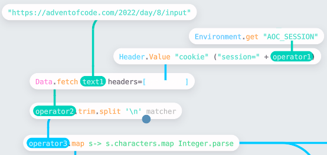
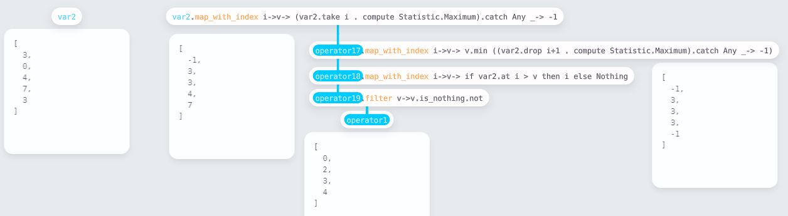
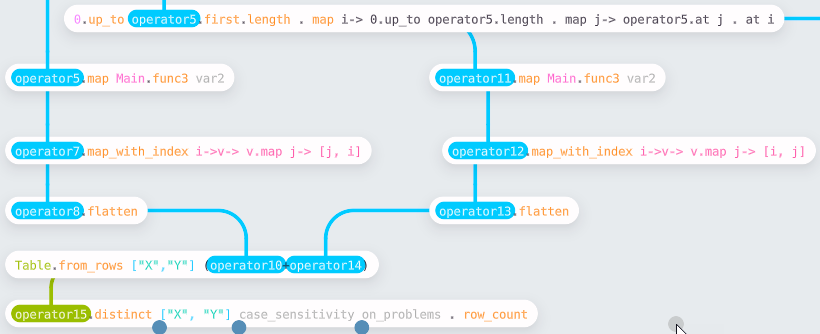

# Solving Advent of Code 2022 with Enso

<!-- Put an image here -->

Some members of the team building [Enso](https://enso.org/) decided to try and tackle last year's [Advent of Code](https://adventofcode.com/2022/) using the language and see how far we could get. I've previously tried [solving Advent of Code in Alteryx](https://jdunkerley.co.uk/2020/12/05/alteryxing-the-advent-of-code-2020-week-1/) and was personally interested to know whether it is easier or more challenging with what we are building.

For those not familiar with the Advent of Code, every year [Eric Wastl](https://twitter.com/ericwastl) creates a set of 25 programming puzzles posted once a day over December. Each puzzle has two related parts with an example set of values and the expected result based on these. Often, the second part is a more challenging extension of the first part. Generally, there should be a solution that can complete within a few seconds (although we didn't always find that one!).

This post summarises a few of the puzzles we tried and some of the challenges we faced, giving the views and experience of myself, Jaroslav Tulach, and Radosław Waśko of us trying to solve them.

## Jaroslav's Experience with Day 1 - Calorie Counting

- https://adventofcode.com/2022/day/1

Initial tasks of Advent of Code are usually quite simple. That is great, especially when starting with a new language or an IDE. As such, let's look at the _Calorie Counting_ task and how it can be solved with Enso and its IDE. I'll do my best to share what I learned while going through the puzzle. I was not new to the Enso language - e. g. it wasn't a problem to express the algorithm. However, I usually coded Enso in a text editor. This time I wanted to taste the real Enso IDE experience.

Problem #1 - how do I read a file? When you create a project, you get an `src` directory. However, you can also make a `data` directory sibling and put the associated data files there. You can then reference that directory as `enso_project.data` in your code. Reading a text file is then simple as

```haskell
enso_project.data/"aoc1-test.txt" . read
```

Problem #2 - working with the textual file requires you to split the text into lines. Great, there is `.lines` function. But then there are groups of lines waiting to be processed. My original solution was just `.fold` over the lines and pass in a `Pair` of two numbers. However, there is a much nicer solution: `operator1.split '\n\n'` - split the text on two new lines! Then one gets the needed groups easily.

Problem #3 - converting the text lines to numbers. It is as simple as `_.map Integer.parse` - however, I learned a handy trick. You can collapse a graph of nodes into a new function. You can then use it in multiple places. Not just that, when double-clicking on the function name, you tell the Enso IDE to open up the collapsed part, and you can refine it and test it with input values. That's cool as it allows one to keep the program clean, focused on individual tasks, and nicely organized inside a single project.

Problem #4 - is to do some statistics on the obtained data. If you are like me, you just do some arithmetic, but the cool kids (those who know all the Enso libraries) use `Statistic` library functions. Then it is just about requesting `Statistic.Maximum`, or `Statistic.Sum`. Nice, powerful, and easy to obtain the desired results.

The 'Calorie Counting' was a simple task, but it opened the door for me to the Enso IDE, its concepts, and the power of the libraries it offers. I  recommend trying this simple task yourself. It is fun, and it is worth it!

## My Experience with  Day 8 - Treetop Tree House

- https://adventofcode.com/2022/day/8

So by day 8, we were more into the swing of it, and the internal competition had heated up. The timezone disadvantage of living in the UK was showing, and those early risers were getting solutions published before I was even awake! The first week of puzzles led to various library improvements and stability fixes that made working in the IDE more pleasant and quicker.

Again the first challenge is loading the data and shaping it into something we can work with:



I chose to fetch the data directly from the website using `Data.fetch`. This API reads the URL, and if in a format Enso recognizes will automatically parse it. In this case, the data is just text. In this case, I wanted to parse the text into a 2D vector of integers, which is easily accomplished by breaking into lines (using `.lines`) and then parsing each character (the `.map s-> s.characters.map Integer.parse`).

The next task is to find how many trees are visible outside the grid. Taking just the horizontal scan, I build a small function (using the approach Jaroslav describes above by grouping nodes):



The function works by computing the maximum height from both ends of the vector to the current point and seeing if the current is higher. It then gathers the indices of visible trees. The view shown is the expanded function showing how you can trace the computation through. `var2` is the input to the method, and it is easy to change the values and test the process from the parent workflow.



Having built the row process (called `Main.func3` in the workflow), this can then be run on columns by transposing the input dataset. Finally, having gathered the complete set of coordinates, we need to make a unique set to find the count. I chose to do this by converting to a table (using `Table.from_rows`) and then using the `.distinct` function.

Part 2 was a straightforward adjustment to the process, looking out from a tree rather than looking in.

*Since building this workflow, we have added the ability to compute running statistics which would have made these computations easier. Likewise, the issue we had at the time with `Vector.distinct` has been resolved, so the need to convert to a table is removed.*

## Day xx 

## Some of the Challenges

## Conclusion
