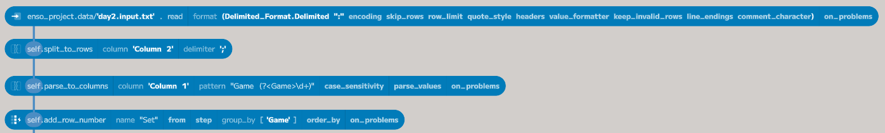
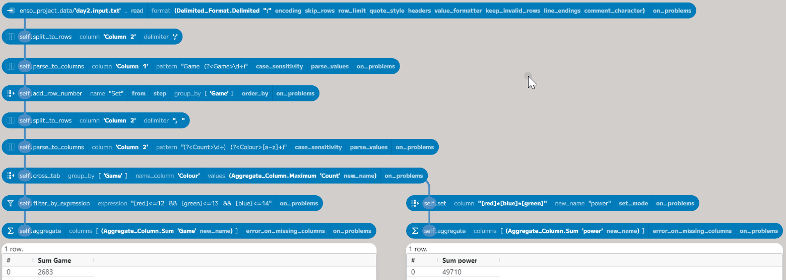
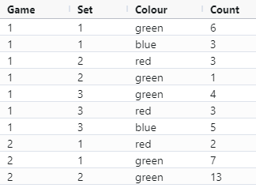
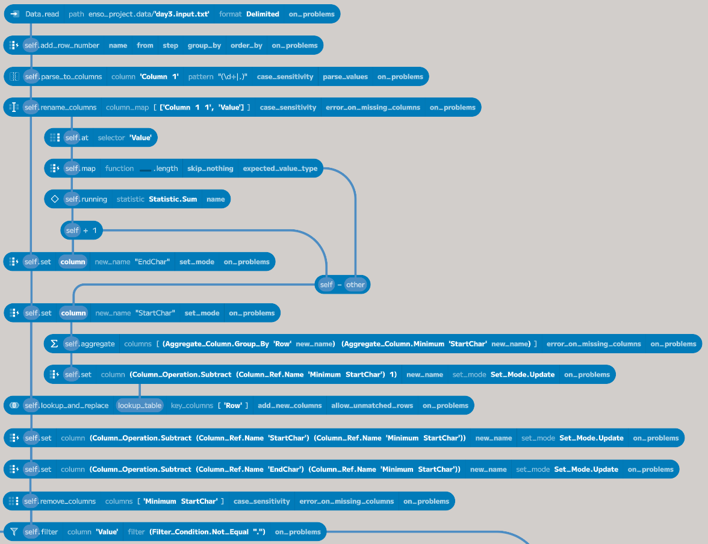
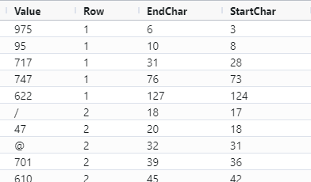
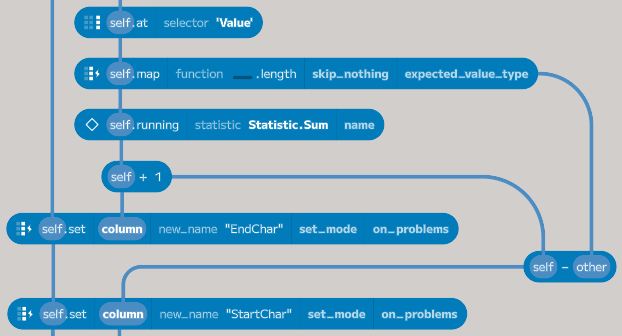
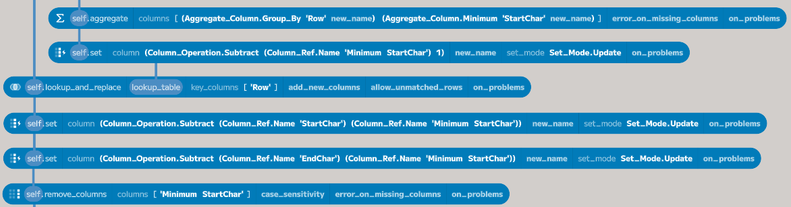
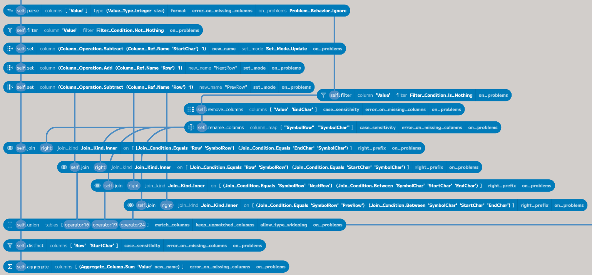
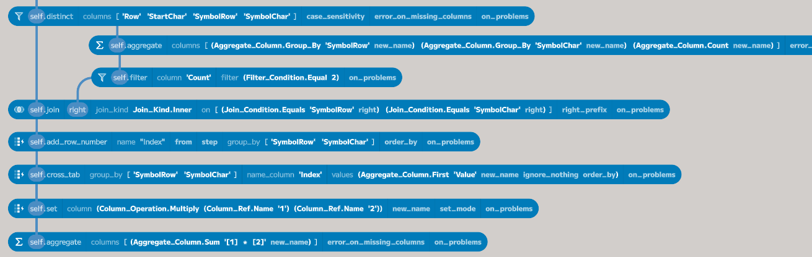
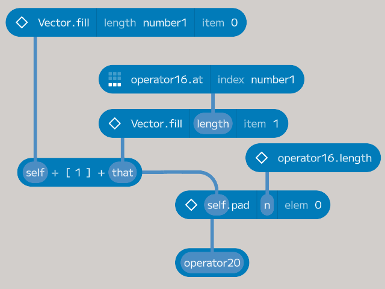

# Solving Advent of Code 2023 in Enso (part 2)

As 2024

## Parsing the Inputs

Rather than cover this for every puzzle, I thought a few pointers on how I've been parsing the inputs would be more helpful. In general, I copy the input for the example into a file called `dayX.test.txt` and the actual input into `dayX.input.txt`, and then drag the files into Enso to copy them into the project's `data` folder.

The first part of the initial component, `enso_project.data/'day1.input.txt'`, creates a `File` object pointing to `day1.input.txt`. The `read` method after this reads in the data. Enso would read these into a single `Text` value by default as the input is a text file; however, by specifying the format as `Delimited_Format.Delimited`, the `read` method reads the data into a `Table` (as if reading a CSV). 

The `Table` type has various methods that allow for restructuring the input. In this workflow, the second component uses the `split_to_rows` method, which takes a single column (`Column 2`) and splits it into new rows based on the specified delimiter (a semi-colon). There is an equivalent `split_to_columns` method that spreads the column across multiple columns.

The `parse_to_columns` function is a handy tool for those who like [regular expressions](https://en.wikipedia.org/wiki/Regular_expression). This function takes an input column and a regular expression to match against each row. Every match of the regular expression becomes a new column. If the expression contains marked groups, then these become separate columns. If the group is named (using the `(?<name>...)` syntax), then the column will be named after the group. The resulting columns will be automatically parsed, so numbers and dates in the default formats will be converted to the appropriate types.

The final function in this part of the workflow is `add_row_number`, which adds an index to the table. The index can be grouped and ordered as needed - for example, grouping by the `Game` column.

## [Day 2 - Cube Conundrum](https://adventofcode.com/2023/day/2)
- [Enso Project file](https://github.com/jdunkerley/adventofcode/raw/master/2023/AoC_2023_2.enso-project)

My solution was to parse the input to a table with each set's `red`, `green`, and `blue` values for every game as a row-based table. This table looked like this:

Next, for each game, I needed to find the maximum for each colour. The goal was to create a column-based table here with each colour a column. The `cross_tab` method can be used to convert a row-based table to a column-based table. The first parameter specifies the grouping for the new table (`Game`), and the second parameter is which column to get the new columns' name from (`Colour`). The final parameter is the value to put in the new columns, which can be any aggregation as needed. Here, it is the maximum `Count` for each `Game` and `Colour`.

For part 1, all that was needed was to filter to the possible games. Using `filter_by_expression` lets me use a syntax familiar to anyone used to Alteryx (or Excel tables). Finally, to aggregate the resulting games.

For part 2, I used the expression syntax within `set` for a shorthand to multiply three columns to produce the needed `power` value.

## [Day 3 - Gear Ratios](https://adventofcode.com/2023/day/3)
- [Enso Project file](https://github.com/jdunkerley/adventofcode/raw/master/2023/AoC_2023_3.enso-project)

This challenge was a little more complicated than the previous day. First, I needed to parse the input into a table.

.

I wanted to create a table with a row with each number in the input combined with the line in the input and the character starting and ending index it was found at. For the non-digit characters, I wanted each to be its own row. The resulting table looked like this:

The `parse_to_columns` uses an expression matching either blocks of numbers of a single character. This breaks the input into the required set of rows but without the character indexes. Let's look at the part making the character indexes in more detail.

What is happening in these components is picking the `Value` column (where the text sections are) and using a `map` function to iterate over each value and compute the character length of each value. The `text_length` function is currently missing on the column, so I resorted to the lower-level function. The `running` function allows the creation of a column with a running statistic (the total here) based on the input. After we have computed this column, we can add `EndChar` and `StartChar` to the input table.

The `running` function works across all the rows and doesn't reset for each line. To correct this, I calculated the minimum `StartChar` for each line and subtracted it from the `StartChar` and `EndChar` columns. This correction uses the `aggregate` function to create the minimum per line and then `lookup_and_replace` to return the minimum value to the original table.

Having built this table, the next step is splitting it into the numbers and the symbols. Using the `parse` function on the `Value` column and ignoring the error, replaces the symbols with `Nothing` and converts the digits to numbers. The `filter` function can then split the table. After this split, we can join between the two sets but need to do four different joins:

- When the symbol is just before the start of the number on the same row.
- When the symbol is just after the end of the number on the same row.
- When the symbol is on the row above between just before and just after the number.
- When the symbol is on the row below between just before and just after the number.

The `EndChar` is already pointing one character beyond the end of the number, so no correction is needed here. The `StartChar` needs to be decreased by one. Additionally, we need to compute the previous and next row indexes. Having created these columns and corrected the `StartChar`, we can join the symbols table four times and union the result.

The final steps are to ensure no duplicates of the numbers using the `distinct` function and then compute the total.

.

For part 2, the filter for the symbol needed a slight change (when equal to `'*'`) and a different final computation. In this case, the unique set is around the symbol, not a number. Additionally, only instances where two numbers match are kept and multiplied before being summed.

## [Day 4 - Scratchcards!](https://adventofcode.com/2023/day/4)
- [Enso Project file](https://github.com/jdunkerley/adventofcode/raw/master/2023/AoC_2023_4.enso-project)

The first part of this challenge was straightforward. I parsed the input into two tables - one for the card values and one for the winning values. Then, join the two tables on the card number and value against winners and count the rows per card.

For part 2, I needed to use Enso's ability to create a grouped function. You can create a set of nodes and then group them using `Ctrl+G` (or `Cmd+G` on a Mac). This grouping creates a new function that can be used in the workflow. The grouped function can be edited by double-clicking on it.

This function takes two inputs. `operator16` has the count of winning numbers for each card, and `number1` tells the function which card to use. The function builds a `Vector` of which cards should be duplicated. So, in the test case with six cards and the first card winning four numbers, the result is `[1, 1, 1, 1, 1, 0]`. It includes the first card being played as well. Mapping over all the cards creates a `Vector` of `Vector`s of the cards to add.

A similar grouped function determines how many times each card was played. It does this by folding over the result of the previous function and adding the counts together.

## [Day 5: If You Give A Seed A Fertilizer](https://adventofcode.com/2023/day/5)
- [Enso Project file](https://github.com/jdunkerley/adventofcode/raw/master/2023/AoC_2023_5.enso-project)

