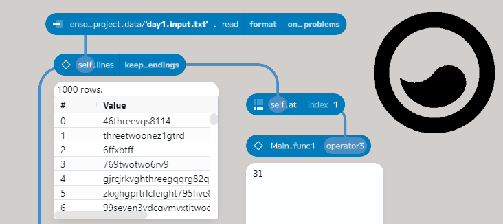
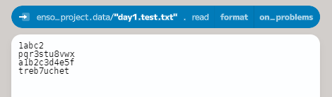
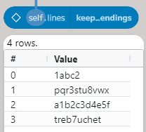
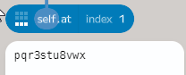
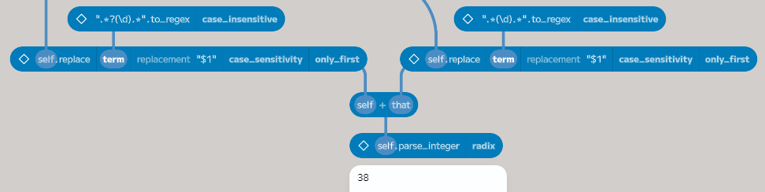
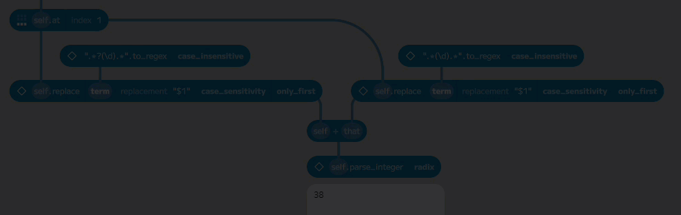
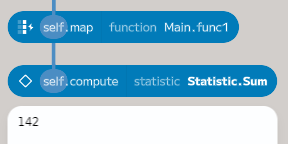
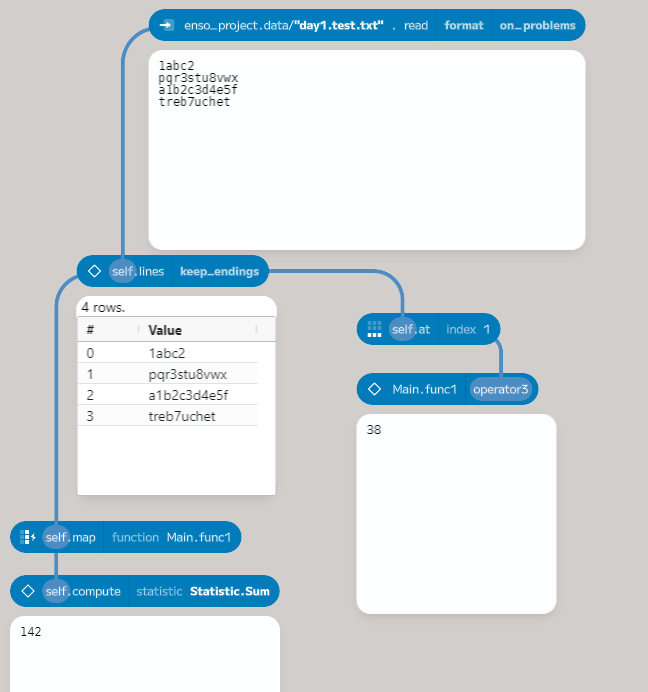
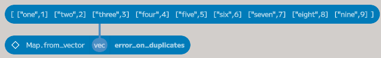
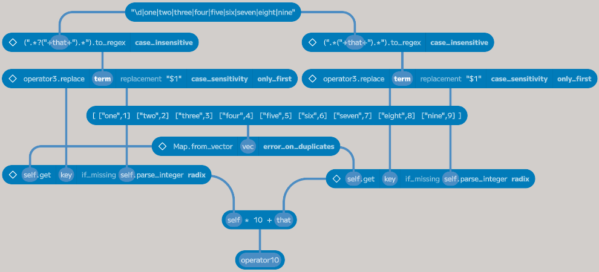

# Solving Advent of Code 2023 in Enso

So it's that time of the year again - it's even snowing here in London as I write this. That means it's time for the [Advent of Code](https://adventofcode.com/). For those who haven't heard of it, this is a fantastic set of 25 puzzles released one by one every day in December until Christmas Day. Each puzzle has two related parts - usually a simple case first, and the second a more complex version. The problems are language agnostic, so they can be solved in any language you like.

Since 2018, I've tried solving these with different tools and languages. This year will be my second time in [Enso](https://enso.org)](https://enso.org). Finding fun challenges that make you think is a great way to use a language and learn it. Last year, the 25 days of puzzles helped us push the product forward and find a lot of bugs. This year, we're hoping to do the same.

As always, I aim to achieve the 50 stars. Last year, across the team, we managed 48 - hopefully, we can do better this year (you can read about our experiences [here](https://jdunkerley.co.uk/2023/01/20/solving-advent-of-code-2022-with-enso/)).

I aim to post about once a week with some of my highlights (and probably some lowlights). The code will be available on [GitHub](https://github.com/jdunkerley/adventofcode) as I go along.

So here we go.

## [Day 1 - Trebuchet?!](https://adventofcode.com/2023/day/1) - Part 1

An old faithful skill for AoC is using Regular Expressions. The first part involves finding a string's first and last digits (from `1` to `9`). Let's run through how to do this in Enso.

First, I created a simple text file (`day1.test.txt`) containing the first example. I also made a second file with my real input (`day1.input.txt`). To load this in Enso, drag the file onto the Enso window. 

Breaking this into separate lines is easy in Enso using the `lines` function. This method on `Text` splits the value on any line separator.

A common way to build a function in Enso is to work with a single example, build up the process, and then create a reusable block. Using the `at` function allows you to pick a value from a `Vector` (Enso's equivalent of a list). The `Vector` is 0-indexed, so the first value is at index `0` and the last at `3`. You can also use negative numbers to count from the end of the list.

I used a regular expression to replace everything that isn't the first digit with an empty str to get the first digiting. The expression I used was `.*?(\d).*`. Let's run over what's in it. The first part (`.*?`) is a non-greedy match-all, matching the minimal characters needed for the expression. The next part (`(\d)`) matches a numeric digit. It is also a marked group (the brackets around it), which means I can access it in a `replace` expression as `$1`. The final part (`.*`) is a greedy match-all for everything after this digit.

Using the `to_regex` function on `Text` compiles the text into a regular expression object, which can then be fed into a `replace` function on `Text`. The replacement value is `$`1`, the first marked group (the first digit).

It is a simple amendment to the expression to match the last digit. The expression is `.*(\d).*`. This time, both match-alls are greedy, which means the first part will match everything up to the last digit, and the final part will match everything after the digit.

The final step is combining the two digits and parsing them. Using the `+` operator on `Text` concatenates two values, and the `parse_integer` function on `Text` converts it to an integer.

To convert this into a reusable function that can be applied over every line, select the six nodes to group together and then press `Ctrl+G` (or `Cmd+G` on a Mac) to group them.

The `map` function on `Vector` can be used to apply this function to every line. The `map` function takes a function and applies it to every element in the `Vector`. Having selected `map` from the component browser, type the created function's name (`Main.func1`). This function will then be called for every line, and the result will be put in a new `Vector` with the required numerical values. The `compute` function can be used to calculate the sum. This function can produce various statistics on a `Vector` - such as the sum or mean.

## [Day 1 - Trebuchet?!](https://adventofcode.com/2023/day/1) - Part 2

So far, so good. On to part 2.

The challenge is still to match the first and last digits, but some may be the name, not the number (e.g., `five`). There are two steps to do this in my solution. First, update the regular expressions to match them. We need to drill down into the grouped function to change the expression. To do this, double-click on the `Main.func1 operator3` node.

To edit the code of a node, you can `Ctrl-Click` (or `Cmd-Click` on a Mac). In the two regular expressions, change from `\d` to `\d|one|two|three|four|five|six|seven|eight|nine`, which matches either a digit or one of the names. The `|` character is the regular expression `or` operator.

Putting the new expression in as a node makes it easier to read and allows it to be reused. The two nodes creating the regular expressions must be updated to use this new node. Some additional brackets are required around the concatenation to build the expression correctly.

The last step for part 2 is to convert the names to numbers. For this part, a `Map` can be created with the names as keys and the numbers as values. The `Map.from_vector` function builds a `Map` from a `Vector` of pairs (key, value).

The `Map` object has a `get` method, which allows you to read a value from the `Map` by key. If the key doesn't exist, it returns `Nothing` by default, but you can provide a function to create a value instead. For this puzzle, the `parse_integer` function used before can convert the text to a number works. Having parsed the two digits, a simple expression can be used to calculate the value.

## Stay Tuned

That's day one solved. I'll be back next week with some more. If you want to follow along, you can find the code on [GitHub](https://github.com/jdunkerley/adventofcode), including an [`enso-project` file](https://github.com/jdunkerley/adventofcode/raw/master/2023/AoC_2023_1.enso-project) you can download and open in the editor.

If you want to try Enso, download it from [here](https://github.com/enso-org/enso/releases/latest), or you can find out more on the [Enso website](https://enso.org). If you have any questions, please join our [Discord](https://discord.com/invite/enso) server or comment below.
