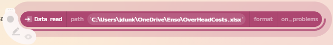
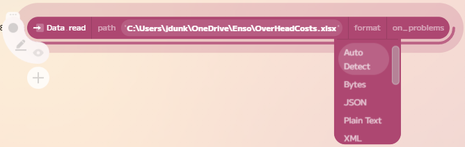
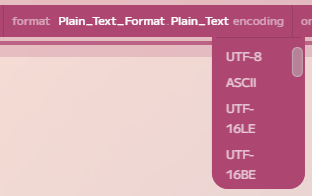

# Connectng to Data

This guide will walkthrough how to connect to data sources in Enso. Enso supports a wide range of data sources, including files, databases, and web services. You can import data from these sources into Enso to use in your workflows.

## Supported Data Sources

Enso currently supports the following data sources:

- Excel (both `.xls` and `.xlsx` file formats) files.
- Delimited text files (e.g. CSV, TSV).
- JSON files.
- XML files.
- SQLite databases.
- PostgreSQL databases.
- Snowflake databases.

*Additional data sources are being added regularly. If you have a specific data source you would like to see supported, please let us know.*

## Reading Files

Let's start by reading a file into Enso. The most direct way to do this is to drag a file onto the graph editor. If you are working locally, this will automatically create a new `Data.read` component with the file path as the input. If you are running within Enso Ccloud, the local file will be uploaded to the project data space.

Taking a look over this component it takes three inputs: 

- `path`: The path to the file you want to read. The path can be a local path (as shown above) or a supported URI. If using a URI, you can currently access the Enso Cloud (via `enso://`), S3 (via `S3://`) or web-based resources (either `http://` or `https://`).

- `format`: The format of the file you are reading. By default, Enso will automatically detect the format from the file extension (or content type headers if using a web-based resource). However, you can also manually specify the format if needed. More details on formats are below.

- `on_problems`: This parameter allows you to control what happens if there are recoverable issues when reading the file. By default, we will attach a warning to the result. However, you can also raise an error or ignore the problems.

If you wish to change the chosen file, click on the `path` input and either manually enter the new path or URI or select `Choose File` to browse for a new file.

## File Formats

By default, Enso will attempt to detect the file format you are reading automatically. This is generally done by looking at the file extension (e.g. `.csv`, `.json`) or the mime type headers if working from a web-based resource. The table below shows some of the supported extension mapping and the corresponding format:

| Extension | Content-Type | Default Format |
|-----------|--------------|----------------|
| `.txt`, `.log` | `text/plain` | `Plain_Text_Format.Plain_Text` |
| `.csv` | `text/csv` | `Delimited_Format.Delimited delimiter=','` |
| `.tsv`, `.tab` | `text/tab-separated-values` | `Delimited_Format.Delimited delimiter='\t'`|
| `.json`, `.geojson` | `application/json` | `JSON_Format` |
| `.xml` | `application/xml` | `XML_Format` |
| `.xls`, `.xlt` | `application/vnd.ms-excel` | `Excel_Format.Workbook xls_format=True` |
| `.xlsx`, `.xlsm` | `application/vnd.openxmlformats-officedocument.spreadsheetml.sheet` | `Excel_Format.Workbook xls_format=False` |

If you need to specify the format manually, you can select the required option from the dropdown list for the `format` argument. This also allows additional parameters to be set as needed. Select `Auto Detect` from the dropdown to have the default behaviour. Details on the current formats are given below.

### Plain Text

The file will be read as plain text. This is useful for reading log files or other text-based files.

The `Plain_Text_Format` takes a single argument specifying the text's encoding. By default, Enso will attempt to detect the encoding automatically. If the file contains a `BOM` (byte order mark), this will be used to determine the encoding. If no `BOM` is present, Enso will try using the `UTF-8` encoding. If an error is detected, it will then fallback to `Windows-1252`.

### Bytes

This is an advanced option allowing you to get the raw bytes of the file. The contents will be read to a `Vector`, which can then be further processed as needed.

