# Using Enso to Analyse Fund Performance (part 2)

In the last post, we looked at taking daily valuations and transactions for a hypothetical investment account and computing daily returns and an index series. In this post, we'll take that analysis further by computing some drawdown statistics and comparing the fund's performance against a benchmark.

We'll start this analysis using the index and return series we created in the last post. If you wish to follow along with this post, you can download the data from [GitHub](https://raw.githubusercontent.com/jdunkerley/jdunkerley/refs/heads/master/enso-fund-performance-2/index.csv) or recreate it using the steps in the previous post.

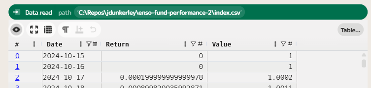

## Maximum Drawdown

The maximum drawdown is the largest percentage decline from a peak to a trough in the value of an investment. More formally, if <em>vt</em> is the value of the investment at time <em>t</em>, then the drawdown can be expressed as:

As <em>vt</em> will be between 0 and the maximum value, the drawdown will be between 0 and 1, where 0 indicates no drawdown and 1 indicates a complete loss of value. To compute this in Enso, we can use the `running` function to keep track of the maximum value seen so far, and then apply a formula to compute the drawdown at each time step.

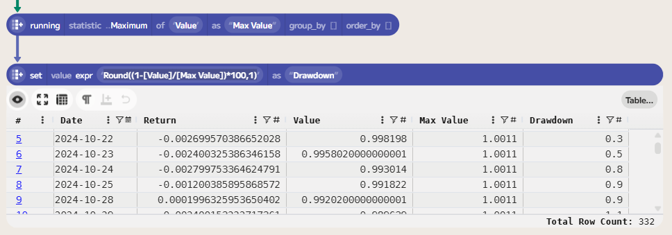

To make the values a little clearer, I chose to format the drawdown as a percentage with 1 decimal place, which is just a matter of multiplying by 100 and rounding. The expression for this percentage drawdown is `Round((1-[Value]/[Max Value])*100,1)`.

Finally, to compute the maximum drawdown, we can use an aggregate function to find the maximum value in the drawdown series. This gives us the maximum drawdown for the entire period.

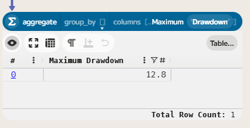

This means that at some point during the period, the fund experienced a drawdown of 12.8%, the largest peak-to-trough decline in the dataset.

## Maximum Drawdown Duration

The maximum drawdown duration is the longest period during which an investment is in a drawdown, meaning it has not yet recovered to its previous peak. We can compute this by first creating a column that counts the number of consecutive days the investment has been in a drawdown.

You could count this in calendar days or trading days. In this case, I have chosen to count in calendar days. Adding a `Days Since Previous` column that computes the number of days since the previous row will allow us to compute the duration. The expression: `coalesce(date_diff(offset([Date],-1),[Date]),0)` computes the difference in days between the current date and the previous date, treating the first row as zero.

We can then create a `Days In Drawdown` column that uses a conditional expression to determine whether the current value is in a drawdown state (i.e., when `Drawdown` is not equal to `0`). By default, this will warn about floating point comparisons, but we can choose to `..Ignore` this warning in the `on_problems` dropdown. We need to convert this column into a running sum, again using the `running` function:

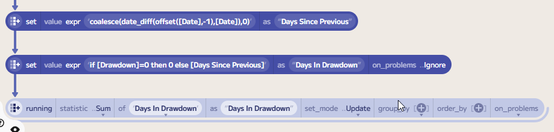

Note: we need to select `..Update` for `set_mode`, as I am replacing the existing series rather than creating a new one. If you don't do this, Enso will throw an error saying the column already exists.

Next, we need to reset the count of days when the value recovers to a new peak. If we use an expression of `if [Drawdown]=0 then [Days In Drawdown] else nothing`, then we get a series where the value is `Nothing` when the value is in drawdown, and the cumulative number of days in drawdown when it is not. Combining this with a `fill_nothing` function that picks up the previous value allows us to create a series of `Days In Drawdown` at the last point of recovery. Finally, removing this from the `Days In Drawdown` series will give us the number of days in drawdown at each point in time:

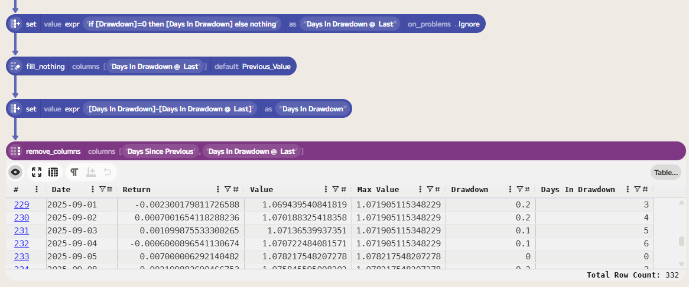

Again, we can then compute the maximum value in this series to get the maximum drawdown duration:

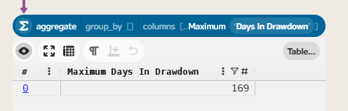
 
 ## Joining a Benchmark

To compare the fund's performance against a benchmark, we can download historical price data for a relevant index. In this case, I chose to use the FTSE 100 index as a benchmark for UK equity performance. We can download historical prices for the FTSE 100 from [this link](https://uk.investing.com/indices/uk-100-historical-data). Due to data rights, I can't share it directly, but you can download it yourself from the link.

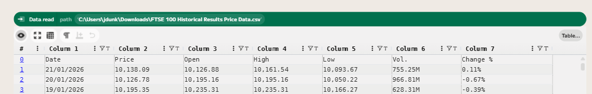

The downloaded CSV contains formatted values, so first we need to clean the data and parse the values. First, using the `use_first_row_as_names` function will name the columns. Then a couple of `parse` functions will convert the columns to the correct type.

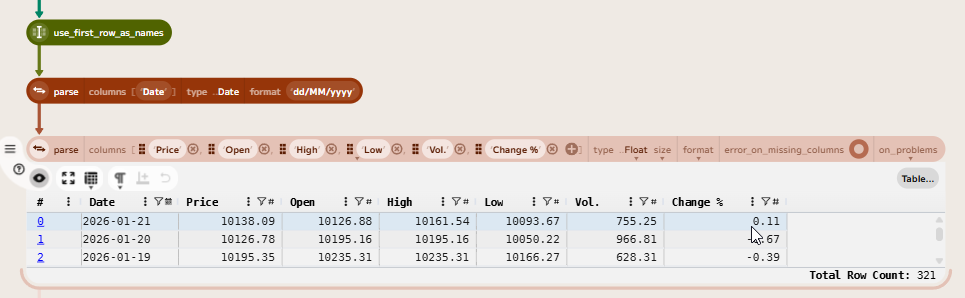

Let's again convert the price series into an index series. We can do this using the expression `[Price]/(first([Price]))` to create an index that starts at 1 on the first day (after sorting the data by date) and is computed as the ratio of the current price to the initial price.

We can then join this back to the original index series for the fund, using a `merge` function to add the benchmark index. Followed by a `fill_nothing` to carry forward the last value of the benchmark index when there are missing values (e.g., due to non-trading days). Finally, we can compute the benchmark return using a formula of `coalesce([BenchmarkIndex]/offset([BenchmarkIndex],-1)-1,0)`.

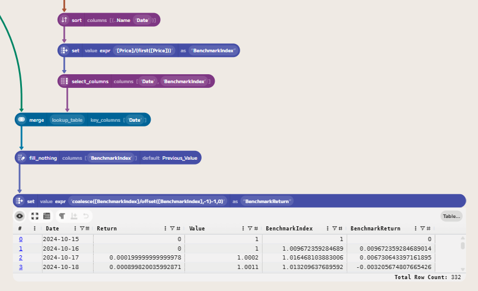

We can now compute the correlation between the fund returns and the benchmark returns. The Pearson correlation coefficient measures the linear relationship between two variables, in this case, the fund returns and the benchmark returns. A correlation of 1 indicates a perfect positive linear relationship, -1 indicates a perfect negative linear relationship, and 0 indicates no linear relationship. To compute this in Enso, first we get the `Return` column from the table and then the `Benchmark Return` column. We can then use the `compute_bulk` function to create a table with the correlation between these two series.

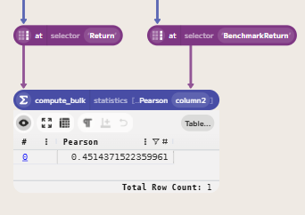

Finally, we can plot fund returns against benchmark returns to visually assess the relationship between the two. This can be done by selecting the three columns (`Date`, `Value` and `BenchmarkIndex`) and then choosing the Scatter Plot option in the visualisation menu.

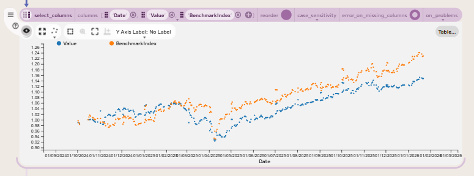

## Computing Excess Returns and Sharpe Ratio

The next step in our analysis is to compare the fund's performance against a risk-free rate to compute excess returns and a Sharpe ratio. The risk-free rate is the interest rate you can earn on an investment with zero risk, such as a bank account or a government bond. For this case, I will use the Bank of England's base rate as a proxy for the risk-free rate.

We can download this series from the Bank of England's database API. The [Official Bank Rate](https://www.bankofengland.co.uk/boeapps/database/fromshowcolumns.asp?Travel=NIxAZxSUx&FromSeries=1&ToSeries=50&DAT=RNG&FD=1&FM=Jan&FY=2020&TD=1&TM=Jan&TY=2040&FNY=Y&CSVF=TT&html.x=66&html.y=26&SeriesCodes=IUDBEDR&UsingCodes=Y&Filter=N&title=IUDBEDR&VPD=Y) has a symbol of `IUDBEDR`. We can use the [API](https://www.bankofengland.co.uk/boeapps/database/help.asp?Back=Y&Highlight=CSV#CSV) to download the data in CSV format. First, we need to construct the URI to fetch the data. This can be linked to the input data to determine the date range for the data we need to fetch. The URI is constructed as follows:

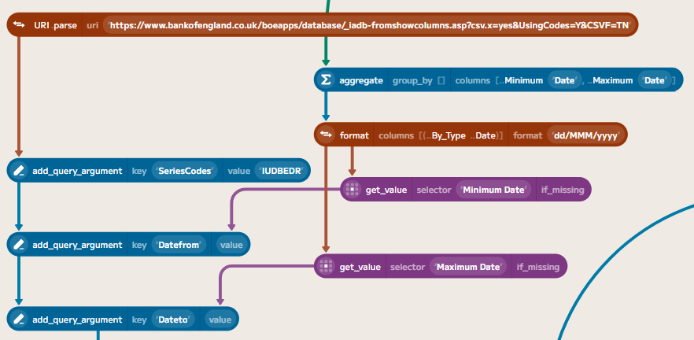

Using `Data.fetch` with this URI will allow us to download the data directly into Enso. You need to specify the format as `..Delimited` so that Enso parses the result into a table. The API reports the content type as `application/csv`, which is not the standard MIME type for CSV (`text/csv`), so we need to specify the format explicitly. We also need to parse the date column, since the API returns `dd MMM yyyy` instead of a standard ISO format. Then we can join this risk-free rate to the fund data, in a similar way to how we joined the benchmark data.

The Bank of England's base rate is an annual rate, so we need to convert it to a daily rate by dividing by 365, as the UK convention (`Actual/365`), and then multiplying by the number of days since the previous row to get the daily risk-free return. The expression for this is `([RiskFree]/100)*[Days Since Previous]/365`. The `ExcessReturn` can then be computed by subtracting the risk-free return from the fund return.

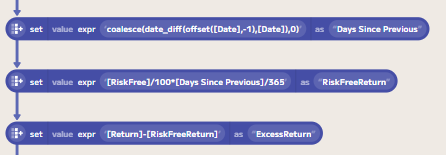

We can then compute a daily [Sharpe Ratio](https://en.wikipedia.org/wiki/Sharpe_ratio) by dividing the average excess return by the standard deviation of the excess return. This can then be annualised by multiplying by the square root of 252 (the number of trading days in a year).

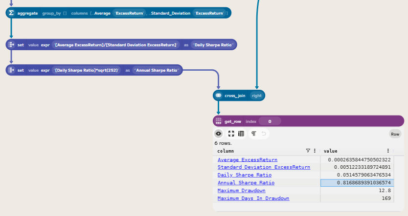

## Wrapping Up

In this post, we have looked at how to compute drawdown statistics from the index and return series we created, and how to join the fund data to a benchmark and compute the correlation. 

Finally, we also looked at how to compute excess returns relative to a risk-free rate and the Sharpe ratio to measure the fund's risk-adjusted performance.

Along the way, we have seen how to use various Enso functions, such as `running`, `fill_nothing`, `merge`, and `compute_bulk`, to perform these calculations. We've also touched on various ways to import, cleanse and prepare data for analysis in Enso, as well as how to create visualisations to help understand the relationships between different series.

If you'd like to try this yourself, you can download a trial of Enso from the [Enso website](https://www.ensoanalytics.com/). The data files used in this project are available from my GitHub repository:

- [index.csv](https://raw.githubusercontent.com/jdunkerley/jdunkerley/refs/heads/master/enso-fund-performance-2/index.csv)

The completed Enso project file is also available on GitHub:

- [Enso Project](https://github.com/jdunkerley/jdunkerley/raw/refs/heads/master/enso-fund-performance-2/Fund%20Performance%20Blog%20Part%202.enso-project)
