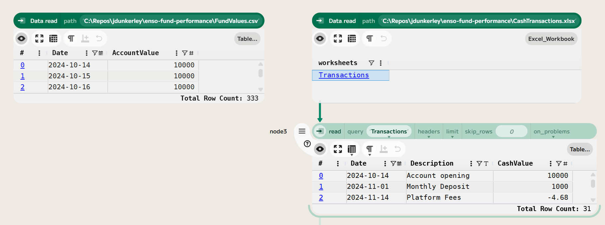
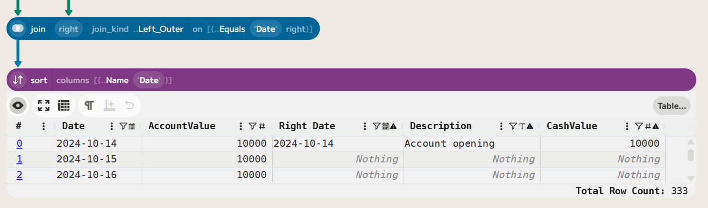
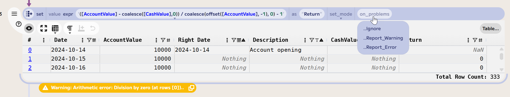
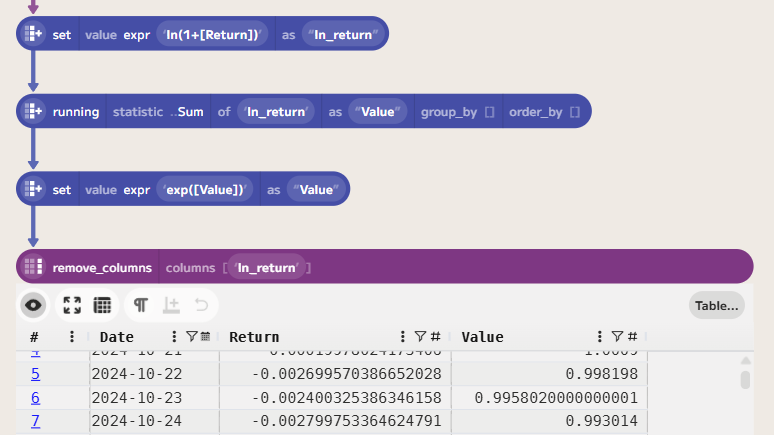
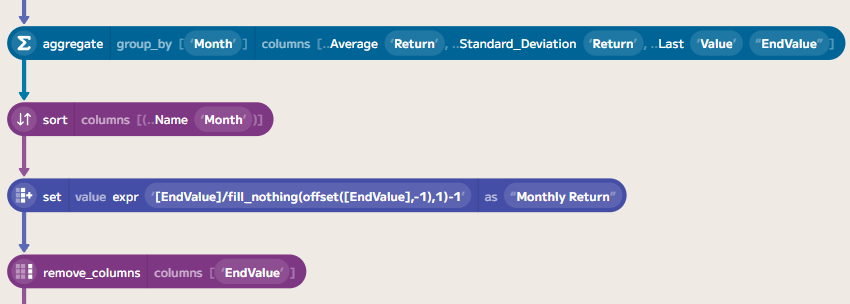
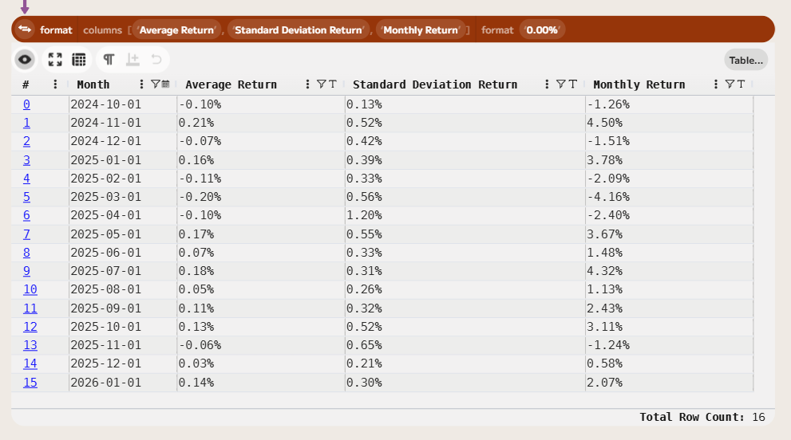

# Using Enso to Analyse Fund Performance


In this post, I'll demonstrate how to use Enso to analyse the performance of a hypothetical investment account.  Starting from a daily valuation and transaction history, we'll create a return series and convert it into an index to show monthly returns and statistics.

## The Input Data

For this analysis, we have two input data files:

- Daily Valuations: A CSV file (`FundValues.csv`) containing the daily valuation of the investment account.
- Transactions: An Excel workbook (`CashTransactions.xlsx`) containing the transaction history of the account, including deposits and withdrawals.

In the hypothetical example, £1,000 is invested on the first business day of each month. There are annual fees of 0.5% charged on the total account value, 14th of each month. The account starts with an initial investment of £20,000.

Let's load the data into Enso - using `Data.read` (or by dropping the files into the Enso workspace).



## Computing Daily Returns

To compute the fund's daily returns, we need to account for both changes in valuation and cash flows (deposits and withdrawals). Firstly, joining the two datasets on the date field allows us to see both the valuation and any transactions on the same date. Because there may be dates with no transactions, we use a left join to retain all valuation dates. Then, we sort the data by date to ensure chronological order.



Next, we compute the return. This is equal to the change in valuation adjusted for any cash flows, divided by the previous day's valuation. As the data is in chronological order, we can use the `offset` function in an Enso expression to get the previous day's valuation. The formula for daily return is:

```
Return = ([AccountValue] - coalesce([CashValue],0)) / coalesce(offset([AccountValue], -1), 0) - 1
```

Where `coalesce([CashValue],0)` ensures that if there is no cash transaction on that day, it is treated as zero. The offset function will return a `Nothing` value if there is no previous day (i.e., the first row), so we also use `coalesce` to treat that as zero.



Note: Enso warns that the first row contains a division by zero because there is no previous-day valuation. This is expected, and we can filter out this row in the next step. If you choose to `Ignore` in the `on_problems` dropdown, the warning will disappear.

This series excludes fees as they were in the cash transactions. These can be easily included by altering the formula to be the maximum of 0 and the `CashValue`: 

```
Return = ([AccountValue] - max(0, coalesce([CashValue],0))) / coalesce(offset([AccountValue], -1), 0) - 1
```

Finally on the data prep, remove the first row (using `drop (First 1)`) and the extra columns we no longer need, leaving just the date and return columns (using `select_columns ["Date", "Return"]`).

## Computing an Index Series

In order to allow for comparing the fund returns and other analysis, it is useful to convert to a series where the current value of £1 invested at the start is given. The value can be computed by multiplying the daily returns plus 1. As we want to get a daily series, the `running` function combined with logarithms allows us to do this:




## Computing Monthly Statistics

To compare the fund's performance against a benchmark, we need to compute the monthly returns from the value series. 

Adding a `Month` column to the data, set to the first day of each month, allows us to group by it. There are a couple of ways to produce this, but the simplest is to use the `first_of_month` function.

Next, we can compute various aggregates such as the final index value, the standard deviation and the average return. Using the final index combined with an offset, it is easy to compute the monthly return.



Finally, to make things easier to read, we can format the values to make them more readable:



## Wrapping Up

In this post, we've walked through how to tidy up and join a valuation series and transaction report to create an index series. Then, finally, we put together a few monthly series.

If you'd like to try this yourself, you can download a trial of Enso from the [Enso website](https://www.ensoanalytics.com/). The data files used in this project are available from my GitHub repository:

- [FundValues.csv](https://github.com/jdunkerley/jdunkerley/blob/master/enso-fund-performance/FundValues.csv)
- [CashTransactions.xlsx](https://github.com/jdunkerley/jdunkerley/blob/master/enso-fund-performance/CashTransactions.xlsx)

The completed Enso project file is also available on GitHub:

- [Enso Project](https://github.com/jdunkerley/jdunkerley/blob/master/enso-fund-performance/Fund%20Performance%20Blog.enso-project)

In the next post, will look at comparing this with an index, adjusting for inflation, and computing some draw-down statistics.
