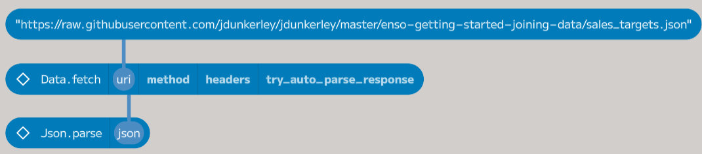
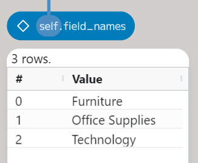
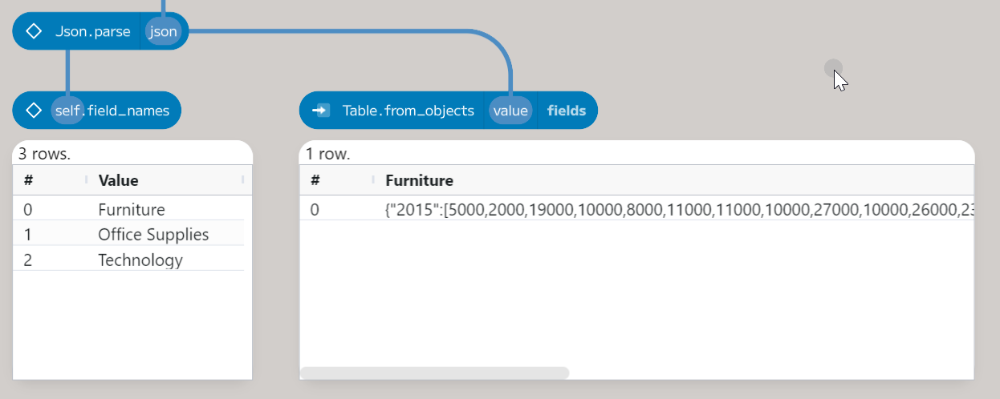
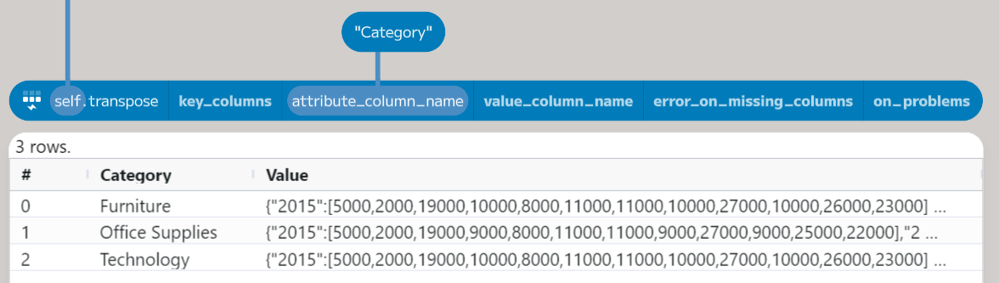
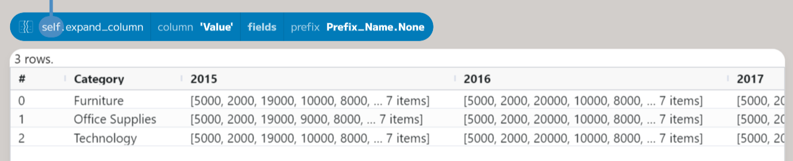
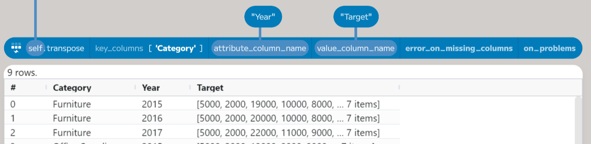
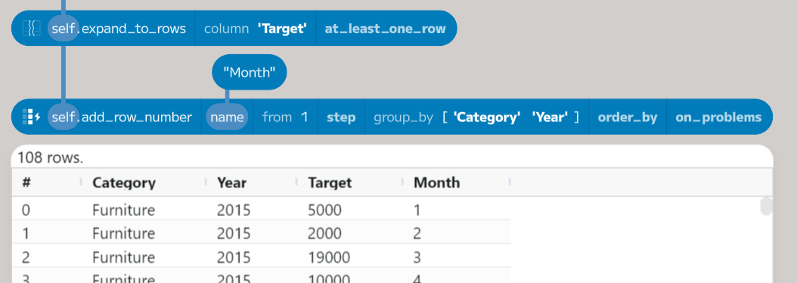
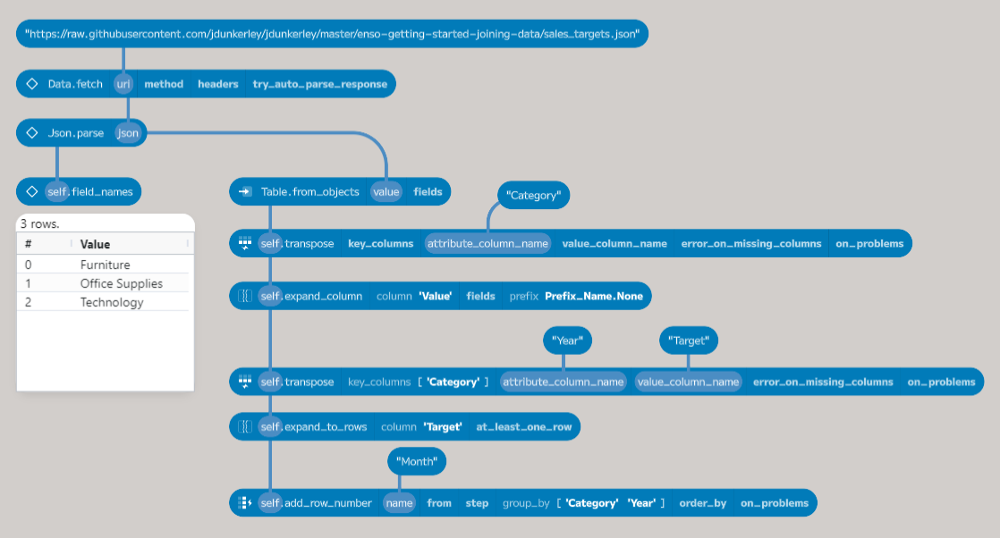

## Getting Started With Enso - JSON and Joins

In this post, I will use the results from the [last post](https://jdunkerley.co.uk/2023/11/10/getting-started-with-enso-parsing-selecting-and-aggregating/) to review how each category has performed against sales targets the company has set.

The completed workflow from that post can be downloaded from [GitHub](https://github.com/jdunkerley/jdunkerley/raw/master/enso-getting-started-parsing-selecting/Enso_Getting_Started_2.enso-project).

The sales targets are stored in a JSON file, so they must first be parsed and then joined to the results from the last post. The raw JSON file can be downloaded from [GitHub](https://raw.githubusercontent.com/jdunkerley/jdunkerley/master/enso-getting-started-joining-data/sales_targets.json). Based on the 2014 data, they have category-level monthly targets from 2015 until 2017.


## Downloading the Sales Targets

Let's take a look at the JSON file:

```json
{
    "Furniture": { 
        "2015": [5000,2000,19000,10000,8000,11000,11000,10000,27000,10000,26000,23000],
        "2016": [5000,2000,20000,10000,8000,12000,12000,10000,29000,10000,27000,24000],
        "2017": [5000,2000,22000,11000,9000,13000,13000,11000,31000,11000,29000,25000]},
    "Office Supplies": { 
        "2015": [5000,2000,19000,9000,8000,11000,11000,9000,27000,9000,25000,22000],
        "2016": [5000,2000,20000,10000,8000,11000,11000,10000,28000,10000,26000,23000],
        "2017": [5000,2000,21000,10000,9000,12000,12000,10000,30000,10000,28000,24000]},
    "Technology": {
        "2015": [5000,2000,19000,10000,8000,11000,11000,10000,27000,10000,26000,23000],
        "2016": [5000,2000,20000,10000,8000,12000,12000,10000,29000,10000,27000,24000],
        "2017": [5000,2000,22000,11000,9000,13000,13000,11000,31000,11000,29000,25000]}
}
```

Each category is listed as a key in the JSON object. The value for each category is another JSON object, with the years as keys and the sales targets as arrays. The first task is to load this into Enso. There are multiple ways to read data from a URL in Enso; a straightforward option is the `Data.fetch` method:


This method will download from the specified `uri`. The other parameters are optional, but let's go through them. The `method` argument specifies the HTTP verb used - by default, `GET` is used; however, you can choose another. Please note that only verbs are allowed, which should not change things on the server. There is a `Data.post` method that accepts the other ones.

The `headers` argument specifies any HTTP headers you want to send with the request. These are passed as a `Vector` of pairs of `Text` values. For this request, there is no need to specify any headers.

Finally, the `try_auto_parse_response` controls how Enso handles the response from the server. If true (the default), Enso parses the response based on the `Content-Type` header. If false, then the response will be returned as a `Response` object. In both cases, a data flow error will be returned if the status code indicates an error (i.e., not 200 - 299).



In this case, we want to parse the response as JSON, so leave the default value of `true` for `try_auto_parse_response`. However, the returned value is a `Text` value, as GitHub returns the `Content-Type` as `text/plain`. The `Json.parse` method can be used to convert this.

## Working with JSON

One of Enso's strengths is the ability to use a variety of programming languages within a project. Most functions are written in Enso's native language, but other languages are also used. For example, the `Json.parse` method is written principally in JavaScript. The returned object is a `JS_Object`, a wrapper around an underlying JavaScript object, which works like any other Enso object. For example, the `field_names` method gets all the keys of the object:



In this case, the goal is to convert the JS_Object into a table. The `Table.from_objects` function will change various things, including `JS_Object`, into a table.



Each field within the object becomes a column. However, in this case, the categories should be rows.



The `Table.transpose` method converts a column-based table (like the result above) to a row-based one. You can supply an `attribute_column_name` to control the output name, in this case, `Category`. I'll cover the other parameters below. The result is a table with two columns - `Category` and `Value`. The `Value` column contains the `JS_Object` for each category. The `expand_column` method allows spreading these objects out over a set of columns:



The first parameter is the column name to expand (the `column` parameter). The second argument, `fields`, can optionally provide a set of names to extract from each object (this is also the case for `Table.from_objects`). If not set, then a union of all fields is produced. Finally, the `prefix` parameter controls adding a prefix to new column names. By default, it will add the name of the source column, but in this case, just the value is needed. Now, back to a second transpose:



This time, a `key_column` entry is needed to keep the `Category` as a column. You can specify any number of columns which should not be transposed. The `value_column_name` allows us to change the output from `Value` to `Target`. Finally, also set the `attribute_column_name` as `Year`. The result is a table with three columns - `Category`, `Year`, and `Target`. The `Target` column contains the sales targets for each month as a `Vector`, so the next step is to expand this into rows (using the `expand_to_rows` method) and then finally add a `Month` column (using a row number function):



The `expand_to_rows` column's first argument again specifies the column to expand. In this case, the column is expanded to a set of rows, each containing a single value from the Vectors. Any other column's value is repeated for each new row added. The second parameter (`at_least_one_row`) ensures that if a value is `Nothing` or an empty `Vector`, then a single row is added with a `Nothing` value.

The `add_row_number` function allows the creation of an index column. By default, this will be called `Row` and start numbering from 1. The `name` parameter allows changing the output name. The initial value and increment can be set using the `from` and `step` parameters. The following two options enable adding a grouping (in this case, by `Category` and `Year`) and finally allow for applying an ordering if desired.

The final process for downloading and reshaping the sales targets looks like this.



## Joining the Data

