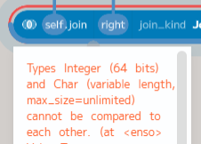
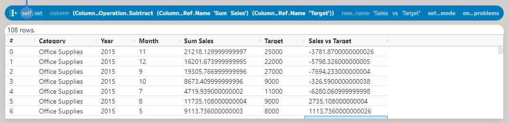
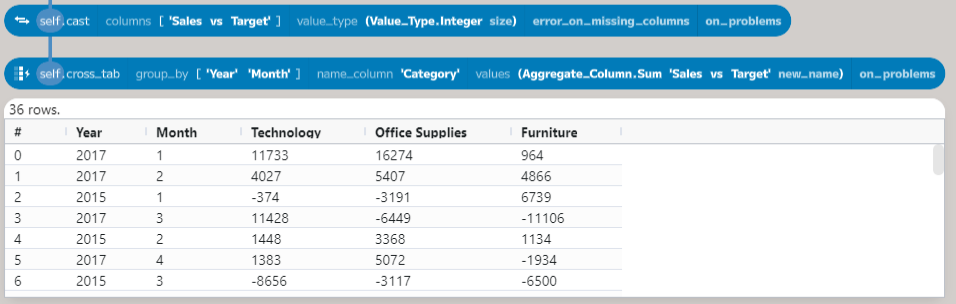

## Getting Started With Enso - JSON and Joins

In this post, I will use the results from my [last post](https://jdunkerley.co.uk/2023/11/10/getting-started-with-enso-parsing-selecting-and-aggregating/) to review how each category has performed against the sales targets the company has set.

The completed workflow from that post can be downloaded from [GitHub](https://github.com/jdunkerley/jdunkerley/raw/master/enso-getting-started-parsing-selecting/Enso_Getting_Started_2.enso-project).

The sales targets are stored in a JSON file, so they must first be parsed and then joined to the results from the last post. The raw JSON file can be downloaded from [GitHub](https://raw.githubusercontent.com/jdunkerley/jdunkerley/master/enso-getting-started-joining-data/sales_targets.json). Based on the 2014 data, they have category-level monthly targets from 2015 until 2017.


## Downloading the Sales Targets

Let's take a look at the JSON file:

```json
{
    "Furniture": { 
        "2015": [5000,2000,19000,10000,8000,11000,11000,10000,27000,10000,26000,23000],
        "2016": [5000,2000,20000,10000,8000,12000,12000,10000,29000,10000,27000,24000],
        "2017": [5000,2000,22000,11000,9000,13000,13000,11000,31000,11000,29000,25000]},
    "Office Supplies": { 
        "2015": [5000,2000,19000,9000,8000,11000,11000,9000,27000,9000,25000,22000],
        "2016": [5000,2000,20000,10000,8000,11000,11000,10000,28000,10000,26000,23000],
        "2017": [5000,2000,21000,10000,9000,12000,12000,10000,30000,10000,28000,24000]},
    "Technology": {
        "2015": [5000,2000,19000,10000,8000,11000,11000,10000,27000,10000,26000,23000],
        "2016": [5000,2000,20000,10000,8000,12000,12000,10000,29000,10000,27000,24000],
        "2017": [5000,2000,22000,11000,9000,13000,13000,11000,31000,11000,29000,25000]}
}
```

Each category is listed as a key in the JSON object. The value for each category is another JSON object, with the years as keys and the sales targets as arrays. The first task is to load this into Enso. There are multiple ways to read data from a URL in Enso; a straightforward option is the `Data.fetch` method:


This method will download from the specified `uri`. The other parameters are optional, but let's go through them. The `method` argument specifies the HTTP verb used - by default, `GET` is used; however, you can choose another. Please note that only verbs are allowed, which should not change things on the server. There is a `Data.post` method that accepts the other ones.

The `headers` argument specifies any HTTP headers you want to send with the request. These are passed as a `Vector` of pairs of `Text` values. For this request, there is no need to specify any headers.

Finally, the `try_auto_parse_response` controls how Enso handles the response from the server. If true (the default), Enso parses the body based on the `Content-Type` header. If false, then the reply will be returned as a `Response` object. In both cases, a data flow error will be returned if the status code indicates an error (i.e., not 200 - 299).


In this case, we want to parse the response as JSON, so leave the default value of `true` for `try_auto_parse_response`. However, the returned value is a `Text` value, as GitHub returns the `Content-Type` as `text/plain`. The `Json.parse` method can be used to convert this.

## Working with JSON

One of Enso's strengths is the ability to use a variety of programming languages within a project. Most functions are written in Enso's native language, but other languages are also used. For example, the `Json.parse` method is written principally in JavaScript. The returned object is a `JS_Object`, a wrapper around an underlying JavaScript object, which works like any other Enso object. For example, the `field_names` method gets all the keys of the object:


In this case, the goal is to convert the JS_Object into a table. The `Table.from_objects` function will change various things, including `JS_Object`, into a table.


Each field within the object becomes a column. However, in this case, the categories should be rows.


The `Table.transpose` method converts a column-based table (like the result above) to a row-based one. You can supply an `attribute_column_name` to control the output name, in this case, `Category`. I'll cover the other parameters below. The result is a table with two columns - `Category` and `Value`. The `Value` column contains the `JS_Object` for each category. The `expand_column` method allows spreading these objects out over a set of columns:


The first parameter is the column name to expand (the `column` parameter). The second argument, `fields`, can optionally provide a set of names to extract from each object (this is also the case for `Table.from_objects`). If not set, then a union of all fields is produced. Finally, the `prefix` parameter controls adding a prefix to new column names. By default, it will add the name of the source column, but in this case, just the value is needed. Now, back to a second transpose:


This time, a `key_column` entry is needed to keep the `Category` as a column. You can specify any number of columns which should not be transposed. The `value_column_name` allows us to change the output from `Value` to `Target`. Finally, also set the `attribute_column_name` as `Year`. The result is a table with three columns - `Category`, `Year`, and `Target`. The `Target` column contains the sales targets for each month as a `Vector`, so the next step is to expand this into rows (using the `expand_to_rows` method) and then finally add a `Month` column (using a row number function):


The `expand_to_rows` column's first argument again specifies the column to work upon. In this case, if a cell contains a set of values (such as a Vector), it is expanded to new rows, each having a single value from the set, with the values from the other columns repeated for each new row added. The current row is added to the output table if the cell is a single value. The second parameter (`at_least_one_row`) controls whether to add a row for an empty `Vector`; if `False` (the default), these rows are dropped; if `True`, then the current row, with the input cell replaced with `Nothing`, is added.

The `add_row_number` function allows the creation of an index column. By default, this will be called `Row` and start numbering from 1. The `name` parameter allows changing the output name. The initial value and increment can be set using the `from` and `step` parameters. The following two options enable adding a grouping (in this case, by `Category` and `Year`) and finally allow for applying an ordering if desired.

The final process for downloading and reshaping the sales targets looks like this.


## Joining the Data

The targets are now easy to work with and can be joined to the results from the previous post. Dragging out from the results and adding a `join` node looks like:


The first argument, `right`, takes a table to join with the self table. In this The first argument, `right`, takes a table to join with the self table. In this case, connect the output from the restructure process to this. The second argument, `join_kind`, controls the type of join to perform. The default is a left-outer join - all rows from the left input (`self`) and the matching rows from `right` are returned. Enso supports the following join types:

&nbsp; | Join Kind | Left Rows | Right Rows | Columns Returned
--- | --- | --- | --- | ---
 | Left Exclusive | All | Non-Matching | Left Only
 | Left Outer | All | Matching | All
 | Inner | Matching | Matching | All excluding equality columns
 | Right Outer | Matching | All | All
 | Right Exclusive | Non-Matching | All | Right Only
 | Full Outer | All | All | All

Most of these joins are the same as you get in SQL. The `Left Exclusive` and `Right Exclusive` joins are additions that allow you to get the rows that were not successfully joined. These can be hugely useful to ensure no data is lost. Another feature to note is that the `join_kind` also determines the set of columns returned. For example, the `Left Exclusive` join only returns columns from the left input because no rows from the `right` input matched. The `Inner` join excludes the equality columns, as they are the same in both inputs. For this example, the `Inner` join will work perfectly.

The following parameter, `on`, specifies how to match the rows between the inputs. By default, it will attempt to match the first column in the left input with a column in the right with the same name. It takes a Vector of `Join_Condition`, which allows either an `Equals` condition or a `Between` (the left table contains a value between two columns in the right).

The `right_prefix` argument adds a prefix to clashing column names from the `right` table. The default value, `"Right "`, is added if a column exists in both tables. You can specify whatever prefix you wish to use. If the name is still not unique, a number is added to the end, and a warning is raised. The `on_problems` parameter works as in other functions to handle how warnings are dealt with.

In this case, the `Category`, `Year`, and `Month` values must be equal. Add three `Equals` conditions to the `on` parameter and then choose the name from the dropdown on each `left` parameter. By default, the `right` parameter will be the same as the `left` one, but you can change this if needed (though the current UI does not support a dropdown on the right side). Once done, an error will be shown:



The error is because the `Year` column is a `Text` value in the restructured table but an `Integer` in the results table. The `parse` function can be added before this join node to convert the `Year` column to an `Integer` (there is no need to select a type as it will automatically determine all are `Integer` values):


## Creating the Summary Table

The table now has `Target` and `Sum Sales` (from the previous post) columns; the next step is to add a column with the difference between the two (using the `set` method):



First, using the `cast` to convert the new column to `Integer` values removes the decimal places. This can then be fed into the `cross_tab` method, which can be used to create a summary table.



The first argument, `group_by`, specifies a set of columns to group the data by. In this case, the `Year` and `Month` columns are used. The second argument, `name_column`, tells the method where to get the new column names. The third argument, `values`, sets how to compute the value for each cell. The default is to count the number of rows in each group, but you can choose any aggregation function. In this case, the `sum` function adds the values in the `Sales vs Target` column.

One final step is to order the results `Year` and `Month`. The complete process of building the summary table looks like this:


## Wrapping Up

In this post, we have looked at many powerful features in Enso for reading and restructuring data. Building on top of the methods introduced before, this time we have seen:

- `Data.fetch`: reading and parsing data from the web.
- `Json.parse`: parsing JSON data from a `Text`` value.
- `Table.from_objects`: converting objects into a table.
- `Table.transpose`: converting a column-based table to a row-based one.
- `Table.expand_column`: expanding a column of objects into multiple columns.
- `Table.expand_to_rows`: expanding a column of lists into multiple rows.
- `Table.add_row_number`: adding an index column to a table.
- `Table.join`: joining two tables together.
- `Table.cross_tab`: creating a summary table from a table.

The completed workflow from this post can be downloaded from [GitHub](https://github.com/jdunkerley/jdunkerley/raw/master/enso-getting-started-joining-data/Enso_Getting_Started_3.enso-project). As always, I hope you will consider trying out [Enso](https://github.com/enso-org/enso/releases/latest). If you have any questions, please join our [Discord](https://discord.com/invite/enso) server or comment below.

I will take a break from this series for December to concentrate on solving Advent of Code in Enso, but more on that later in the week. I'll be back in January with the next post in this series.
