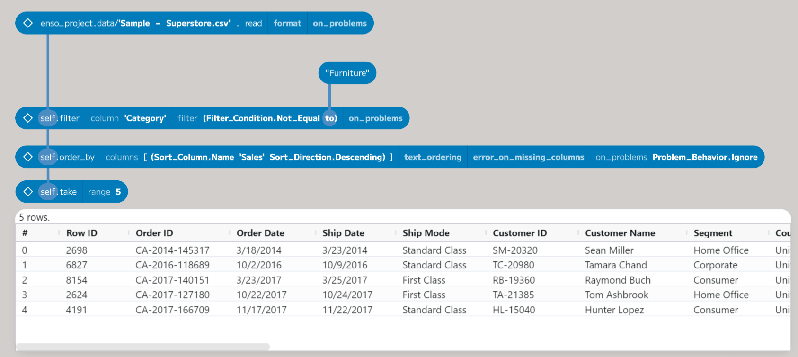
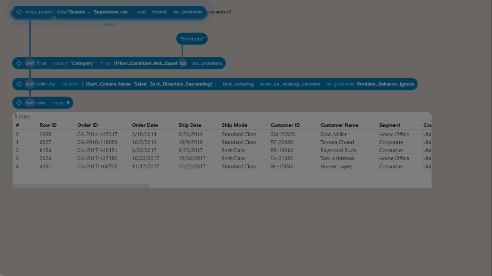
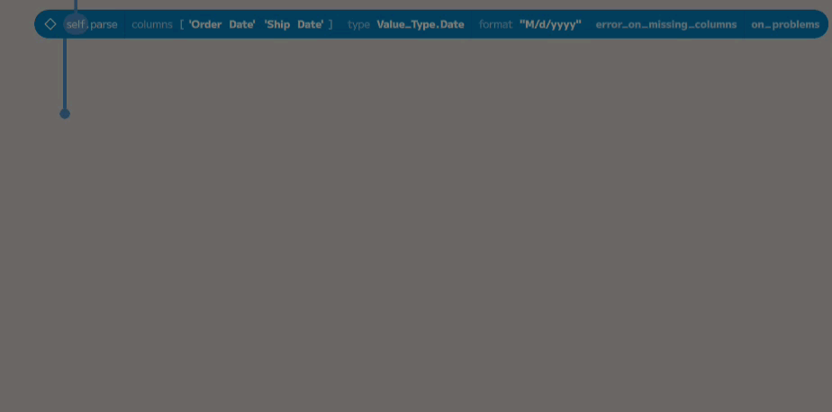
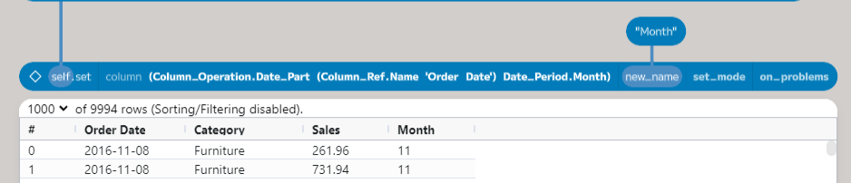
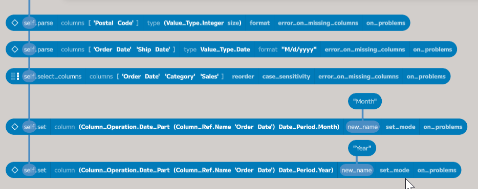
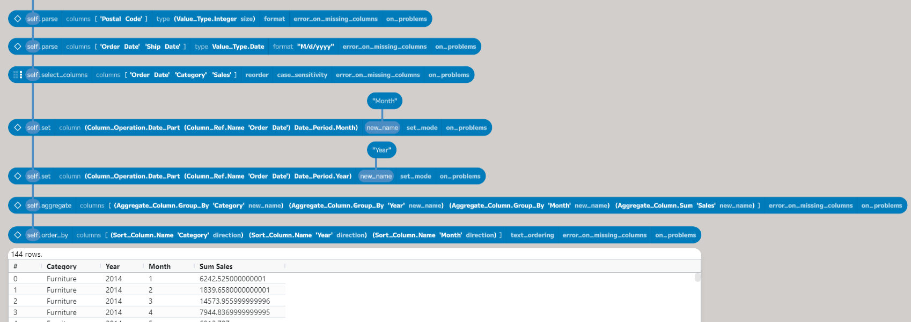

## Getting Started With Enso - Parsing, Selecting and Grouping

The [previous post](https://jdunkerley.co.uk/2023/11/02/getting-started-with-enso/) looked at installing Enso and then loading in some data. In this post, I will build on top of those first steps and go over how to parse values in the dataset, select down to just the columns we are interested in, and finally aggregate the data.

It starts from the workflow created in the last post using the [Kaggle Superstore Dataset](https://www.kaggle.com/datasets/vivek468/superstore-dataset-final). If you have not read that post, I recommend you do so before continuing. The workflow can be downloaded from [here](https://www.dropbox.com/scl/fi/doq5ksb38ky0b1oww4q11/Enso_Getting_Started_1.enso-project?rlkey=yb75gl7197wdkjgd71vgavaye&dl=0).

The goal of this workflow will be to get a table of the total sales by category for each month (using the order date).

## Parsing the Data

Let's start by taking a look at the structure of the data. We can do this using the `info` function on the first node. To add this node, select the first node and press Return or drag out from the bottom of that node. Then, in the new node, type `info` or choose it from the component browser. This function returns a new table containing the metadata about the table. In this case:

Column | Items Count | Value Type
---|---|---
Row ID | 9994 | Integer (64 bits)
Order ID | 9994 | Char (variable length, max_size=unlimited)
Order Date | 9994 | Char (variable length, max_size=unlimited)
Ship Date | 9994 | Char (variable length, max_size=unlimited)
Ship Mode | 9994 | Char (variable length, max_size=unlimited)
Customer ID | 9994 | Char (variable length, max_size=unlimited)
Customer Name | 9994 | Char (variable length, max_size=unlimited)
Segment | 9994 | Char (variable length, max_size=unlimited)
Country | 9994 | Char (variable length, max_size=unlimited)
City | 9994 | Char (variable length, max_size=unlimited)
State | 9994 | Char (variable length, max_size=unlimited)
Postal Code | 9994 | Char (variable length, max_size=unlimited)
Region | 9994 | Char (variable length, max_size=unlimited)
Product ID | 9994 | Char (variable length, max_size=unlimited)
Category | 9994 | Char (variable length, max_size=unlimited)
Sub-Category | 9994 | Char (variable length, max_size=unlimited)
Product Name | 9994 | Char (variable length, max_size=unlimited)
Sales | 9994 | Float (64 bits)
Quantity | 9994 | Integer (64 bits)
Discount | 9994 | Float (64 bits)
Profit | 9994 | Float (64 bits)

Enso will automatically parse columns of all numbers (such as `Sales`, `Quantity`, and `Profit`) and recognise standard format dates and times (such as `2023-11-09` or `2023-11-09 12:22:04`). 

At first glance, the `Postal Code` column appears to be a number (US 5-digit Zip codes), but as some have leading 0s, Enso will not parse this column by default. While we probably would want to keep these as text values, we can convert this to a number (specifically, an integer) using the table's `parse` function.

Once we have added the node, the next step is to choose the columns we are interested in and to specify the target type. Clicking on the right of the `columns` placeholder will add a new column name, then choose `Postal Code` from the dropdown. Finally, choose `Integer` from the `type` dropdown.

 In this dataset, the date fields are stored in US format without leading zeros. Enso uses similar [format strings to .Net](https://learn.microsoft.com/en-us/dotnet/standard/base-types/custom-date-and-time-format-strings) to specify how to parse or format dates. The table below is not an exhaustive list but gives some key date specifiers.
 
 Specifier | Description | Example
--- | --- | ---
`d` | Day of month (1 to 31) | 1
`dd` | Day of month (2 digit, 01 to 31) | 01
`ddd` | Day of week (short name) | Mon
`dddd` | Day of week (full name) | Monday
`M` | Month of year (1 to 12) | 1
`MM` | Month of year (2 digit, 01 to 12) | 01
`MMM` | Month of year (short name) | Jan
`MMMM` | Month of year (full name) | January
`yy` | Year (2 digit) | 23
`yyyy` | Year (4 digit) | 2023

 The US format of `M/d/yyyy` is used to parse the Order Date and Ship Date columns. Add a new `parse` node and two entries to the `columns` placeholder. Then, choose `Order Date` and `Ship Date` from the dropdowns. Next, select `Date` from the type dropdown.

 

 At this point, the node will be surrounded by a yellow border, indicating that a problem has occurred when trying to parse these columns. By default, Enso attaches a warning to the resulting table and puts a `Nothing` value in for the cells it cannot parse. In this case, the format of the dates has not yet been given. There are two ways to set the format: add a new node (using the `+` button) and enter the value `"M/d/yyyy"` or edit the existing node and type the value at the end of the code. To edit the node, Ctrl-click on it, and it will switch to a text box showing the code. Type the format string at the end of the code preceded by a space (` "M/d/yyyy"`). The yellow border will disappear, and the warning will be removed.

 *The new IDE (coming soon) will have significantly improved support for editing text placeholders.*  

The last two parameters in the `parse` function allow more control over the error handling. By default, if a column you have chosen does not exist, the function will error and stop. If you wish to allow this to continue, select `False` in the `error_on_missing_columns` dropdown, and a warning will be attached to the result instead of the process erroring.

The final parameter, `on_problems`, specifies what Enso should do with warnings. This argument is present in a lot of our functions. Generally, warnings are attached to the result and can be examined or handled within the workflow. You can choose one of the following from the dropdown to control this.

- `Ignore`: warnings are ignored, and the result is returned.
- `Report Warning`: warnings are attached to the result and then returned
- `Report Error`: warnings are treated as a dataflow error, and the error is returned instead of the result.

In a later post, I will fully cover how to handle warnings and errors.

## Selecting Columns

`Order Date`, `Category`, and `Sales` are the only columns needed for this task. To choose these columns, add a new node connected to the second parse node and choose `select_columns` from the component browser.

Add three new entries to the `columns` argument and choose the required columns from the dropdowns under each. The `select_columns` function will return a new table containing only the columns you have selected.

By default, the columns will be in the same order as the source table. Choose `True` from the `reorder` dropdown to return the columns in the order of the select list. The names are matched case-sensitively. To allow case differences, choose `Insensitive` from the `case_sensitivity` dropdown.

## Adding Month and Year Columns

The table now contains only the interested columns, but we need to extract the month and year from the `Order Date` column. The `set` function allows us to derive a value from an existing column and add it to the table. Add a new node connected to the `select_columns` node and choose `set` from the component browser.

The first parameter, `column`, defines the new column, which can be done in a few different ways (I will cover more of these methods in a later post). For this post, we will use a `Column_Operation`. To add the month as a column, choose "date part" from the dropdown and pick "Order Date" for the `input` and `Month` from the `period`. A new column called `date_part([Order Date], Month)` will be added. We want to rename this to "Month". If you add a new node with a value of `"Month"` and then connect to `new_name`, the column will be renamed.

Using the same process to add a new column for the year, the table now has all the data needed to aggregate.

## Grouping and Aggregating

The last step to produce the table is to aggregate the data. Add a new `aggregate` node connected to the `set` function, which added the year. This function takes a list of `Aggregate_Columns`, which define the grouping (via `Aggregate_Column.Group_By`) and the aggregations (such as the sum of sales). In this case, we want to group by `Category`, `Year`, and `Month` and then sum the `Sales`.

Add four entries into the `columns` argument and then select group by for the first three and sum for the last. Then, choose the appropriate columns from the dropdowns. The `aggregate` function will return a new table with the aggregated data. *This function does tend to get quite long. Later versions of the IDE should show this better.*

The grouped table is not returned in a specific order. To sort the data into the required order, use the `order_by` function as shown in the previous post. The completed process is shown below.

## Conclusion

In this post, we have introduced a few more functions and covered some of the basics of parsing, selecting, and grouping data. So far, we have used the following functions:

- `filter`: choosing specific rows from a table based on a condition.
- `order_by`: sorting the rows in a table.
- `info`: getting the metadata about a table.
- `parse`: converting columns to a different type.
- `select_columns`: choosing a set of columns from a table.
- `set`: adding a new column to a table.
- `aggregate`: grouping and aggregating data.

The following post in this series will cover how to join tables together.

As before, I hope you will consider trying out Enso. We are working hard to make it a fantastic product and would love your feedback. If you have any questions, please join our [Discord](https://discord.com/invite/enso) server or comment below.
