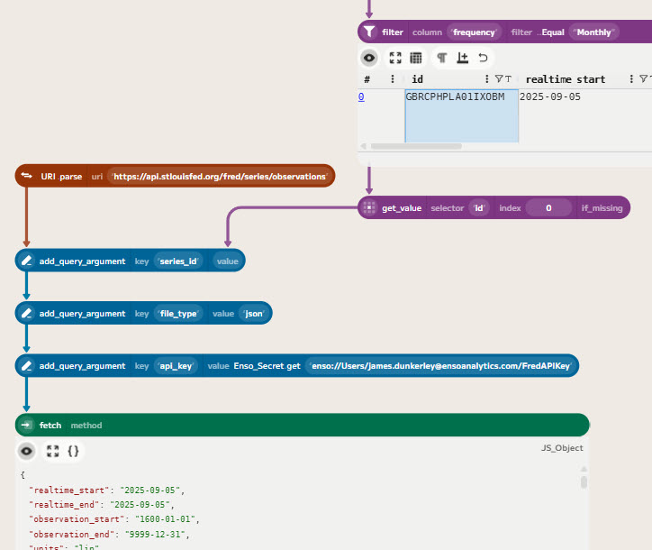

# Using Enso to Analyze UK Prime Ministers and Inflation

One of Enso's strengths is its ability to easily gather and process data from various sources, particularly web-based APIs. In this post, using Enso, I'll show how to combine data from [FRED](https://fred.stlouisfed.org/) and [Wikipedia](https://www.wikipedia.org/) to create a dataset of UK Prime Ministers and the annualised inflation rate during their time in office.

My goal is to create a table of Prime Ministers, their start and end dates, and the annualised inflation rate during their time in office. Something that looks like this:

## Setting up access to the FRED API

The FRED is a fantastic source of economic data. It provides a free API to access its data, which makes it easy to gather data using Enso. First, you'll need to sign up for a free API key from [FRED](https://fred.stlouisfed.org/docs/api/api_key.html).

Having created an account and obtained an API key, let's make a new Enso secret to store it securely. We can then use it within our projects. First, switch to the "Data Catalog" view in Enso and then click on the "Cloud" to access the Cloud drive.

Then click on the create new secret button in the toolbar.

This will pop up a dialog where you can enter your API key. Give it a name (e.g. `FredAPIKey`) and then paste in your API key. Then click "Create" to save the secret.

Now we can use this secret in our Enso workflow. Let's create a new project and bring the inflation data for the United Kingdom into Enso. 

## Searching the FRED database

FRED has a search API at `https://api.stlouisfed.org/fred/series/search` which we can use to find the series ID for the UK inflation data. Let's start by building up a new component to make this request.

Click on the "Input" button in the toolbar to create a new input component. Type `uri` to search for the `URI.parse` component within the Component Browser. This will allow us to create a new URI that we can use to make our search request. Enter the above URL into the `uri` parameter input.

Next, the API needs some query parameters to specify the search term, the file type, and our API key. We can add these using the `add_query_argument` component on the URI. To do this, click on the output port of the `URI.parse` component and choose `add_query_argument` from the Component Browser. Each query argument takes a key (the name of the parameter) and a value, which can be either a Text value or point to an Enso secret. 

We'll need to add three query arguments: `search_text` with a value of `Inflation UK`, `file_type` with a value of `json`, and `api_key` with a value pointing to our `FredAPIKey` secret (which you can choose using the secret browser). Add each one in turn by clicking on the output port of the previous `add_query_argument` component.

To then bring the data into Enso, add a `fetch` component to the last `add_query_argument` component, to make the HTTP request. Enso automatically detects the content type and parses the JSON response into an Enso data structure (technically a `JS_Object` in this case).

In this case, the series are returned in the `seriess` field of the response. We can use a `get` component and then a `to_table` component to convert this into a `Table`, which we can then sort (by `popularity`) and filter to monthly series.

Looking through the results, we can see that the series ID for the UK inflation data is `GBRCPHPLA01IXOBM`, which corresponds to "Consumer Price Indices (CPIs, HICPs), COICOP 1999: Consumer Price Index: Overall Index Excluding Energy, Food, Alcohol and Tobacco for United Kingdom". We can now use this to get the actual inflation data.

## Getting and preparing the inflation data

Now that we have the series ID, we can use the FRED series observations API at `https://api.stlouisfed.org/fred/series/observations` to get the actual inflation data. We can build this request in a similar way to the search request. This API needs the `series_id`, `file_type`, and `api_key` query parameters.

To get the series ID value into the request, you can right-click in the table cell and choose "Get Value" to create a component linked to the table with that value.

Then, as before, build up the URI with the query arguments and a `fetch` component to make the request. The only extra difference is that the value for the series ID is now linked to the `get_value` component (drag from the output port to the value parameter).

*You can also copy and paste the search request components to save time. Remember to change the URL and update the `search_text` query argument to `series_id` and link its value to the `get_value` component.*

Converting this into a table of data is very straightforward. The observations are in the `observations` field of the response, so we can use a `get` component to extract this and then a `to_table` component to convert it into a table. To then tidy up the table, we can use a `parse` component to convert the values from text to numbers and dates, and then a `select_columns` component to keep only the `date` and `value` columns.

## Getting the Prime Ministers dataset from Wikipedia

Having gathered the inflation data, we need to get the list of UK Prime Ministers and their time in office. Wikipedia has a page listing all the Prime Ministers of the United Kingdom at [https://en.wikipedia.org/wiki/List_of_prime_ministers_of_the_United_Kingdom](https://en.wikipedia.org/wiki/List_of_prime_ministers_of_the_United_Kingdom). We can use Enso's web scraping capabilities to extract this data.

To do this, let's add a `Data.fetch` component to fetch the HTML content of the Wikipedia page. As this doesn't need any special query arguments, enter the URL directly into the `uri` parameter. Wikipedia requires a user-agent header to be set, so we can add this by clicking the `+` button in the headers parameter and entering `User-Agent` as the key and something like `Enso/2025.2 (https://ensoanalytics.com)` as the value.

By default, Enso returns a `Response` object for HTML responses (allowing you to access headers, status code, etc.). To get the HTML content, we can either use a `decode_as_text` component or change the `format` parameter of the `Data.fetch` component to `Plain_Text`.

Enso caches web requests while working within a project. If you change parameters sent to the server, it will refresh, but if you change values within Enso that don't affect the request, it will use the cached version. To force a refresh, you can use the Refresh button in the top toolbar.

Extracting the data from this HTML is a bit more involved. The data we want is in a table on the page. The specific table is the first table on the page with the caption "Prime Ministers of the United Kingdom". Using a regular expression of `<table.*?</table>` will find tables within the HTML. Using a `tokenize` component will split the HTML into a list of tables, and then using `first` will extract the target table's HTML.

To include the current Prime Minister, Kier Starmer, we need to modify the HTML slightly. The end date for the current Prime Minister is listed as "Incumbent", which we need to change to a date. Formatting today's date in the correct HTML format (e.g. `"
8 September
 2025"`) makes this row consistent with the other rows.

To convert this HTML into a table of rows, each containing HTML, regular expressions can again be used. The pattern `<tr[^>]*>(?<HTML>.*?)</tr>` will match each row in the table, and then using a `parse_to_table` component will convert this into a table with a single column containing the HTML for each row. *The special `(?<HTML>...)` syntax is a named capture group, which allows us to name the column in the resulting table.*

The first two rows (which are headers) can be removed using a `drop` component.

Extracting the columns from this table is a bit fiddly as the table uses a lot of multi-row cells. In the end, matching patterns for the key fields worked better. I won't go into the details of this here, but after some trial and error (easily enabled by Enso's live re-evaluation), I ended up with the following table:

## Joining the datasets

Having got both datasets, it's time to join them together. The inflation data is monthly, so let's add an end-of-month column. Using the `set` component with an expression of `date_add(date_add([date],1,..Month),-1)` allows creating this based on the existing date column.

Next, as the inflation data starts in 1988, let's filter the Prime Ministers to only those who served (or were serving) from 1988 onwards. Use a `filter` component on the `End Date` column and then choose `Equal_Or_Greater` and join the first value from the inflation data (using a `get_value` component).

Finally, onto the join! To enable this, Enso has a `Between` condition on the `join` component, which allows joining based on a range of values. To obtain the initial and final inflation values for each Prime Minister, two between-join operations are required. The first join gets the inflation at the start of their term, and the second join gets the inflation at the end of their term. The first Prime Minister in the filtered list is Margaret Thatcher, who started on 4 May 1979. Therefore, the first join will not find any matching inflation data (as that data begins in 1988). To handle this, the join is set to use the first inflation date instead. Likewise, for the current Prime Minister, Kier Starmer, the newest inflation data is used.

## Calculating the annualised inflation

To compute the annualised inflation rate during each Prime Minister's time in office, we can use the formula: `([End Value] / [Start Value]) ^ (12 / [Months]) - 1`.

To calculate the number of months in between the first and last inflation data points, a simple expression using the Date Diff function can be used.

*To make the expressions clearer, I also used a simple expression to divide the end value and the start value.*

Finally, we can tidy up the table by selecting only the columns we want to keep and renaming them as appropriate.

## Conclusion

In this post, I've shown how to use Enso to gather data from web-based APIs and web pages, process it, and combine it to create a new dataset. The ability to easily access and manipulate data from various sources, combined with the real-time feedback, makes using Enso great fun and very productive.

If you'd like to try Enso for yourself, you can download it from [ensoanalytics.com](https://ensoanalytics.com).

If you'd like to see the complete workflow for this example, you can download it from [here](https://www.dropbox.com/scl/fi/bokbrm9hlemoyvq97mjk7/UK-Prime-Ministers-Inflation.enso-project?rlkey=dnz3t3yufe4puc26c2x0yfju2&st=jbumyo37&dl=0). *You will need to add your own FRED API key secret to run it.*

Happy data wrangling!
