# Using Enso to Solve Preppin Data Challenges

Enso is a functional programming language that lets you quickly and simply load, blend, and analyze your data. We've been building out the core capabilities of the product and are rapidly working on the IDE and cloud release to give a straightforward experience for users using it.

To show some of the new capabilities, I have tackled the first three challenges of 2023 posted on [Preppin Data](https://preppindata.blogspot.com/). These data challenges are posted by [Carl Allchin](https://twitter.com/datajedininja), [Jonathan Allenby](https://twitter.com/jonathanallenby), [Jenny Martin](https://twitter.com/jennymartinds14), and [Tom Prowse](https://twitter.com/TomProwse1). They are solvable in many data tools and make an excellent set of tasks to show how to use Enso.

This blog was written using a recent nightly build; many features and functions are still maturing and subject to change as we approach our release. In addition, we are still working on adding more "widgets" to the nodes and improving data visualization capabilities to help guide you through building the workflow. These will appear over the next month or two in the nightly builds.

## Week 1 - The Data Source Bank

- https://preppindata.blogspot.com/2023/01/2023-week-1-data-source-bank.html

<iframe width="560" height="315" src="https://www.youtube.com/embed/yhSqxkkhQVk" title="YouTube video player" frameborder="0" allow="accelerometer; autoplay; clipboard-write; encrypted-media; gyroscope; picture-in-picture; web-share" allowfullscreen></iframe>

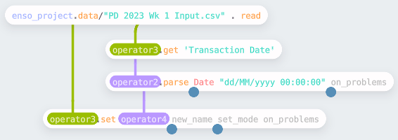

Loading a dataset into Enso is as simple as dragging the file onto the IDE, and it will then set up the first node and attempt to parse the data. However, Enso's default CSV parsing only recognizes dates in ISO format (`yyyy-MM-dd`). So to parse the 'Transaction Date' column, we need to select it (using the `get` method) and then parse it (using the `parse` method), and finally replace the original column in the table (with the `set` method).

For this challenge, we need to derive three values - the day of the week, the bank code, and whether a transaction was in-person or online. For the first two, I used the same process - select the column, apply a function over each row, and then add the result to the table. 

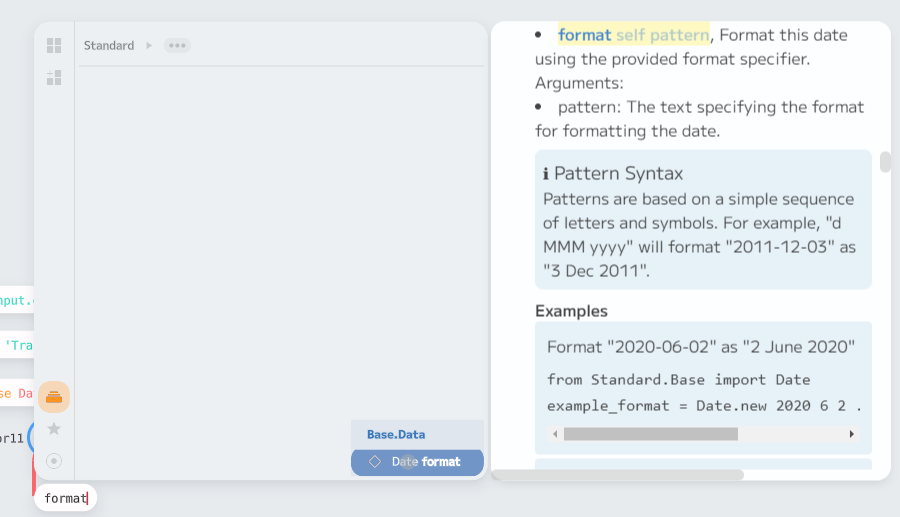

Creating the "day of week" column involves formatting the date. The `format` function on a `Date` allows for this. Enso uses Java for date and times, so the [usual](https://docs.oracle.com/javase/8/docs/api/java/time/format/DateTimeFormatter.html) date format specifiers](https://docs.oracle.com/javase/8/docs/api/java/time/format/DateTimeFormatter.html) work - so in this case, the expression is `_.format "EEEE"` (the `_` is a shorthand to create a lambda function). To build this within the IDE, I took a single value from the column (using `.first`), and then the component browser showed the available functions for a `Date`. If you then detach the incoming node, the new node becomes a reusable function I can feed into the `map` function on the column.

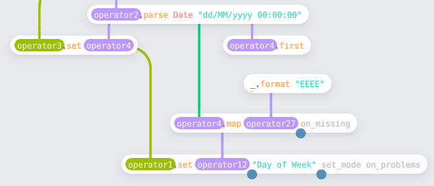

For the "bank" column, we need to split the "Transaction Code" string and take the first part. The process was the same - pick the input column, get a single value, and create a mapping function. In this case, the mapping used the `split` and `first` functions.

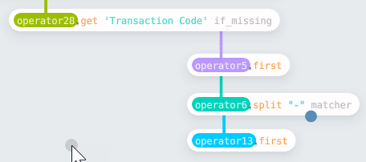

Having built these nodes, Enso allows me to make a reusable function by selecting them and pressing `Ctrl-G`. The result can then be fed into the same `map` as above.

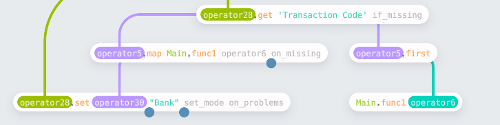

The final column was created using Enso expressions, an Excel formula-like syntax allowing a shorthand to derive a new column. You can reference existing columns (specified by name in square brackets) and use all the functionality defined on a column. In this case, `'IF [Online or In-Person]==2 then "In-Person" else "Online"'` will decode the column into the text values.

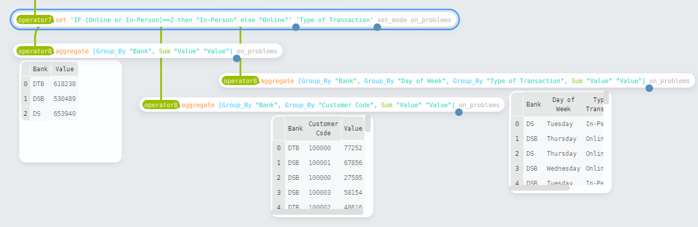

Finally, the last task is aggregating the results to produce the three new tables. The `aggregate` function allows us to do this. It takes a vector of `Aggregate_Column` to create the summarised tables. These columns are either group bys or aggregate calculations. For example, `operator8.aggregate [Group_By "Bank", Group_By "Day of Week", Group_By "Type of Transaction", Sum "Value" "Value"]`.

The final workflow is shown below:

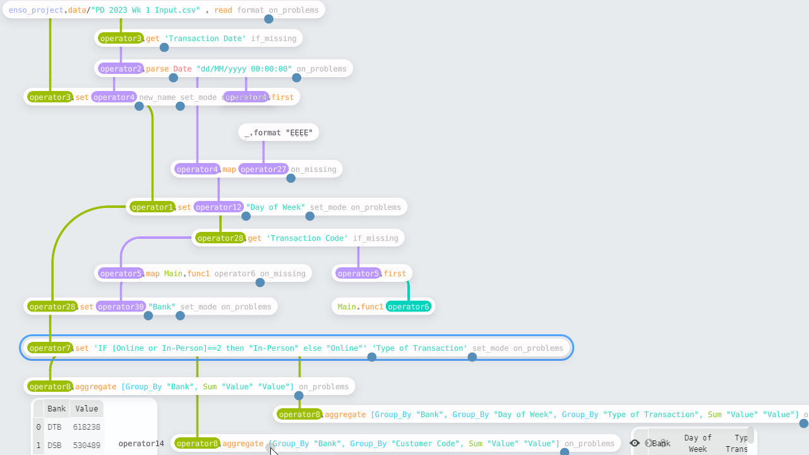

[Code](https://gist.github.com/jdunkerley/44d0e1f66fedad1223a3a08bd44c440d)

## Week 2 - International Bank Account Numbers

- https://preppindata.blogspot.com/2023/01/2023-week-2-international-bank-account.html

<iframe width="560" height="315" src="https://www.youtube.com/embed/ne-Y9P_WvEk" title="YouTube video player" frameborder="0" allow="accelerometer; autoplay; clipboard-write; encrypted-media; gyroscope; picture-in-picture; web-share" allowfullscreen></iframe>

For the second challenge, we need to construct "IBAN" codes for a set of transactions. In this case, two input files are provided - one with SWIFT codes for banks and another with transaction data. There is one slight complication with bringing the data in. All the values are text in the "Swift Codes" file, so Enso doesn't automatically detect the headers. The `use_first_row_as_names` function renames the columns to the first value.

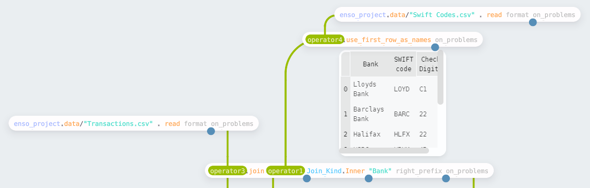

Having read the files, the next step is to join the two data sets. The `join` function allows you to specify the type of join (such as Inner, Left Outer, Full) and the columns to join on (defined as a Vector). For this function, if the two inputs have the same first column, it will, by default, automatically perform an inner join using this.

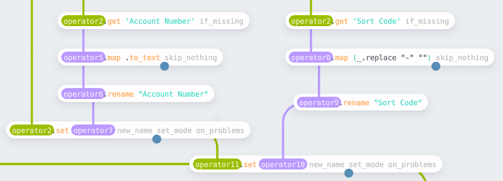

There is a small amount of preparation before creating the IBAN for each transaction. First, the transaction file has been automatically parsed, and the account numbers have been converted to integers. However, to concatenate these values in the final expression, they must be converted back to text. Using the same process as week one to create a derived value, the `map` function uses `.to_text` to convert the values. For the "Sort Code," we need to remove `-` from the values; a simple `replace` on each record covers this.

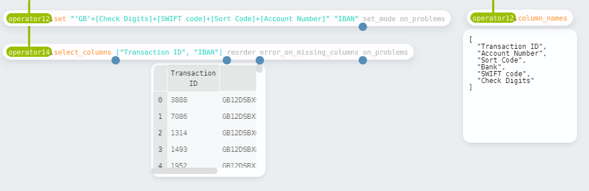

The final step is to concatenate the various parts of the IBAN into a single value. I chose to use the expression syntax again here. 

The final workflow is shown below:

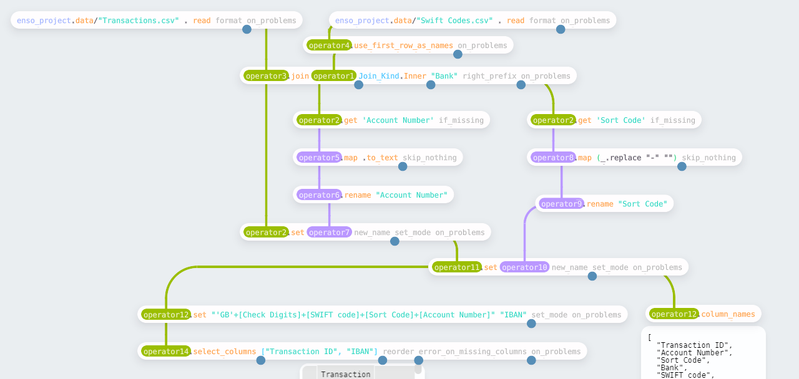

[Code](https://gist.github.com/jdunkerley/37653fed9c7c09bc8eed1e92852df235)

## Week 3 - Targets for DSB

- https://preppindata.blogspot.com/2023/01/2023-week-3-targets-for-dsb.html

<iframe width="560" height="315" src="https://www.youtube.com/embed/uDGCw0kzEpI" title="YouTube video player" frameborder="0" allow="accelerometer; autoplay; clipboard-write; encrypted-media; gyroscope; picture-in-picture; web-share" allowfullscreen></iframe>

For the final challenge in this post, some quarterly targets for the DSB were provided. This task builds on top of the work of week 1. The first step is to get the quarterly totals.

Starting from the pre-aggregated table in week 1, the data is filtered down to just the transactions for DSB. The `filter` node allows you to specify various ways to filter the data, such as a simple equality check. You can also use `filter_by_expression` using the expression syntax if preferred (for this case, it would be `[Bank] == 'DSB'`). Having filtered the data, the quarter for the dates is added as a new column and then aggregated into the summary table.

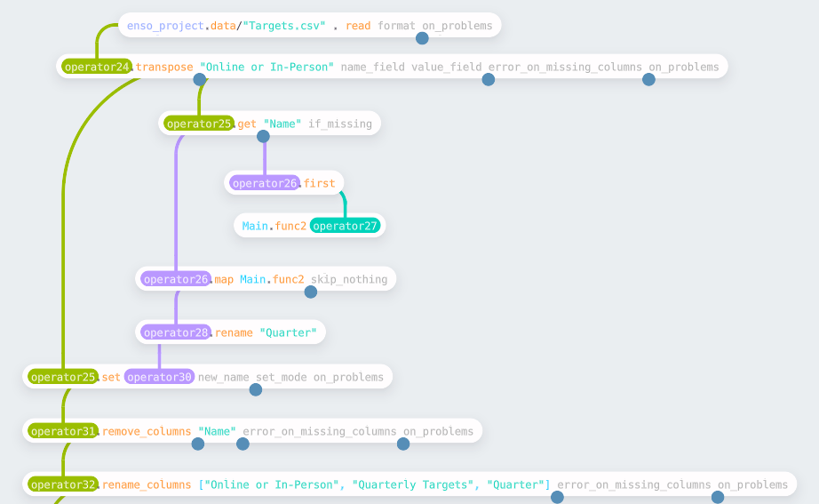

The next task is to read in and reformat the input file containing the targets. This file is in a column-based format; we want to convert this to rows. The `transpose` function allows us to do this - the first argument is one or more columns to leave unchanged and keep as id fields; the other columns will be transposed into a `Name` and `Value` column.

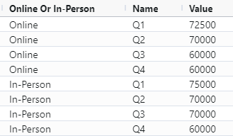

To join these targets to the aggregated data, the "Name" column must be parsed, first removing a "Q" and then converting to an integer. 

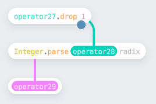

This follows the standard pattern of picking a column, creating a reusable function (as shown above), apply to each row using a map, and writing back into the table. Finally, remove the "Name" column and rename the remaining columns to create the tidied targets to join the totals.

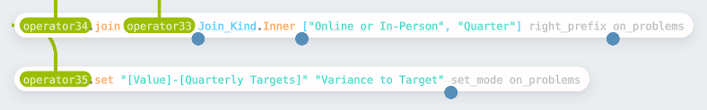

This join requires two fields to be equal - as the names match, these can be specified as a vector of strings. More complicated join conditions can be used by using the `Join_Condition` type. Finally, the last step is to compute the variances - this time using the expression syntax.

The final workflow (built on top of part 1) is shown below:

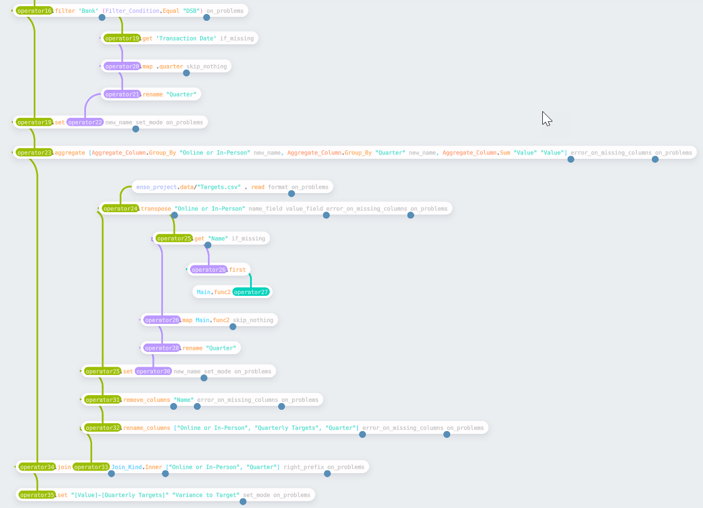

[Code](https://gist.github.com/jdunkerley/ad0623c935249767045c5043fe716ac8)

## Summary

Hopefully, these examples give you a feel of how to use Enso. If you want to try it, download a [nightly release](https://github.com/enso-org/enso/releases/latest/) from our GitHub or look for the forthcoming beta release in a few months.
