# Looking at the 2025 rainfall data for the UK in Enso

It's been a little while since I last posted, as the team and I at Enso have been hard at work on the new version of the app. We released [version 2025.1](https://ensoanalytics.com/trial) a couple of weeks ago with a huge amount of [new features and improvements](https://community.ensoanalytics.com/c/what-is-new-in-enso/enso-analytics-2025-1-1-has-been-released).

As any who live in the UK will know, it has been a (very dry spring)[https://www.bbc.co.uk/weather/articles/c5y64p3m7pyo] so far. As I write this, it is another beautiful sunny day in London, and the forecast is for more of the same. I thought I would use Enso to take a look at the rainfall data for the UK. I will be using the [UK Met Office](https://www.metoffice.gov.uk/) data, which is available for free on their [Climate Data](https://www.metoffice.gov.uk/research/climate/maps-and-data/data/historic-station-data) page. The specific data I will be looking at is the [UK monthly rainfall data](https://www.metoffice.gov.uk/research/climate/maps-and-data/uk-and-regional-series) starting from 1836.

## Fetching and Parsing the data

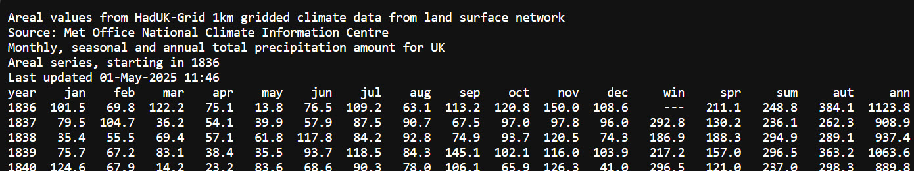

Looking at the data, it is clear it is in a fixed width format. The first 5 lines are the header, and the rest of the data is in a fixed width format. Lets bring this data into Enso and see what we can do to parse it. *Currently, Fixed Width native support is only in the nightly  build of Enso, so I will show how to do it using the current release version. The nightlies are available from our GitHub repository [here](https://github.com/enso-org/enso/releases).* 

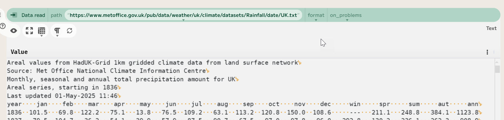

The `Data.read` command is used to read data into Enso. It can read from files or from URLs. In this case, it downloads the data from the Met Office website and reads it into Enso. The data is identified as plain text, so it is read into Enso as `Text`. We can however, tell it to read it as a delimited file and then skip the header rows.

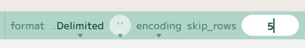

To do this, choose the `Delimited` option in the format command. This will allow us to specify the delimiter, which in this case choosing `{none}` as it is not delimited. We can also specify the number of header rows to skip, which here is 5. The data is then read into Enso as a single column Table. As we are only interested in the monthly data, use a `set` component to take just the first 88 (4 for the year, 7 for each month) characters of each value (using `Text Left`).

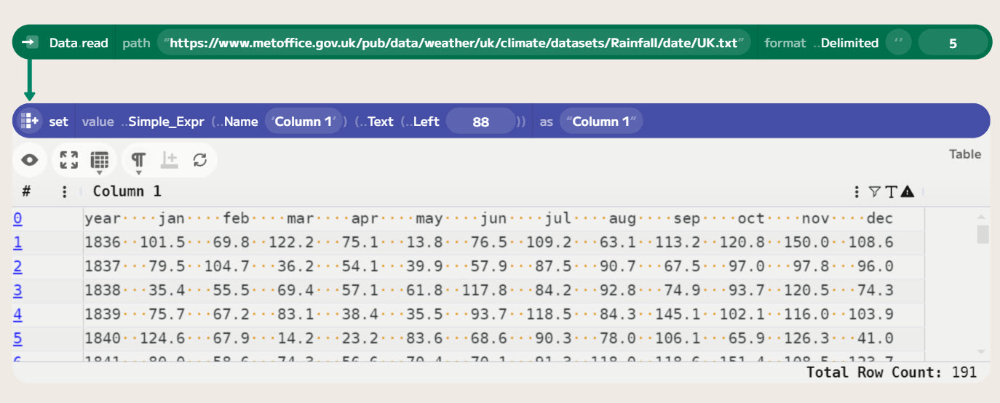

Now, we want to split into columns. I'm going to use regular expressions here as that is my favourite way of doing such things. The `tokenize_to_columns` function takes a column and a regular expression and splits the column into multiple columns. If there is a marked group in the regular expression, it will be used the value and the other parts discarded. The expression I am using is `\s{0,7}(\S+)`. This will match any whitespace (up to 7 spaces) followed by a non-whitespace sequence (the actual data we want).

I then do a couple more transformations to the data:

1. Use the first row as the column names.
2. Replace empty values with `Nothing`.
3. Parse all the values.

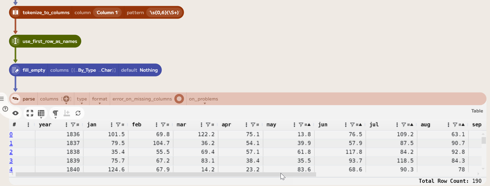

## Comparing year by year

Now we have the data in a nice format, we can start to do some analysis. I want to change the data to a row based format with `year`, `month` and `rainfall` columns. A transpose function will rotate the data and then we can convert the month name to a season as well. I created a lookup table (using `Table.input`) to convert the month names to number and seasons. I then use a `merge` function to join the data with the lookup table. This gives us a table with the year, month, season and rainfall values.

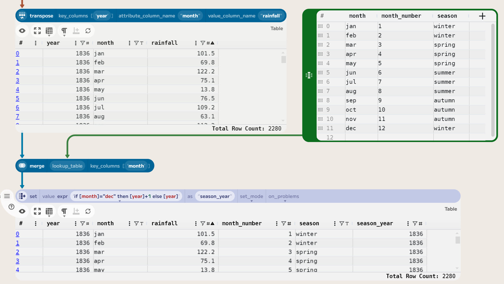

As December is in the winter, need to add a `season year` column to the data. This is just the year, unless it is December, in which case it is the next year. Using a `set` component with an [expression](https://help.enso.org/docs/using-enso/expression-syntax) of `if [month]="dec" then [year]+1 else [year]` to make the new column.

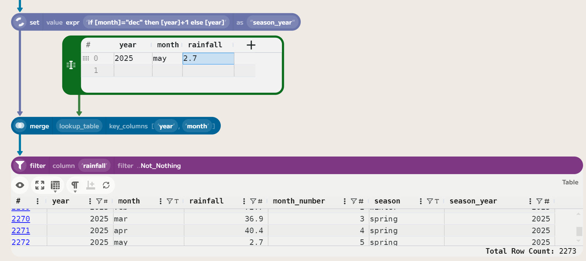

Finally, in preparing the data, need to add a row for May 2025. As this is not currently in the monthly data. Based on the article, the average for Spring 2025 is 80mm, so for May this comes out as just 2.7mm. Using another look up table and merge function we can update this value and then filter out the future rows (where the rainfall is `Nothing`).

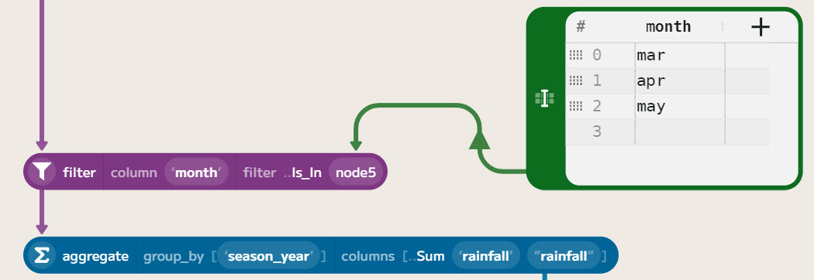

To create the yearly data, filter down to the interesting months (here March, April and May). Using another look up table and linked to a `filter` where `month Is_In` allows you to do this easily. Then aggregate by `season year` creating the total rainfall for each year.

## Computing average of previous 20 years

One of the new features in the 2025.1 release is the ability to use `Table.offset` to access previous rows in a table. This allows us to easily compute a rolling average. It can be used as it's own function or within an expresison. You do need to ensure that the table is sorted first, but this is done easily using a `sort` function (you can specifiy the ordering in `offset` component as well).

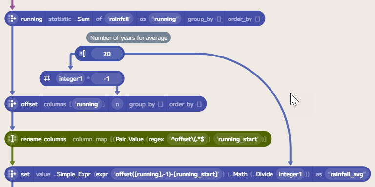

First we use a `running` component to compute a new running total rainfall since 1836. To then get the value from 20 years ago, use the `Table.offset` function with n set to -20. One of the really powerful features of Enso is that everything can be passed into configure components. So we can have the value of the number of years as its own component. This allows us to easily change the number of years we are looking at.

As offset needs a negative value, but computing the average will also want the number of years, first need to multiply the number of years by -1. The offset function returns a table with an additional column with the shifted values, with a name of `offset([running], -20, ..Nothing)`. As this depends on the number of years, a `rename_columns` function is needed to normalise the name to `running_start`.

Finally to compute the average, a `set` component is used. Showing some of the power of this component, you can combine `Simple_Expression` and expressions together. Let's take a look at the expression: `offset([running],-1)-[running_start]`. The first part, `offset([running],-1)`, gets the previous value of the running total by using a offset inline of the expression. The second part, `- [running_start]`, subtracts the value from 20 years ago. This gives us the total rainfall for the last 20 years.

The `Simple_Expression` is then used to divide this value by the number of years to get the average. The final result is a table with the year, month, season and rainfall values, as well as the average rainfall for the previous 20 years for each row.

## Calculating a z-score

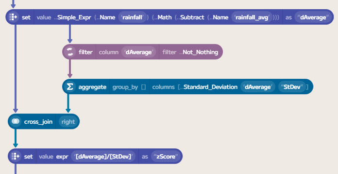

To compute the deviation from the average, we can subtract the average from the current value. This is done using another `set` component. To compute the z-score, we need to divide this value by the standard deviation. The z-score is a measure of how many standard deviations a value is from the mean. A z-score of 0 means that the value is equal to the mean, while a z-score of 1 means that the value is one standard deviation above the mean.

You could compute a rolling standard deviation in a similar way to the rolling average above. However, for my own analysis, I decided to just use compute this over the entire dataset. This is a standard computation on the `aggregate` function. To then attach this to the data, a `cross_join` will perform a carthesian product of the two tables.

Finally, we can compute the z-score by using a `set` component with the expression `[dAverage]/[std_dev]`. 

## Displaying the data

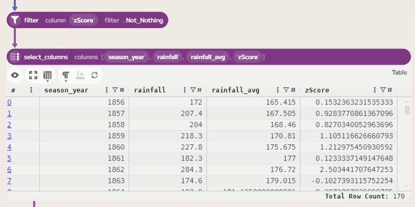

Next, we can filter the rows to remove the rows without a z-score. These will be the first 20 years of data, as we are using a 20 year rolling average.

To pick the columns we want to display, use a `select_columns` compontent. In this case keeping `season_year`, `rainfall`, `rainfall_avg` and `zScore`.

Enso has the option of showing data on a scatter plot, which is a great way to visualise the data. If you add a `color` column, you can use this to colour the points. In this case, I used the `zScore` column to colour the points when more than 2 standard deviation below the average.

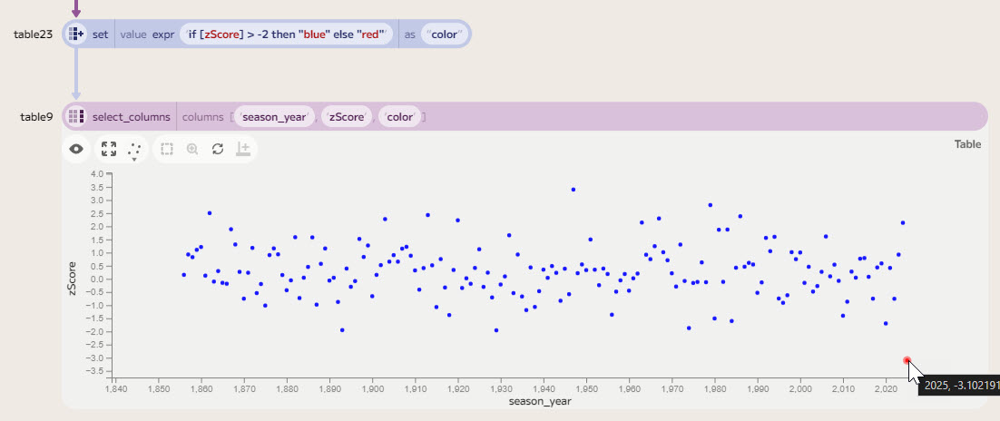

This gives a nice visualisation of the data, showing the years with the extreme rainfall - either very high or very low. We can see 2025 really stands out as a very dry year being more than 3 standard deviations below the average of the last 20 years.

The table below shows the years outside 2 standard deviations:

| Year | Rainfall | 20yr Average | Z-Score |
|------|----------|--------------|---------|
| 1862 | 284.3 | 176.7 |  2.50 |
| 1903 | 285.4 | 187.7 |  2.27 |
| 1913 | 311.4 | 207.0 |  2.43 |
| 1920 | 307.9 | 212.1 |  2.23 |
| 1947 | 326.8 | 180.7 |  3.40 |
| 1963 | 280.1 | 188.0 |  2.14 |
| 1967 | 294.5 | 195.7 |  2.30 |
| 1979 | 327.1 | 206.4 |  2.81 |
| 1986 | 313.8 | 211.4 |  2.38 |
| 2024 | 301.7 | 210.0 |  2.13 |
| 2025 |    80 | 213.3 | -3.10 |

## Conclusion

This is a simple example of how to use Enso to analyse data. The new features in 2025.1 make it easy and quick to work with data and experiment.

While this is not a deep analysis, the flexibility and control of parameters and the live re-evaluation of results make it a great tool to look at the historical data. I hope this gives you a taste of what is possible with Enso and how easy it is to work with data. If you have any questions or comments, please let me know in the comments below.

If you're interested in trying out Enso, you can download the latest version from our [website](https://ensoanalytics.com/trial). We also have a [community forum](https://community.ensoanalytics.com/) where you can ask questions and share your experiences with other users.