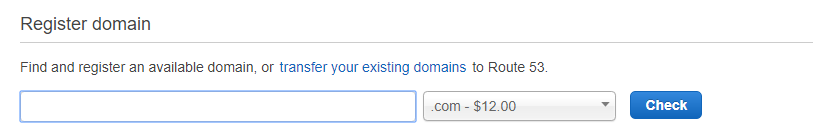
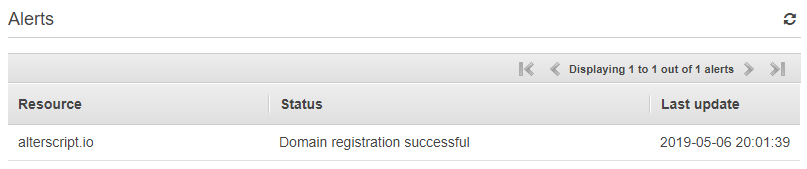
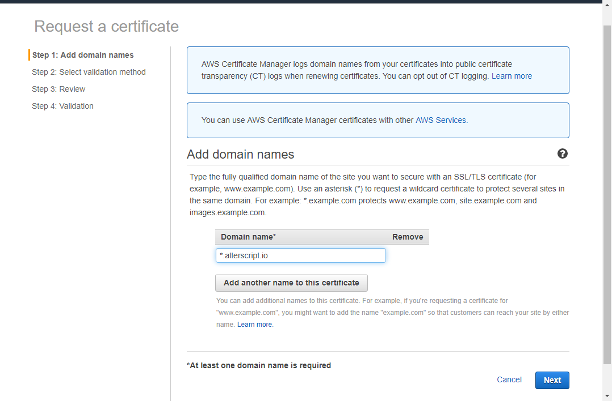
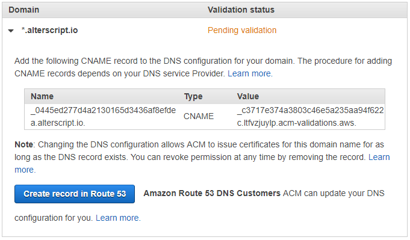

# Hosting an HTTPS Website in S3 and CloudFront

This post is a quick guide on setting up a new domain and hosting it as a bucket in S3 behind CloudFront to provide HTTPS.

## Register a Domain

Log on to the [AWS console](https://console.aws.amazon.com/) and go to [Route 53](https://console.aws.amazon.com/route53/home?region=us-east-1#). From the front page, you can register a new domain or transfer in one of your existing domains. 



The process is pretty straight forward and if your domain is not available, it will give you a massive list of alternative top level domains you can use. Once you have purchased the domain name, it will start the registration process. This takes a while (over 20 minutes in my case). Eventually it should look like:



## Creating the Certificate

In order to host a bucket with HTTPS, we will need to create a certificate. AWS has a [Certificate Manager](https://aws.amazon.com/certificate-manager/) service which will allow you to create a public certificate for free. CloudFront requires the certificate to be in the North Virginia (us-east-1) region. Access the [console in that region](https://console.aws.amazon.com/acm/home?region=us-east-1#/) and go to *Request Certificate*, and choose a public certificate.



Here, I have asked for a wildcard certificate (hence the `*`) but you could create a specific one for each name you need. On the next stage of the wizard, choose DNS verification and click through to Step 4. If you expand the domain under validation, you will see a button to create the record in Route 53.



After this click Continue. This validation process takes some time, though nothing like 30 minutes, once it has completed you should see the status become *Issued* within the ACM console.

### CLI Method

To do this with the cli, first run (replacing `www.domainname.com`):

```bash
aws acm request-certificate --validation-method DNS --region us-east-1  --domain-name www.domainname.com
```

This will result in a `CertificateARN` in a JSON format, like:

```
{
    "CertificateArn": "arn:aws:acm:us-east-1:123456789012:certificate/12345678-1234-1234-1234-123456789012"
}
```

Using this you can then get the details needed to verify the domain by running:

```bash
aws acm describe-certificate --region us-east-1 --certificate-arn arn:aws:acm:us-east-1:123456789012:certificate/12345678-1234-1234-1234-123456789012 
```

There will be a section containing the details to confirm the domain:

```json
"DomainValidationOptions": [
    {
        "DomainName": "www.domainname.com",
        "ValidationStatus": "PENDING_VALIDATION",
        "ResourceRecord": {
            "Name": "_878ad6ed933b923829d1bdab076d8ed9.www.domainname.com.",
            "Type": "CNAME",
            "Value": "_186306151298a445c972df27a38ed741.ltfvzjuylp.acm-validations.aws."
        },
        "ValidationMethod": "DNS"
    }
]
```

When you register a domain with Route 53, it will automatically create a Hosted Zone for it. You can run the following command to get all hosted zones:

*At least with my version of the cli, I had problems with the list-hosted-zones-by-name command, so chosen to use this one*

```bash
aws route53 list-hosted-zones
```


Below is a single PowerShell script to create a certificate and set up the verification.

```powershell
$dnsName='alterscript.io'
$certName="www.$dnsName"
$hostedZoneId=((aws route53 list-hosted-zones | ConvertFrom-Json).HostedZones | Where-Object {$_.Name -eq "$dnsName."}).Id
```

## Creating the Bucket

Now to set up the S3 bucket. 