# Order of Operations in Alteryx Expressions

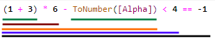

This post is the start of a small series around some of the functionality coming in the Alteryx Abacus 1.4 release. While this post, doesn't directly use anything in the add in, understanding the sequence of evaluation within an Alteryx expression is critical when working with variables (one of the big new features in the next release). It specifically looks at how Alteryx evaluates an expression. While in general you don't care, once your expression has '[side-effects](https://en.wikipedia.org/wiki/Side_effect_(computer_science))', it can start to really matter.

As always, as I don't work for Alteryx this is based on my poking and prodding and seeing what happens, so no guarantees it is correct! 

## LOGS

In this post, I'm going to use a special function - `LOG` this allows me to get a line written to a file to tell me what was evaluated. This is a new function in Abacus 1.4. It's stupidly useful for debugging complicated expressions. The syntax is:

```none
LOG(<ReturnValue>, <FileName>, [Message])
```

# Back to School

Let's go back to basics to start with some simple maths. Maths defines an order of operation. I'm English so I learnt it as 'BODMAS':

- **B**rackets (Parenthesis in American)
- **O**rder (Exponents in American)
- **D**ivision / **M**ultiplication
- **A**ddition / **S**ubtraction

If there is an ambiguity, then *left-to-right* is used (e.g. `3-4-5` is evaluated as `(3-4)-5` i.e. `-6`). Let's do some simple tests in Alteryx. 

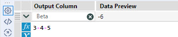

Unsurprisingly, this produces the correct result of `-6`. Now, another `10-3+2` should be treated as `(10-3)+2` i.e. 9:

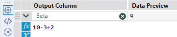

In Alteryx's case, *Order* is not an operator, it's a function so onto...

# Programming Languages

Programming languages have way more operators. The table below summarises the order assuming Alteryx follows this standard:

- **B**rackets, Function calls
- Unary operators - `!`, `-`, `+`
- **D**ivision / **M**ultiplication
- **A**ddition / **S**ubtraction
- Comparisons: less-than and greater-than (`<`, `>`, `<=`, `>=`)
- Comparisons: equal and not equal (`==`,`!=`)
- Logical AND, `&&`
- Logical OR, `||`

Please note some of the common programming operators (e.g. `%`) are function calls in Alteryx expressions (e.g. `MOD`). Consider a simple expression: `4 + 9 > 12`. This will be evaluated as `(4 + 9) > 12`:

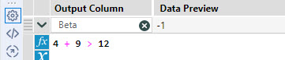

*Alteryx represents TRUE as -1 if shown as a number*

Now onto at a bit of a more weird and wonderful example - `3 < 2 != 3 < 5`. This evaluates to `(3 < 2) != (3 < 5)` which evaluates to `TRUE`:

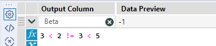

One last logic example: `1 - 3 > 2 < 5 - 4`. Breaking it down this is evaluated as:

1. Evaluate `1 - 3` ==> `-2`
2. Evaluate `5 - 4` ==> `1`
3. Evaluate `-2 > 2` ==> `FALSE` (or `0`)
4. Evaluate `0 < 1` ==> `TRUE` (or `-1`)

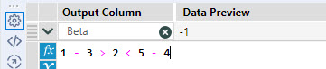

## Functions

Let's think about another quick example. What about `MOD(7 + 4, 2) + -MOD(7, 4)`? Well following the normal logic, we would evaluate each of the `MOD` functions and then evaluate the addition. In other words:

1. Evaluate `7 + 4` ==> `11`
2. Evaluate `MOD(11, 2)` ==> `1`
3. Evaluate `MOD(7, 4)` ==> `3`
4. Evaluate Unary Minus ==> `-3`
5. Evaluate `1 - 3` ==> `-2`

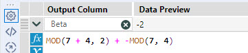

## Short Circuits

So far, we have no choice on what we have had to do. To perform most operations, all inputs need to be known. Now think about logical `AND` and `OR`. Well for `AND`, we have the logic table:

|Left|Right|Output|
|---|---|---|
|FALSE|FALSE|FALSE|
|FALSE|TRUE|FALSE|
|TRUE|FALSE|FALSE|
|TRUE|TRUE|TRUE|

If we evaluate `Left` to be `FALSE`, we can stop as we know the result is `FALSE` and not bother with evaluating `Right`. Likewise, if we look at `OR`:

|Left|Right|Output|
|---|---|---|
|FALSE|FALSE|FALSE|
|FALSE|TRUE|TRUE|
|TRUE|FALSE|TRUE|
|TRUE|TRUE|TRUE|

In this case, if we evaluate `Left` to be `TRUE`, we can stop as we know the result is `TRUE` and not bother with evaluating `Right`.

This is called [Short Circuit Evaluation](https://en.wikipedia.org/wiki/Short-circuit_evaluation). Take a look and see what happens in Alteryx:

```none
LOG(1, "C:\Temp\Logic.log", "Left") AND LOG(1, "C:\Temp\Logic.log", "Right")
```

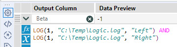

As expected, both sides must be executed, so log output looks like:

```none
Left
Right
```

So, now let's try:

```none
LOG(0, "C:\Temp\Logic.log", "Left") AND LOG(1, "C:\Temp\Logic.log", "Right")
```

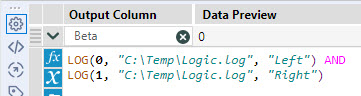

The log output this time looks like:

```none
Left
```

Alteryx has short circuited the evaluation and not bothered to work out value of the second input. For sake of completeness, the example below shows same behaviour in an `OR` case:

```none
LOG(1, "C:\Temp\Logic.log", "Left") OR LOG(1, "C:\Temp\Logic.log", "Right")
```

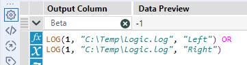

As expected, the log looks like this:

```none
Left
```

Alteryx's engine is efficient - that shouldn't surprise anyone.

# IF and  IIF

Now, think about functions (or operators as well I guess). In order to evaluate the function, you need to first evaluate all the inputs to it. However, the same kind of short-circuiting logic can be applied to an `IF` or `IIF` statement as we saw with `AND` and `OR`. You first evaluate the condition, and then can decide whether to execute true or false:

```none
IF LOG(1, "C:\Temp\Logic.log", "Condition") THEN
	LOG(100, "C:\Temp\Logic.log", "True")
ELSE
	LOG(-100, "C:\Temp\Logic.log", "False")
ENDIF
```

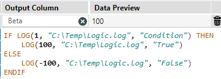

Looking at the log, Alteryx evaluates the condition gets a `TRUE` value and then evaluates the first block. 

```none
Condition
True
```

Let's look at a `FALSE` scenario in an `IIF` function:

```none
IIF(LOG(0, "C:\Temp\Logic.log", "Condition"),
	LOG(100, "C:\Temp\Logic.log", "True"),
	LOG(-100, "C:\Temp\Logic.log", "False")
)
```

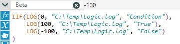

As expected, just the `FALSE` block is evaluated.

```none
Condition
False
```

As far as I have ever been able to tell, there is no evaluation difference between `IF` and `IIF`. You can use the one you prefer the look of (I vary between the two depending on the complexity of the expression).

# SWITCH

The `SWITCH` statement could easily have the same short-circuiting approach. We could first evaluate the `Value` input, then evaluate each `Case1`, `Case2`, ..., `CaseN` in turn until we either find one which matches or run out of cases. We can then evaluate the appropriate `Result` or `Default` expression. So, let's look at a simple example:

```none
SWITCH(LOG("A", "C:\Temp\Logic.log", "Value"),
       LOG(-1, "C:\Temp\Logic.log", "Default"),
       LOG("A", "C:\Temp\Logic.log", "Case1"),
       LOG(1, "C:\Temp\Logic.log", "Result1"),
       LOG("B", "C:\Temp\Logic.log", "Case2"),
       LOG(2, "C:\Temp\Logic.log", "Result2")
)
```

The log output looks like:

```
Value
Default
Case1
Result1
Case2
Result2
````

Even though logically there is no way to get to other results all are evaluated. If you need short circuiting, then you will need to use an `IF...ELSEIF...ENDIF` structure. You can always make the formula have 2 steps - first evaluate the `Value` then in the second step have the `IF` expression needed. 

# IFNULL

So, this is an interesting one. `IFNULL` is an [XML Macro Function](https://jdunkerley.co.uk/2016/08/13/beyond-alteryx-macros-part-2-how-to-create-an-xml-macro-function/) built into the Abacus library (it's been there since the earliest versions). Its underlying expression is:

```none
IIF(ISNULL(P1),P2,P1)
```

Let's consider the case where P1 is NULL:

```none
IIF(ISNULL(LOG(NULL(), "C:\Temp\Logic.log", "IIF_Cond")),
    LOG("NotNull", "C:\Temp\Logic.log", "IIF_NotNull"),
    LOG(NULL(), "C:\Temp\Logic.log", "IIF_Null"))
```

versus

```none
IFNULL(LOG(NULL(), "C:\Temp\Logic.log", "IFNULL_P1"),
       LOG("NotNull", "C:\Temp\Logic.log", "IFNULL_P2"))
```

Looking at the `IIF` statement, it evaluates the `Cond` and the `NotNull` expressions. Unsurprisingly, `IFNULL` evaluates both `P1` and `P2`. Now consider the case where P1 is not null, e.g.:

```none
IIF(ISNULL(LOG("Something", "C:\Temp\Logic.log", "IIF_Cond")),
    LOG("NotNull", "C:\Temp\Logic.log", "IIF_NotNull"),
    LOG("Something", "C:\Temp\Logic.log", "IIF_Null"))
```

versus

```none
IFNULL(LOG("Something", "C:\Temp\Logic.log", "IFNULL_P1"),
       LOG("NotNull", "C:\Temp\Logic.log", "IFNULL_P2"))
```

The `IIF` statement, it evaluates the `Cond` and the `Null` expressions. However, the `IFNULL` continues and evaluates both `P1` and `P2`. This can be an advantage or a disadvantage. Imagine a case where computing `P1` was complicated - then `IFNULL` avoids it being computed twice. This can clearly be a big advantage in this scenario. However, in another case if you have a function which reads a value and if null updates the value (this is the variable functionality in Abacus) then you want `P2` to only be executed if `P1` is null. 

This was a surprise for me when I first noticed this behaviour as I had imagined XML Macro functions worked as a substitution straight into the expression (just making it easier to write), but this behaviour allows for some performance wins (and some losses).

# A Brief Mention of the Parse Phase

Just a quick note on how expressions are pared within Alteryx. If you try some of these examples, you will find the expression is evaluated over and over. Alteryx runs a parse phase where it evaluates the expression. It checks syntax and makes sure all is well. If you have a custom function, you will be passed `0` or an empty string where you would get a data field. This allows Alteryx to check syntax and understand the structure of the expression. The code below shows the output of the following expression:

```
IIF(LOG([Alpha], "C:\Temp\Logic.log", "Condition") = "A",
	LOG(100, "C:\Temp\Logic.log", "True"),
	LOG(-100, "C:\Temp\Logic.log", "False")
)
```

With an input of:

|Alpha|
|---|
|A|
|B|

When you work with the formula editor the expression is evaluated on first lost, then on every keypress so you end up with a log file full of entries. The sequence below shows what happens when the editor is first loaded:

```
True
False
Condition
True
False
Condition
Condition
True
```

This same sequence happens on every keypress in the editor as it re-evaluates the expression. The first 6 lines are the parse phase being run twice (not sure why it runs it twice), followed by the last 2 evaluating a single test record. If we now run the workflow, we get the following logs:

```
True
False
Condition
Condition
True
Condition
False
```

In this case you can see the parse is run (first three lines). Then each record is evaluated in turn (2 lines for each record). When I first tried the variable functions, the parse caused me a little issue as got an extra call I didn't expect.

# Summing Up

Hopefully, some of the odd and outputs from expressions might make some sense now. As functions get more complicated (and time to execute increases), thinking about how an expression is evaluated becomes more and more important.